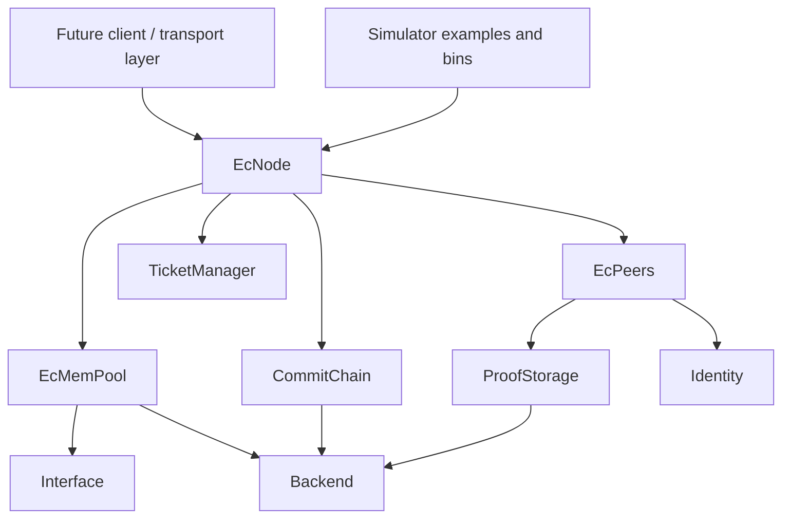

# Architecture

echo-consent is a Rust reference implementation and simulator suite for the EC Protocol. The crate is a library named `ec_rust`; there is no `src/main.rs` application entry point.

For deeper agent guidance, start with [agent-docs/implementation/module-boundaries.md](agent-docs/implementation/module-boundaries.md).

## System Shape

## Core Library

- [src/ec_interface.rs](src/ec_interface.rs): Shared protocol types, messages, aliases, storage traits, events, batching, and commit-chain messages.
- [src/ec_node.rs](src/ec_node.rs): Integration facade for mempool, peers, tickets, local time, event sink, batching, and commit-chain sync.
- [src/ec_mempool.rs](src/ec_mempool.rs): Pending/committed/blocked block state machine, vote accounting, conflict repair, vote scheduling, diagnostics.
- [src/ec_peers.rs](src/ec_peers.rs): Peer lifecycle, discovery, referrals, elections, topology, pruning, adaptive neighborhoods.
- [src/ec_proof_of_storage.rs](src/ec_proof_of_storage.rs): Proof-of-storage helpers, token storage backend trait, ring distance, consensus clustering, peer election logic.
- [src/ec_commit_chain.rs](src/ec_commit_chain.rs): Local append-only commit-chain tracking and sync behavior.
- [src/ec_memory_backend.rs](src/ec_memory_backend.rs): Default in-memory backend for tests and simulators.
- [src/ec_identity.rs](src/ec_identity.rs): Argon2 identity mining, validation, network isolation, and X25519 shared-secret derivation.
- [src/ec_genesis.rs](src/ec_genesis.rs): Deterministic genesis generation and selective storage initialization.
- [src/ec_ticket_manager.rs](src/ec_ticket_manager.rs): Ticket generation, validation, and rotating secrets.

## Simulator

Simulator code lives under [simulator/](simulator/) and is wired through `Cargo.toml` examples and binaries, not as a separate crate.

- `simulator/consensus/`: Core consensus simulation.
- `simulator/peer_lifecycle/`: Discovery, elections, token allocation, topology, churn.
- `simulator/integrated/`: Combined node, lifecycle, churn, commit-chain sync, and transaction flow.
- `simulator/commit_chain/`: Focused commit-chain simulation.

See [agent-docs/simulator/evidence-index.md](agent-docs/simulator/evidence-index.md).

## Boundaries

- `EcNode` is the integration point.
- `EcPeers` and `EcMemPool` should remain separately testable.
- Core logic should stay network-agnostic.
- Transport/API design belongs in [agent-docs/api/](agent-docs/api/) until a stable implementation exists.
- Storage changes must stay aligned across traits, memory backend, batched writes, and simulator stores.

## High-Blast-Radius Areas

Read [agent-docs/implementation/dangerous-change-areas.md](agent-docs/implementation/dangerous-change-areas.md) before changing message variants, peer topology/pruning defaults, storage traits, token/block ID aliases, or commit-chain sync behavior.

