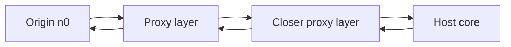
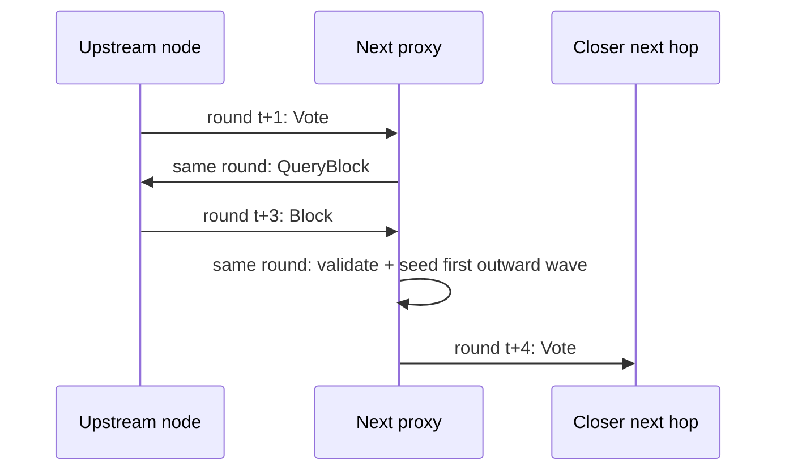

# Response-Driven Commit Flow

This note updates the transaction commit design after the protocol moved away from pure tick-driven vote pumping and toward a mixed request / delayed-response flow.

It has two goals:

1. describe the mechanics of the current design in the same terms we now use in code and simulation
2. give a lower-bound timing and message model for the conflict-free, perfect-network case

This is not a formal proof. It is a design argument with explicit assumptions.

Unless otherwise stated, the timing discussion below models the **current implementation**, including the newer reactive first wave on block arrival.

## Scope

This note describes the behavior implemented in:

- [`src/ec_node.rs`](../src/ec_node.rs)
- [`src/ec_mempool.rs`](../src/ec_mempool.rs)
- [`src/ec_peers.rs`](../src/ec_peers.rs)

It should be read alongside:

- [`Design/vote_flow_and_batching.md`](./vote_flow_and_batching.md)
- [`docs/ec_protocol_v0.12.md`](../docs/ec_protocol_v0.12.md)

Conflict handling is intentionally kept out of the main line of this note.
The purpose here is to get a clear baseline for:

- conflict-free commit mechanics
- conflict-free timing lower bounds
- how real network conditions should stretch those bounds

Once that baseline is stable, conflict can be layered on top as a separate analysis.

## Design Intent

The commit protocol is no longer best described as "nodes push votes every tick until something commits".

The closer description is:

- the first wave plants the transaction into the token and witness neighborhoods
- each receiving node records who is interested
- once the block content is known, nodes immediately seed the first outward span toward the next closer peers
- once relevant local state becomes terminal, nodes answer back
- when local state changes from `Pending` to `Commit` or `Blocked`, nodes push that new state back to interested peers
- periodic outward sweeps remain only as a repair mechanism for loss, delay, and churn

So the protocol is now a hybrid:

- initial push toward the host neighborhoods
- delayed response outward from those neighborhoods

## Core Concepts

The commit flow is easier to reason about if we keep six concepts explicit from the start:

| Concept | Meaning |
| --- | --- |
| `role` | One token vote or the witness vote for the block id |
| `host core` | Nodes that actually have prior state for the role and can evaluate it honestly |
| `proxy layer` | Nodes that can relay toward the host core but do not themselves hold the role state |
| `interest trail` | The set of peers that voted early and are waiting for an answer back |
| `state-change push` | A reply sent because local state became `Commit`, not because a tick decided to poll again |
| `repair sweep` | The periodic tick-driven resend path used to recover from loss, delay, or churn |

Two pictures capture the intended baseline.

### Picture 1: Inward seed, outward reflection



The first half of the path moves the block and vote request inward.
The second half moves positive commit knowledge back outward through already-registered interest.

### Picture 2: What the current implementation does in a perfect network



This is the important implementation reality:

- receiving a vote and requesting the block is immediate
- receiving the block and seeding the next proactive wave can happen in the same round
- but the **next hop sees that forwarded vote one round later**

So one inward routing step is not "1 tick". In the current implementation it is closer to a **4-round sender-to-next-receiver cycle**, or about **3 extra rounds after the first receiver sees the vote**.

## Roles

For a block touching `k` tokens there are `k + 1` independent vote roles:

- one vote role per token
- one witness role for the block id

Each role has its own neighborhood.

In the conflict-free case, the commit rule is:

- if every token role reaches vote balance `> 2`
- and the witness role reaches vote balance `> 2`
- and the block validates locally
- then the block commits locally

## Current Mechanics

### 1. Deterministic outward polling

For each unresolved token role and witness role, the node keeps a small sequence counter.

The current polling pattern is:

- sequence `0`: send to the closest pair around the role center
- sequence `1`: send to the next pair one step farther out
- sequence `2`: send to the third pair
- sequence `3`: send to the fourth pair
- sequence `4`: skip one round and reset to `0`

When a node learns a block for the first time and can evaluate it, it does not wait for the next tick to start.
It immediately emits the first span of that sweep:

- first `4` targets if available, corresponding to sequence `0` and `1`
- then it records the local sequence as `2`
- later periodic polling continues at sequence `2`, `3`, skip, then restart at `0`

So the steady conflict-free polling rule is:

- exactly `2` vote requests per unresolved role per active polling round
- one target on each side of the role center
- no cooldown structure other than the built-in `4 on / 1 off` sequence

There is one additional stop rule:

- if a token-role tally falls below `-2`, that role pauses proactive polling
- if later reply traffic raises the tally back above that negative cutoff, polling resumes from sequence `0`

If the origin is not itself a host for a role, its own vote for that role is usually negative.

The important job of this polling wave is not to settle the vote immediately. Its job is:

- to place the block id into the routing neighborhood of the role
- to cause closer nodes to fetch the block content
- to register interest along the way

### 2. Early-voter registration

A node records votes from connected peers even before it knows the block content.

That matters because:

- the node now knows which peers are waiting for its answer
- once the block arrives, it can answer those peers immediately

This creates a trail of interested peers from the host neighborhood back toward the origin.

### 3. Block acquisition

A node that receives a vote for an unknown block cannot evaluate it yet.

The node must first request the block:

1. receive `Vote(block_id, vote, reply=true)`
2. record the sender and their vote
3. send `QueryBlock(block_id)` back toward the sender
4. receive `Block(block)`
5. validate and store the block

Only after step 5 can the node evaluate its own vote and seed the first outward span.

### 4. Terminal fast reply only

Receiving a vote does **not** cause an immediate reply while the block is still `Pending`.

The current rule is narrower:

- if the block is `Commit`, reply immediately with all `1`s
- if the block is `Blocked`, reply immediately with all `0`s
- if the block is `Pending`, do not fast-reply
- receiving the `Block` itself does not trigger a terminal reply, but it does trigger the first outward seed wave

This keeps the protocol simple:

- votes register interest
- block arrival starts routing progress
- terminal state changes satisfy the registered interest

### 5. State-change pushes

When a block changes local state:

- `Pending -> Commit`
- `Pending -> Blocked`

the node sends its new terminal vote to all interested peers whose latest vote still has `reply=true`.

If the block was blocked by a higher-ranked direct conflict, that push may be bundled with the higher contender so the receiver learns a better candidate together with the `0` vote.

In that case the blocked mempool entry keeps a reference to a higher direct contender, so the bundled reply can be produced from the same mempool family without introducing a second tracking structure.

That higher direct contender may itself already be `Blocked`.
If so, the bundled reply sends:

- `0` for the blocked transaction we were asked about
- `0` for the referenced higher contender

rather than pretending that the higher contender is still viable.

This is the main response-driven improvement in the simplified protocol.

### 6. Repair sweep

The periodic tick remains necessary for:

- lost messages
- delayed messages
- nodes that never fetched the block
- churn and topology changes

But under the simplified design, its role should be:

- repair

not:

- the dominant source of progress

## Idealized Conflict-Free Flow

In the perfect-network case, conflict-free commit should proceed in three phases.

### Phase A: seed the neighborhoods

The origin sends vote requests toward each role neighborhood.

If the origin is far away from the hosts, the first few hops act like proxies:

- they record interest
- they fetch the block
- they immediately forward toward nodes that are closer to the role address

### Phase B: saturate the host core

Once the block reaches the true host neighborhood for a role:

- many nearby nodes receive overlapping vote requests
- those nodes know the token state
- they start answering early voters and subsequent requests immediately
- vote balance saturates in the center first

So the "core" neighborhood should commit before the periphery does.

### Phase C: reflect outward

Once core nodes commit:

- they push `Commit` to the peers that previously asked them
- those peers now get enough positive replies to commit
- they then push `Commit` to their own interested peers

So in the ideal case the commit wave propagates:

- inward by routed vote requests
- outward by reply and state-change push

## Lower-Bound Timing And Message Model

We want a simple model that reflects the protocol structure without pretending to be exact.

The important quantity is:

- minimal ticks until the origin can commit

Message counts still matter, but mainly because they create or remove delay.

### Parameters

For each role `i`:

- `h_i`: size of the host neighborhood that truly evaluates the role
- `Δ_i`: ring-rank distance from the origin to that role neighborhood
- `s_i`: average progress toward the neighborhood per routing hop, measured in connected-peer rank steps
- `t_i`: proactive targets sent per hop for that role
- `ρ_i`: overlap factor of those targets, `0 < ρ_i <= 1`

Interpretation:

- `s_i` is the *effective routing slope* in node-rank terms
- `t_i * ρ_i` is the effective number of new interested peers added per step after path overlap is accounted for

There are two different "slope" ideas here, and they should not be mixed:

1. **Topology slope**
   - this is the probability curve over candidate peers by ring distance
   - example: "close peers are almost always connected, farther peers fade out linearly"
   - this is a property of the maintained peer set

2. **Routing slope**
   - this is the actual progress a vote request makes toward the host neighborhood on each hop
   - measured in peer-rank steps or ring-distance reduction
   - this is a property of the commit flow running on top of the peer set

The topology slope induces the routing slope, but they are not identical.

Why that distinction matters:

- a topology can look local in probability terms and still route badly if target selection is poor
- two networks with the same topology rule can have different routing slope under different connection budgets
- for message lower bounds, the probability curve is useful background
- for commit latency in ticks, the routing slope is the more useful variable

Define:

- `g_i = t_i * ρ_i`
- `d_i = ceil(Δ_i / s_i)`

Then a first-order estimate of the number of distinct participants reached for role `i` is:

```text
S_i ≈ h_i + g_i * d_i
```

This is the right shape for a converging gradient:

- linear in hop depth
- not exponential in fanout

### Per-role timing lower bound

For latency we care about how long it takes the role to:

1. reach the host core
2. saturate enough votes there to commit
3. reflect `Commit` back through the registered-interest trail to the origin

Define:

- `τ_seed_i`: ticks needed for one pre-host routing step
- `τ_core_i`: ticks needed once the host core first knows the block until that role commits in the core
- `τ_reflect_i`: ticks needed for one outward response layer

Then the role timing lower bound is:

```text
T_i >= d_i * τ_seed_i + τ_core_i + d_i * τ_reflect_i
```

This is the key latency form:

- inward depth
- plus constant core saturation
- plus outward reflected confirmation

#### What creates `τ_seed`

For a node that does not know the block yet, one routing step is not "just forward one vote".

It is:

1. receive vote request
2. record early voter
3. request block
4. receive block
5. only then become able to evaluate and forward honestly

So the first inward wave is delayed by block acquisition.

In a perfect network, that delay is still real even if no packets are lost.

For the **current implementation**, the first outward span is now emitted immediately after block acquisition.
So the current `τ_seed` should be read as including:

1. receive vote
2. request block
3. receive block
4. validate and emit the first outward seed wave immediately
5. one more round for that forwarded vote to be observed downstream

That is the more honest lower-bound timing model for the system as it exists now.

In a future more reactive design, `τ_seed` could be smaller, but that is not the model assumed here.

#### What creates `τ_reflect`

The outward part can be faster than the inward part because:

- peers already know the block
- only vote state must move back
- `Commit` and `Blocked` are terminal local states

So `τ_reflect_i` is typically smaller than `τ_seed_i`.

For the **current implementation**, `τ_reflect_i` is also not fully zero-cost:

- direct vote replies can be emitted immediately on receive once local state is known
- but commit itself is still determined during mempool processing in `tick()`

So the current outward reflection model is:

- host/core state changes happen on tick
- replies to interested peers are emitted on that same tick
- receiving peers may still need their own next tick before they themselves change local state

This is still better than the inward pre-host path, but it is not instantaneous.

For the **current implementation** in a perfect network, the practical constants are:

```text
τ_seed ≈ 3 rounds
τ_core ≈ 1 round
τ_reflect ≈ 1 round
```

So the clean first-order timing model used below is:

```text
T_i ≈ 4 * d_i + 1
```

where `d_i` is the number of inward routing steps before the host core is reached.

### Whole-transaction timing lower bound

For a block with `k` tokens plus witness, the roles are seeded in parallel.

So whole-transaction latency is *not* the sum across roles.

It is governed by the slowest role:

```text
T_tx >= max_i T_i
```

This is the most important timing statement in the design.

Message counts sum across roles.
Commit latency does not.

For the **current implementation**, this also means there are two separate honest lower bounds to track:

1. **protocol lower bound**
   - what the response-driven structure would allow with ideal local scheduling
2. **implementation lower bound**
   - what the current tick-driven forwarding and tick-driven commit evaluation actually allow

This note is modeling the second one.

### Per-role lower bound

For each distinct participant in role `i`, the best-case conflict-free exchange is:

1. one vote request inbound
2. one vote reply outbound

That gives the semantic vote lower bound:

```text
M_vote_i >= 2 * S_i
```

If a participant did not already know the block, it also needs:

1. one `QueryBlock`
2. one `Block`

In the ideal first-touch case, all participants except the original sender need that once:

```text
M_block_i >= 2 * (S_i - 1)
```

So a simple per-role lower bound is:

```text
M_i >= 4 * S_i - 2
```

Substituting `S_i`:

```text
M_i >= 4 * h_i + 4 * g_i * d_i - 2
```

With the common simple case:

- two targets per active polling round
- one new pair per step
- good overlap
- `g_i ≈ 2`

we get:

```text
M_i >= 4 * h_i + 8 * d_i - 2
```

This is the key message argument:

- lower-bound message cost grows linearly with hop depth under a converging gradient
- not quadratically with global network size

### Whole transaction lower bound

For a block with `k` tokens, there are `k + 1` roles including witness:

```text
M_tx_role_sum >= Σ_i (4 * S_i - 2)
```

This is the role-sum lower bound.

If some nodes participate in multiple roles, the true lower bound can be lower because:

- block fetches can be shared
- votes can be batched
- one node can cover multiple token or witness responsibilities

So the coalesced lower bound is better written in terms of the union of participant sets:

```text
M_tx_coalesced >= 2 * Σ_i S_i + 2 * |U - {origin}|
```

where `U` is the union of distinct participants across all roles.

This is why the simulator tracks both:

- role-sum ideal
- coalesced ideal

And it is why timing and message complexity should be discussed separately:

- timing is `max` over roles
- message cost is approximately `sum` over roles

## What The Slope Means

The gradient slope matters twice:

1. **Hop depth**
   - steeper locality means fewer hops to reach hosts
   - smaller `d_i`

2. **Side spread**
   - flatter locality causes more lateral spread before reaching hosts
   - larger `g_i`

So a good gradient lowers both:

- distance to the center
- wasted width on the way there

That is why the peer-set shape is so important for commit complexity.

## Terminal State Semantics

### Commit

After local commit:

- the node will not vote negatively on that block later
- it can answer interested peers with `reply=false`
- this is a terminal local state

## Guarantees Claimed By This Design

Under honest-majority conditions and a sufficiently local connected-peer gradient:

1. **Conflict-free commits should converge from the host core outward**
   - the center sees the most overlapping requests first
   - responses then flow back toward the origin

2. **Message cost is governed by role neighborhood depth, not total network size**
   - the lower bound is linear in hop depth under a converging gradient

3. **State-change pushes reduce the need for repeated polling**
   - once a node has enough local information, it should answer interested peers
   - the tick sweep is repair, not the only source of progress

## Important Caveats

This argument depends on assumptions that are not always true in the current implementation:

- the live churn network currently over-connects relative to the corrected ring target
- flatter live peer sets increase both hop spread and message cost
- not every proxy already behaves as a strict non-host

## Worked Examples

The formulas above are easier to reason about if we pin down a small family of representative numbers.

For the example tables below, assume:

- good routing slope: `s = 4` to `6` peer-rank steps per inward hop
- effective side spread: `g = 2`
- host core size: `h = 5`
- current implementation timing:
  - `τ_seed = 3`
  - `τ_core = 1`
  - `τ_reflect = 1`

So the working estimates are:

```text
d = ceil(Δ / s)
S ≈ h + g * d
M >= 4 * S - 2
T >= 4d + 1
```

Here:

- `Δ` is how far the transaction enters from the role center
- `d` is how many inward routing steps are needed before the host core is reached
- `S` is how many role-participants get tagged
- `M` is the semantic lower-bound message count for that role
- `T` is the lower-bound role latency in rounds

### Example A: how many steps to the center?

With a good gradient, the main question is how quickly a far entry point collapses toward the token neighborhood.

Under `s = 4`, the role depth bands look like this:

| Entry distance `Δ` | Inward steps `d` | Tagged role-participants `S` | Role messages `M` | Role latency `T` |
| --- | ---: | ---: | ---: | ---: |
| `1..4` | `1` | `7` | `26` | `5` rounds |
| `5..8` | `2` | `9` | `34` | `9` rounds |
| `9..12` | `3` | `11` | `42` | `13` rounds |
| `13..16` | `4` | `13` | `50` | `17` rounds |
| `17..20` | `5` | `15` | `58` | `21` rounds |

So with a healthy gradient, transactions that enter within roughly `8..12` rank steps of the true role center should reach it in about `2..3` inward steps.

That is the key message-complexity argument:

- settlement cost grows with role depth
- role depth grows with entry distance divided by routing slope
- neither term needs to grow with total global network size

### Example B: what does a better gradient buy us?

Fix one representative far-entry case at `Δ = 12`.

| Routing slope `s` | Inward steps `d` | Tagged role-participants `S` | Role messages `M` | Role latency `T` |
| --- | ---: | ---: | ---: | ---: |
| `3` | `4` | `13` | `50` | `21` rounds |
| `4` | `3` | `11` | `42` | `16` rounds |
| `6` | `2` | `9` | `34` | `11` rounds |

This is why the gradient matters so much.

A better routing slope does two things at once:

- it reduces the number of proxy layers that have to fetch and forward the block
- it reduces the number of nodes that get tagged along the way

So a better gradient improves both:

- time-to-commit
- total semantic message work

### Example C: whole-transaction scale

The system does not settle on "the whole network". It settles on the union of the token roles plus witness role.

If we take a representative mid-distance case with `d = 3`, then one role has:

- `S = 11` tagged participants
- `M = 42` semantic messages
- `T = 16` rounds

Using that one-role case as a building block:

| Transaction shape | Roles | Tagged role-participants `ΣS_i` | Unique participants lower bound | Unique participants upper bound | Role-sum messages `ΣM_i` | Tx latency lower bound |
| --- | ---: | ---: | ---: | ---: | ---: | ---: |
| `1 token + witness` | `2` | `22` | `11` | `22` | `84` | `16` rounds |
| `2 tokens + witness` | `3` | `33` | `11` | `33` | `126` | `16` rounds |
| `4 tokens + witness` | `5` | `55` | `11` | `55` | `210` | `16` rounds |

The lower / upper participant bounds matter:

- lower bound: all roles overlap on the same physical nodes
- upper bound: all roles use disjoint neighborhoods

Real transactions should land somewhere between those two extremes.
Batching and shared block fetch move the wire cost closer to the lower side even when the semantic role-sum stays near the upper side.

### Example D: corrected ring-gradient test setup

The corrected steady-state harness currently uses:

- `N = 192` peers
- guaranteed ring neighbors: `±8`
- linear fade-out tail: `9..15`
- vote-eligible host width: `±6`

For that topology:

- expected farthest connected peer on one side is about `12.8` rank steps
- average distance from a random origin to the nearest host-core member is about `42.2` rank steps

That gives a topology-only inward depth estimate of:

| Quantity | Value |
| --- | ---: |
| average inward depth | `3.7` steps |
| p50 inward depth | `4` steps |
| p95 inward depth | `7` steps |
| max inward depth | `8` steps |

Viewed as logical protocol layers, that suggests:

- roughly `depth` layers inward
- then roughly `depth` layers of reflected terminal replies outward

So a random all-pairs role in this corrected ring is expected to settle on the order of:

```text
~ 2 * depth
```

logical layers, before network stretch and scheduler effects.

That is deliberately looser than the per-message round model.
It is useful because it matches what we should first compare against in perfect or near-perfect steady-state runs:

- if the gradient depth is low, commit should also stay low
- if commit blows up while depth stays low, the issue is likely elsewhere

### Converting the examples to wall clock

If one round is roughly `25 ms`:

| Role latency | Wall clock |
| --- | ---: |
| `6` rounds | `0.15 s` |
| `11` rounds | `0.28 s` |
| `16` rounds | `0.40 s` |
| `21` rounds | `0.53 s` |
| `26` rounds | `0.65 s` |

If one round is roughly `50 ms`:

| Role latency | Wall clock |
| --- | ---: |
| `6` rounds | `0.30 s` |
| `11` rounds | `0.55 s` |
| `16` rounds | `0.80 s` |
| `21` rounds | `1.05 s` |
| `26` rounds | `1.30 s` |

This is the main human-timescale argument for the conflict-free design:

- if a good gradient keeps most roles at `d = 2..3`
- and if the network does not force many repair sweeps
- then lower-bound commit times stay in the sub-second to low-single-second range

That is the scale the simulator should be compared against.

## Real-Network Stretch Factors

The tables above are the clean lower bound.
Real networks stretch them in three direct ways.

### 1. Delay stretches time

Extra link delay adds directly to inward and outward hop time.
So delay increases `T` even if message count stays the same.

This hurts the inward path most because the inward path includes:

- vote arrival
- `QueryBlock`
- `Block`
- next tick-driven forward

### 2. Loss stretches both time and spread

Loss does not only slow one path down.
It also causes resend and repair sweep activity, which means:

- more rounds before commit
- more peers get tagged before replies close the path
- more total messages than the clean lower bound

So in practice loss increases both:

- `T`
- `S` and therefore `M`

### 3. Reordering behaves mostly like extra seed delay

The protocol tolerates votes arriving before the block:

- early votes are recorded
- the block is fetched afterward
- replies happen once the state is known

So reordering is not mainly a safety issue here.
Its main effect is that more of the flow has to pass through the slower seed path before useful replies can start.

## Using This Model Against Simulations

This note is meant to be checked against simulator behavior, not treated as pure theory.

The practical use is:

1. estimate whether a run is dominated by topology depth, network delay, or repair delay
2. compare observed latency against the structure:

```text
T_tx >= max_i (d_i * τ_seed_i + τ_core_i + d_i * τ_reflect_i)
```

3. use the mismatch to find likely bugs or missing implementation pieces

Examples:

- if measured latency is much higher than the worked examples even in a perfect or near-perfect network, that suggests:
  - unnecessary tick barriers
  - excessive repeated vote pumping
  - poor routing slope

- if latency rises sharply with loss, that suggests:
  - repair delay is dominating
  - state-change replies are not closing enough paths

- if message counts rise much faster than the worked examples under churn, that suggests:
  - the live peer graph is too flat or too broad compared to the intended gradient

So this model is useful both as:

- a design argument
- and a debugging lens for simulator discrepancies

So this document should be read as:

- the target mechanics of the updated design
- and the lower-bound model we should compare the simulator against

not as a claim that every current run already matches the ideal.

## Next Design Questions

The current simulator suggests the next questions are:

1. can the churn-formed peer sets be pruned toward the corrected gradient target without hurting recovery?
2. can the periodic sweep be reduced once state-change replies are reliable enough?
3. once the conflict-free model and measurements are stable, how should conflict be layered on without losing the clarity of the timing argument?

## Conflict Knowledge Propagation

The next layer on top of the conflict-free model is not full conflict resolution.
The first question is narrower:

- can the protocol spread knowledge of the highest-ranked contender to nodes that are currently working on a lower contender?

That is the right first objective because it is strictly weaker than unanimous settlement, but still extremely valuable:

- it lets nodes stop reinforcing a known-lower contender
- it lets clients be warned that the family is contended
- it gives the protocol a base from which majority convergence can later improve

### Conflict Family

For this section, define a direct conflict family `F` as the set of contenders that:

- touch the same token
- have the same parent state for that token

Write the contenders as:

```text
F = {b_1, b_2, ..., b_m}
```

ordered by block id, with:

```text
b* = max(F)
```

the highest-ranked contender.

This section is about propagating `b*`, not about proving that every node commits `b*`.

### Desired Property

For every node that has become involved in the family, we would like one of these to become true:

1. it learns `b*` directly
2. it learns an explicit signal that a higher contender exists

The second is already useful even if the first is delayed.

So the minimal conflict-propagation property is:

```text
participant in lower contender => eventually sees (higher contender) or (conflict signal)
```

This is weaker than consensus, but strong enough to support:

- operator caution
- client-side election on observed majority
- erosion of lower contenders over time

### Current Mechanism

In the current implementation, the main conflict-spread mechanisms are:

1. local highest-first preference
   - if multiple contenders for the same token are being considered in one tick, higher ids are preferred first

2. local blocking of known lower direct conflicts
   - once a higher direct sibling is known, the lower contender is blocked locally

3. blocked-transition push
   - when a contender transitions to `Blocked`, the node sends an update to interested peers recorded on that contender

4. paired conflict update
   - the blocked-transition push can include:
     - `0` vote on the blocked contender
     - current vote on the higher contender

This is the first response-driven conflict mechanism that is cheap enough to keep.

### Participant Sets

For a family `F`, define:

- `P(F, t)`: peers that know at least one contender from `F` at time `t`
- `H(F, t)`: peers that know the highest contender `b*` at time `t`
- `C(F, t)`: peers that have explicit conflict knowledge at time `t`

where explicit conflict knowledge means:

- they know at least two contenders, or
- they received a paired blocked / higher update, or
- they locally blocked a lower contender because of a higher one

The first propagation objective is then:

```text
grow H(F, t) and C(F, t) across P(F, t)
```

### Conflict Chains And Legitimate Stall

Conflict does not always form a simple winner / loser pair.

A small example is:

- `t1(A)`
- `t2(A, B)`
- `t3(B)`

Here:

- `t1` conflicts with `t2`
- `t2` conflicts with `t3`
- but `t3` is not a substitute for `t1`

So even if `t3` remains viable for token `B`, there may be no viable commit for token `A` until the family graph changes.

This means a stalled outcome is not always a protocol failure.
Sometimes it is the only consistent outcome available to the currently known conflict graph.

So conflict evaluation in simulation should separate:

- unhealthy lower-candidate commits
- unhealthy split final states
- legitimate stall caused by an incompatible conflict graph

### Lower-Bound View

Conflict propagation reuses the same interest trails created during normal vote flow.

That means the cheapest useful conflict update is not a global rebroadcast.
It is a family-change push along already-open edges.

If a lower contender `b_l` is blocked by `b*`, and the lower contender has `r` interested peers already recorded, then the best-case conflict-spread step is:

```text
1 blocked update + 1 higher-contender vote
```

to each of those `r` peers.

So the semantic lower bound for that state-change event is:

```text
M_conflict_transition >= 2 * r
```

The timing lower bound for that transition is:

```text
T_conflict_transition >= τ_block + τ_reflect
```

where:

- `τ_block` is the tick at which the node first recognizes the lower contender must block
- `τ_reflect` is the outward notification time to interested peers

The important point is that conflict spread should scale with:

- the already-created participation trail

not with:

- all peers in the neighborhood

That is why piggybacking conflict on state transitions is attractive.

### What "Success" Means First

For this first conflict-handling argument, the primary success condition is **not**:

- unanimous commitment to `b*`

The first success condition is:

- high coverage of `H(F, t) ∪ C(F, t)` over `P(F, t)`

In words:

- among nodes that are participating in the family at all, most of them should either know the highest contender or know that a higher contender exists

This is the right early benchmark because it is directly tied to safe operator and client behavior.

### Why This Matters

Without this property, a lower contender can keep living in isolated pockets simply because higher knowledge never reaches them.

With this property, even if the system does not immediately converge, those pockets are weakened because:

- they stop being purely ignorant
- they can stop reinforcing the lower contender
- they can begin relaying the higher contender or at least conflict warnings

So conflict-knowledge spread is the precursor to eventual highest-majority formation.

### What To Measure In Simulation

The current simulator already points at the right measurement family.

For each conflict family we should care about:

1. `participant peers`
   - peers that know any contender in the family

2. `highest-contender coverage`
   - share of participant peers that know `b*`

3. `conflict-signal coverage`
   - share of participant peers that know conflict exists

4. `lower-owner-commit`
   - whether lower contenders still committed at their owners despite the spread

5. `stalled-no-majority`
   - whether the family at least stalled instead of converging to the wrong winner

The first milestone for conflict handling should therefore be:

- maximize highest-contender coverage and conflict-signal coverage among participant peers

before demanding strong majority convergence.

### Current Design Reading

The current response-driven conflict path should be read as aiming for:

1. spread awareness that the family changed
2. attach the highest contender to that warning when possible
3. let eventual convergence build on top of that shared awareness

That is a more defensible first argument than claiming full conflict resolution.
