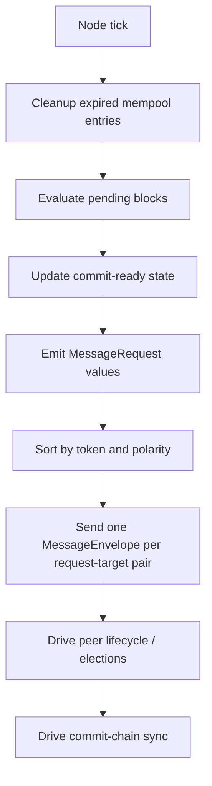
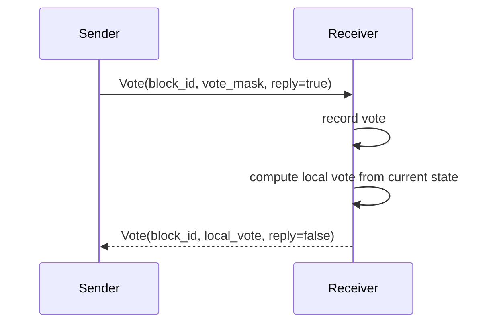
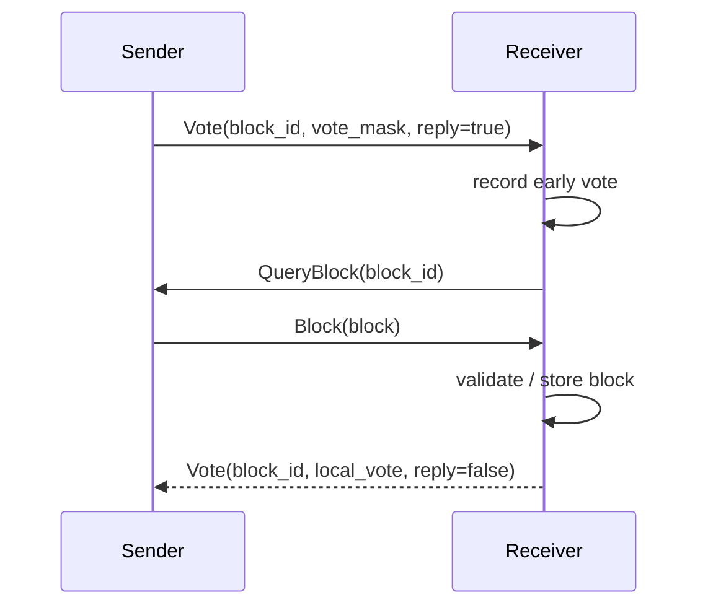
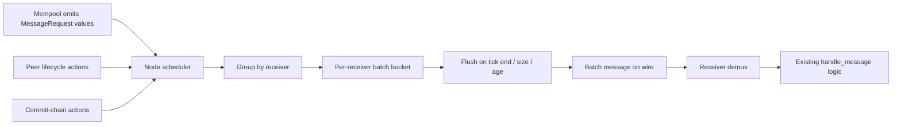

# Vote Flow And Batching

This note captures two things:

1. how voting and block propagation work in the current implementation
2. what the recent simulator experiments suggest about batching

The intent is to keep the current protocol understandable before we change transport shape.

## Scope

This document describes the current behavior in:

- [`src/ec_interface.rs`](../src/ec_interface.rs)
- [`src/ec_node.rs`](../src/ec_node.rs)
- [`src/ec_mempool.rs`](../src/ec_mempool.rs)
- [`src/ec_peers.rs`](../src/ec_peers.rs)

And it summarizes the recent simulator findings in:

- [`simulator/DELAYED_VOTE_REPLY_REPORT.md`](../simulator/DELAYED_VOTE_REPLY_REPORT.md)
- [`simulator/PREFER_UNHEARD_TARGETS_REPORT.md`](../simulator/PREFER_UNHEARD_TARGETS_REPORT.md)
- [`simulator/VOTE_TARGET_COUNT_REPORT.md`](../simulator/VOTE_TARGET_COUNT_REPORT.md)
- [`simulator/LONG_RUN_PROFILE_COMPARISON.md`](../simulator/LONG_RUN_PROFILE_COMPARISON.md)

## Current Message Surface

Today the protocol uses single-message `MessageEnvelope`s carrying one `Message` each.

Relevant message types are defined in [`src/ec_interface.rs`](../src/ec_interface.rs):

- `Vote { block_id, vote, reply }`
- `QueryBlock { block_id, target, ticket }`
- `QueryToken { token_id, target, ticket }`
- `Answer { answer, signature, head_of_chain }`
- `Block { block }`
- `Referral { token, high, low }`

There is also an unused batching sketch already present:

- `RequestMessage`
- `Message2::Requests`

That is a useful reminder that batching was already expected, but the current live path still uses
single-message envelopes.

## What A Vote Means Today

The current semantics are:

- a `Vote` is both a vote and optionally a request for a vote back
- `reply = true` means "if you can evaluate this block, send me your current vote"
- `reply = false` means "this is my answer; do not bounce it back again"

This is implemented in [`src/ec_node.rs`](../src/ec_node.rs):

- pending known block + trusted sender:
  - record the vote
  - if `reply = true` and the block is known locally, answer immediately with local vote
- committed block:
  - answer positive if `reply = true`
- blocked block:
  - answer negative if `reply = true`
- unknown block + trusted sender:
  - record the early vote
  - request the block from that same sender
- useful block arrives later:
  - compute local vote
  - send one delayed vote reply to all early voters with `reply = false`

That last piece is the recently-added "delayed vote reply" improvement.

## Current Send-Side Tick

Each node tick currently does this:



The important detail is that the mempool emits logical message requests, but the node currently
materializes them immediately into one envelope per `(request, receiver)` pair.

This happens in [`src/ec_mempool.rs`](../src/ec_mempool.rs) and
[`src/ec_node.rs`](../src/ec_node.rs).

## Current Commit Rule

For each pending block:

- token votes are counted only from peers in the token's peer range
- witness votes are counted from peers in the block-id witness range
- each token bit and the witness bit remain in `remaining` until their balance exceeds
  `VOTE_THRESHOLD`
- commit happens only when:
  - `remaining == 0`
  - `validate == 0`

In the current implementation:

- `VOTE_THRESHOLD = 2`
- so useful settlement usually needs more than one inbound response wave

This is one reason repeated vote traffic exists even on a perfect network.

## Current Receive-Side Flow

### 1. Normal fast path: receiver already knows the block



### 2. Fetch-before-reply path: receiver does not know the block yet



This second path is where the delayed vote-reply change helped.

### 3. Block query / referral path

If a node does not have a requested block:

- untrusted requester:
  - send `Referral`
- trusted requester:
  - usually forward the `QueryBlock`
  - otherwise send `Referral`

That means transaction traffic and discovery/routing traffic are already mixed in the same
envelope stream.

## Why The Current Path Gets Expensive

The main structural reason is simple:

- the mempool reevaluates pending blocks every tick
- unresolved token bits emit `MessageRequest::Vote`
- unresolved witness emits another `MessageRequest::Vote`
- each request is expanded to one envelope per selected peer

So cost grows with:

- number of pending blocks
- unresolved token bits per block
- unresolved witness bits
- number of vote targets
- number of ticks the block stays unresolved

This is why late-stage runs can still be expensive even when the network itself is not especially
slow.

## What The Recent Experiments Say

### Delayed vote reply is good

The delayed reply path was a clear win.

From [`simulator/DELAYED_VOTE_REPLY_REPORT.md`](../simulator/DELAYED_VOTE_REPLY_REPORT.md):

- `cross_dc_normal`
  - delivered messages: `52.6M -> 42.1M`
  - avg commit latency: `37.9 -> 28.7` rounds
  - p95 commit latency: `193 -> 106` rounds
- `cross_dc_stressed`
  - delivered messages: `64.9M -> 59.5M`
  - avg commit latency: `56.9 -> 50.0` rounds
  - p95 commit latency: `272 -> 217` rounds

Conclusion:

- keep it

### Prefer-unheard target ordering is bad

The "prefer peers we have not yet heard from" heuristic looked attractive, but it regressed.

From [`simulator/PREFER_UNHEARD_TARGETS_REPORT.md`](../simulator/PREFER_UNHEARD_TARGETS_REPORT.md):

- `cross_dc_normal`
  - delivered messages: `42.1M -> 54.7M`
  - avg commit latency: `28.7 -> 40.2`
- `cross_dc_stressed`
  - delivered messages: `59.5M -> 60.9M`
  - avg commit latency: `50.0 -> 55.9`

Likely reason:

- "already heard from" is not the same as "not useful"
- those peers often become the best fast-reply candidates once they have the block

Conclusion:

- do not keep this heuristic

### More vote targets help only when brute force is affordable

From [`simulator/VOTE_TARGET_COUNT_REPORT.md`](../simulator/VOTE_TARGET_COUNT_REPORT.md):

- `3` targets did not help enough in long runs
- `4` targets improved shorter-run latency but raised traffic a lot

Conclusion:

- wider fanout can buy latency
- it probably only becomes attractive once batching lowers the transport cost

### Perfect network still has high overhead

From [`simulator/LONG_RUN_PROFILE_COMPARISON.md`](../simulator/LONG_RUN_PROFILE_COMPARISON.md):

- even `perfect` network runs still sit far above the ideal message lower bound

Conclusion:

- the main remaining problem is protocol/message amplification
- not just WAN delay

## Good News For Batching

The experiments also tell us something positive:

- we do not need extremely rigid target pinning to make progress
- but we also should not overfit to "unheard-from" status

That suggests a batcher can have some freedom to reuse nearby receivers when that reduces transport
cost, as long as it stays within the same local routing neighborhood and does not systematically
avoid fast responders.

## Batching Goals

The first batching design should try to reduce transport cost without changing vote semantics.

That means:

- same voting rules
- same threshold rules
- same delayed reply behavior
- same nearby routing logic
- fewer wire-level envelopes

So the first batching question should be:

> Can we send the same logical work in fewer network frames?

## Recommended First Batching Shape

### Principle

Batch by receiver, not by transaction.

Reason:

- current cost is dominated by many small request-like messages
- transactions overlap in receiver neighborhoods
- batching by receiver lets multiple in-flight transactions travel together

### First candidate

Introduce a transport-level batch message containing multiple request-like items for one receiver.

Conceptually:

```text
BatchEnvelope {
  sender,
  receiver,
  items: [
    VoteRequest(...),
    VoteRequest(...),
    QueryBlock(...),
    QueryToken(...),
    ReferralHint(...),
  ]
}
```

The receiver then demultiplexes each item into the existing handlers.

### Why this is the safest first step

It keeps semantics close to current behavior:

- batching changes transport shape
- not the core consensus rules
- not the proof-of-storage logic
- not the commit rule

That makes simulator results easier to interpret.

## Recommended Transport Layers

### Phase 1: request batching only

Batch these first:

- `Vote`
- `QueryBlock`
- `QueryToken`

Leave these standalone for the first experiment:

- `Block`
- `Answer`
- `CommitBlock`

Reason:

- request-like messages dominate count
- `Block` and `Answer` are larger and more stateful
- batching large payloads and request bursts at the same time makes the first experiment harder to
  reason about

### Phase 2: piggyback fast replies

Once Phase 1 is working:

- allow immediate/delayed `Vote(reply=false)` responses to join the same outbound batch if a batch
  to that receiver is already open in the current tick

### Phase 3: consider large-payload piggybacking

Only after we understand the first two phases:

- piggyback `QueryBlock` with a `Vote` batch
- possibly piggyback small `Referral` hints
- keep `Block` and `Answer` special unless a size-aware framing rule is added

## Suggested Batching Architecture



The important design choice is that batching belongs in a scheduler/outbox layer, not inside the
mempool or the peer manager.

That matches the TODO already present in [`src/ec_node.rs`](../src/ec_node.rs):

- move tick scheduling into an orchestrator
- collect multi-messages
- allow overlapping transactions to share outbound work

## Receiver-Side Rule

Receiver-side batching should be semantic-preserving:

- unpack each submessage
- process them in stable order
- produce the same logical effects as if the single messages had arrived in that order

This matters because otherwise batching changes both transport and semantics at the same time.

## A Practical Flush Policy

The first simulator implementation should use a simple flush rule:

- one open batch per `(sender, receiver)` per tick
- append all request-like items generated during the tick
- flush at end of tick

Optional later refinements:

- flush earlier on item count threshold
- flush earlier on byte-size threshold
- keep a short carry-over window across ticks

The end-of-tick flush is easiest to reason about and easiest to compare against today's behavior.

## Metrics To Add For Batching

The existing metrics are good, but batching needs a few extra ones:

- logical submessages sent
- wire batches sent
- average items per batch
- p50 / p95 items per batch
- batch fill ratio by receiver
- fraction of votes sent inside a batch
- fraction of `QueryBlock` requests piggybacked into an existing batch

The main outcome metrics should stay the same:

- commit latency p50 / p95
- delivered wire messages
- peak in-flight queue
- block-message factor vs ideal
- committed vs pending blocks

## First Experiment To Run

The first clean batching experiment should be:

1. keep current vote target selection
2. keep current delayed vote reply behavior
3. batch only request-like traffic per receiver per tick
4. leave `Block` and `Answer` standalone
5. rerun the existing fixed-seed `1600`-round normal and stressed scenarios

That isolates batching itself.

## Second Experiment To Run

If the first batching step works:

1. repeat the `4`-target short-run test with batching enabled
2. compare against unbatched `2` targets and unbatched `4` targets

That tells us whether batching unlocks the "more fanout, still acceptable cost" regime.

## Design Guidance So Far

At this point the safest conclusions are:

- keep delayed vote replies
- do not keep unheard-first targeting
- do not spend more time on target heuristics before batching
- make the first batching step semantic-preserving and receiver-oriented
- measure batching against the same long-run baselines already in the repo

## Open Questions

These are still open after the current experiments:

1. Should batching be a new `Message::Batch`, or should the dormant `Message2` path be evolved?
2. Should request ordering inside a batch preserve generation order or use a canonical order?
3. Should vote replies share the same batch lane as ordinary vote requests, or remain immediate?
4. How much receiver reuse is safe before batching starts changing effective routing behavior?

My current recommendation:

- add a dedicated batch message rather than forcing the current `Message2` sketch to fit
- keep submessage ordering stable and simple
- batch requests first, replies second
- evaluate routing drift explicitly in the simulator
