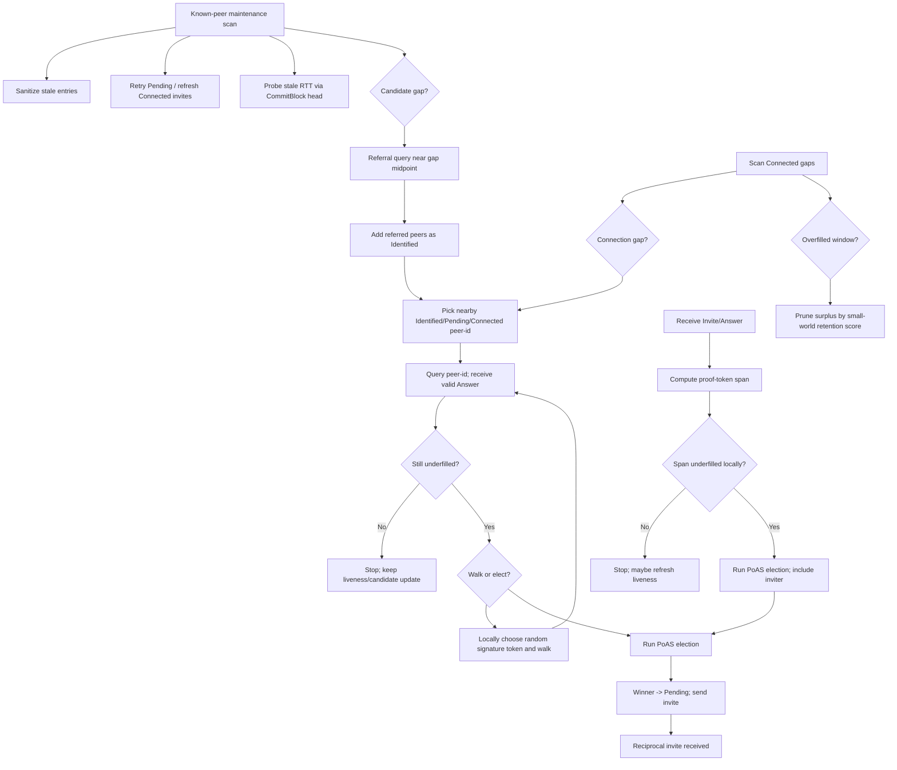
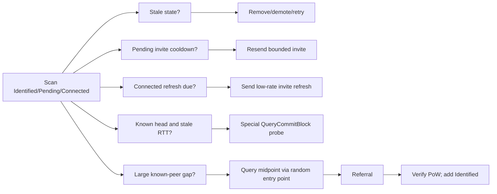
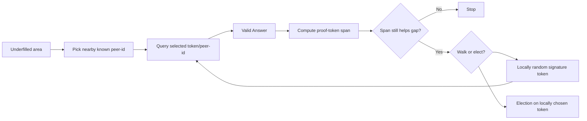
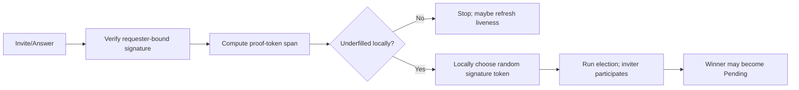
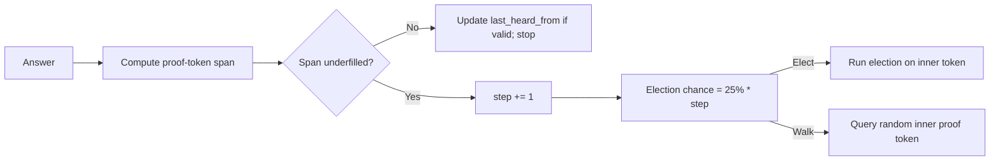
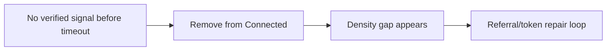

# Peer Lifecycle Structure

## Protocol Goal

Build and maintain an election-gated peer set that moves toward the node's optimal local view: dense near the node, fading outward, with enough useful remote coverage to avoid isolated islands and enough probabilistic selection that outsiders cannot exactly predict another node's active peer set. Discovery may find candidates, but only proof-of-storage election winners should become trusted connected peers outside explicit simulator/bootstrap setup paths.

This note is a candidate simplification of the current `ec_peers.rs` lifecycle. It should be tested against the existing implementation and simulators before replacing current strategies.

## Core Model

The lifecycle has two local repair layers:

1. **Known-peer maintenance** keeps the address book fresh, retries relationship state, probes peer quality, and uses referrals to learn peer IDs in underfilled areas.
2. **Connected repair** uses valid `Answer` material to decide whether to walk, elect, or stop.

Invite handling is separate from node-initiated connection-building. Invites are inbound pressure to form reciprocal connections; node-initiated walks are local repair work driven by gaps the node sees in its own peer set.

Small-world logic is primarily a retention/pruning objective. When an area is underfilled, accept any valid election-gated connection available. When an area is slightly overfilled, pruning shapes the peer set. The current target-shape evidence is summarized in [peer-shape-target.md](peer-shape-target.md).

## Density Scan Model

Both repair layers use the same gap primitive. Scan the sorted peer array, select the relevant peer states, and emit the raw clockwise gaps between matching peers.

```text
gap = { left_peer, right_peer, midpoint, width }
```

The lifecycle core should not decide repair/prune policy. A caller can compare raw gap width with a target-gap function, rank gaps, and cap work per tick. Keeping that policy outside the peer collection avoids hiding too many knobs inside the storage/indexing layer.

The target-gap function should be evidence-driven. Current reports warn against three false targets: nearest-neighbor-only sets, flat far tails optimized only for graph hop count, and degree targets that prune local-core holes into existence.

Layer 1 scans `Identified + Pending + Connected` for maintenance and treats selected large gaps as referral-search targets. Layer 2 scans only `Connected` and treats selected large gaps as token-walk/election targets. Small gaps are purge/prune candidates for the matching layer.

The candidate `ec_peer_lifecycle_v2.rs` API uses a minimum-state convention to keep callers simple:

- `Identified` means all known peers: `Identified + Pending + Connected`
- `Pending` means active entry points: `Pending + Connected`
- `Connected` means election-gated voting/routing peers only

That convention is used by `peers_around`, `span_around`, `scan_gaps`, and `count_in_span`.



## Known-Peer Maintenance Scan

The known-peer scan is not an election mechanism. It maintains the address book and relationship freshness while discovering more peer IDs.

It scans `Identified + Pending + Connected` in sorted order and may produce four bounded kinds of work:

1. **Sanitize stale entries**
   `Identified` entries can expire, `Pending` entries can demote or retry, and stale `Connected` peers can leave the connected set so the connected-gap scan sees the damage.
2. **Retry or refresh invites**
   `Pending` peers may receive retry invites after a cooldown. `Connected` peers may receive occasional low-rate refresh invites. Invite replies from `Connected` peers can fast-track liveness refresh; `Pending` invite handling must avoid unbounded ping-pong.
3. **Probe comparable RTT**
   If a peer has a commit-chain probe cursor and its quality signal is missing or stale, send a special `QueryCommitBlock(cursor)` probe and record `sent_at`. A matching `CommitBlock` response updates RTT quality and `last_heard_from`, then advances the cursor to the returned block's `previous` id so repeated probes walk the peer's history instead of hammering one head. This probe must use a ticket that cannot be confused with normal chain tracking.
4. **Discover peer IDs by referral**
   For a selected known-peer gap, query a midpoint-ish token through a random entry point, preferably `Pending` or `Connected`. The midpoint is unlikely to be a real token, so the expected useful response is a `Referral`. Verify referred identity/PoW before adding peers as `Identified`.



Token walks do not belong in this scan. They belong to the `Connected` repair scan.

## Peer State Transitions

```mermaid
stateDiagram-v2
    [*] --> Unknown
    Unknown --> Identified: valid referral / known candidate
    Identified --> Pending: wins local election; invite sent
    Pending --> Connected: reciprocal invite received
    Connected --> Identified: stale / pruned / churn
    Pending --> Identified: pending timeout

    note right of Connected
      Connected peers are usable for voting/routing.
      Normal path requires election success.
    end note
```



## Connected Repair Token Walks

Node-initiated connection repair starts from `Connected` density observations. When a connected area is underfilled, the node may choose any `Identified`, `Pending`, or `Connected` peer-id near that area as the first query target. This avoids maintaining a shadow token set and avoids assuming the local token store already has relevant tokens in the damaged area.



The same query/walk mechanism can form the basis of client-library peer discovery after a client has learned entry points. A client can learn peer knowledge without having a local token store. A client simply does not promote peers to `Connected`; node connectivity still requires proof-of-storage elections and reciprocal connection handling.

## Invite Handling

Invites are inbound connection pressure. They should be favored enough that reciprocal connections can form, but they must not let an outsider dictate the local peer set.

On a valid invite/answer:

1. verify the answer/signature for this requester
2. compute the proof-token span
3. if the span is not locally underfilled, stop and possibly refresh liveness
4. if the span is locally underfilled, start an election on a locally chosen signature token
5. include the inviting peer as a participant/source, but do not admit it directly



The inviter does not automatically win. The local proof-of-storage election still decides.

## Answer And Token Safety

`Message::Answer` contains one `answer: TokenMapping` plus ten proof token mappings. The signature proof model returns five matching tokens above the query target and five below it. The answer-covered area is the span from the high-side proof token to the low-side proof token.

The signature set is bound to the requester:

```text
signature_chunks = Blake3(requesting_peer_id || token || block)
```

An answer prepared for one peer cannot be replayed as a valid answer to another peer. However, a responder may still reveal candidate tokens through its answer. The receiver must retain local control over whether the area is underfilled and which revealed token becomes a walk/election challenge.

To reduce drift, token search may ignore outermost proof tokens and choose walk/election tokens from an inner subset.



Design invariant:

> A responder may reveal candidate tokens, but must not decide which candidate becomes the election challenge.

## Liveness And Churn

Any verified useful response may refresh `last_heard_from`: invite, answer on a recognized ticket, referral on a recognized ticket, block response, or commit-chain response.

`Answer` messages carry the sender's `head_of_chain` when available. Requested answers are the normal source for updating a peer's known head and resetting/refreshing its commit-chain probe cursor. Invite answers may seed the cursor only if the peer has no known head yet; otherwise they should not constantly overwrite the cursor, because that would keep probes near the newest head and lose the history-walk behavior.

The peer lifecycle may use a special `QueryCommitBlock(cursor)` probe to measure comparable request/response quality. A successful matching `CommitBlock` response refreshes liveness, updates peer RTT quality, and advances the cursor to `block.previous`; a timeout is a weak quality signal, not immediate proof of dishonesty.

Stale connected peers are removed from the voting/routing set before density is measured. Churn repair then becomes ordinary gap repair.



## Pruning And Small-World Shape

Pruning should only act on surplus. Hard protections come before scoring:

1. protect underfilled areas
2. protect required remote/far weak ties
3. score only peers in overfilled windows or over-budget regions

Primary retention signal: topology distance and contribution to local clustering/fade shape.

Secondary signals: commit-chain probe RTT/quality and liveness freshness among otherwise topology-equivalent peers.

Final tie-breaker: deterministic hash distance among otherwise equivalent peers, so dense regions form stable hierarchy rather than arbitrary churn.

## Next Tests

### 1. Bootstrap Formation

Objective: verify that a node starting with a few entry points can learn candidates across the spectrum and convert underfilled areas into election-gated `Connected` peers.

Run shape:

```bash
EC_PEER_LIFECYCLE_BOOTSTRAP_PEERS=6 \
EC_PEER_LIFECYCLE_INITIAL_PEERS=96 \
EC_PEER_LIFECYCLE_ROUNDS=240 \
cargo run --release --quiet --example peer_lifecycle_sim
```

Measure:

- `Identified` growth by density window
- normalized largest gap over time
- core, fade, and remote/cell coverage against the target-shape policy
- referral queries started from known-peer gaps
- referrals accepted after identity/PoW validation
- elections started from answer-covered underfilled areas
- `Pending -> Connected` success rate
- final target fit and peer-set unpredictability inside eligible bands
- repair messages per normalized-gap improvement

Pass direction:

- largest gaps shrink over time
- candidates appear near previously empty spans
- connected density improves without broad message growth

### 2. Churn And Stall Repair

Objective: verify that leaves, crashes, and stale peers create measured gaps and that the same repair loop fills them.

Run shape:

```bash
EC_LONG_RUN_ROUNDS=600 \
EC_LONG_RUN_NETWORK_PROFILE=cross_dc_normal \
EC_LONG_RUN_EXISTING_TOKEN_FRACTION=0.5 \
cargo run --release --quiet --example integrated_long_run
```

Measure:

- stale/demoted connected peers per event
- gap created by each demotion/crash wave
- time to restore density windows
- local-core holes after each churn wave
- invite refreshes and `last_heard_from` updates
- pending invite retries and connected invite refreshes
- commit-chain RTT probes sent, answered, and timed out
- pending timeout rate
- transaction p50/p95 before, during, and after churn

Pass direction:

- stale peers leave `Connected` before they distort routing
- repair targets the damaged windows
- recovery does not require over-broad permanent connectivity

### 3. Steady-State Message Discipline

Objective: verify that when the peer set is mostly healthy, maintenance does not cause message explosion.

Run shape:

```bash
EC_LONG_RUN_ROUNDS=600 \
EC_LONG_RUN_JOIN_COUNT=0 \
EC_LONG_RUN_CRASH_COUNT=0 \
EC_LONG_RUN_RETURN_COUNT=0 \
EC_LONG_RUN_SECOND_JOIN_COUNT=0 \
EC_LONG_RUN_SECOND_CRASH_COUNT=0 \
EC_LONG_RUN_EXISTING_TOKEN_FRACTION=0.5 \
cargo run --release --quiet --example integrated_long_run
```

Measure:

- maintenance queries per round
- invite refreshes per round
- commit-chain RTT probes per round
- election starts per round
- probe stops because covered area is filled
- first-stage distance reduction toward role-covering peers
- time to first covering-neighborhood contact
- total wire messages per committed block
- p50/p95 transaction latency

Pass direction:

- healthy regions stop generating work
- message rate stays bounded
- no growing queue when topology is already near target

## Python Simulator?

A Python simulator may help explore pure density-scan math, but it should not be the next main step. The risk is producing a clean toy model that skips the real hard parts: referrals, answer spans, pending reciprocity, liveness refresh, pruning, and simulator message pressure.

Preferred next move:

1. Add focused unit tests around density scanning, known-peer maintenance work, answer-covered spans, invite-triggered elections, connected-repair token walks, and pruning protections.
2. Add metrics to the existing Rust simulators.
3. Implement the candidate lifecycle behind a config flag in `ec_peers.rs`.
4. Compare bootstrap, churn, and steady-state runs against the current implementation.

Use Python only if the target-gap or pruning-score function is unclear after the first Rust tests.

## Known Gaps

- Define and validate a target-gap/ranking policy outside the core peer collection, using [peer-shape-target.md](peer-shape-target.md) as the evidence map.
- Exact inner proof-token subset and local-random selection rule for walk/election selection.
- Invite-triggered election rate limits by sender/span.
- Pending invite retry and Connected invite refresh cooldowns.
- Commit-chain RTT probe ticket separation from normal chain tracking.
- Deterministic hash-distance tie-breaker definition.
- Metrics for known-peer referral queries, answer-covered spans, invite-triggered elections, RTT probes, and repair efficiency.

## Primary Files

- [src/ec_peers.rs](../../src/ec_peers.rs)
- [src/ec_proof_of_storage.rs](../../src/ec_proof_of_storage.rs)
- [src/ec_interface.rs](../../src/ec_interface.rs)
- [Design/signature_proof_of_storage.py](../../Design/signature_proof_of_storage.py)
- [simulator/peer_lifecycle/](../../simulator/peer_lifecycle)
- [simulator/integrated/](../../simulator/integrated)

## Agent Notes

- Keep proof-of-storage election winner logic in `ec_proof_of_storage.rs`.
- Keep ticket purpose opaque on the wire.
- Keep invite handling separate from node-initiated repair; the inviter may participate in an election, but local density and local randomness choose whether and where to elect.
- Treat this as a candidate simplification to test, not a mandate to delete current strategies.
