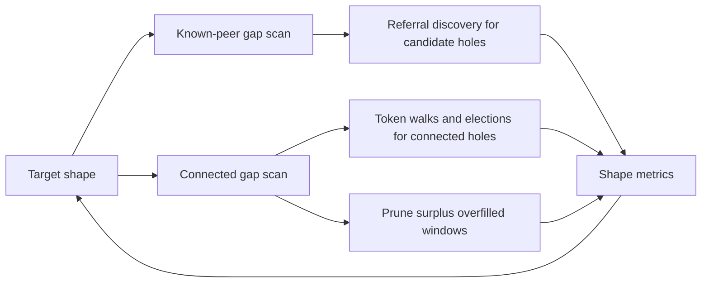

# Peer Shape Target

## Protocol Goal

Maintain an active peer set that routes work quickly toward covering nodes while staying safe under open membership. The peer-shape goal serves the project-level objective from [protocol-pillars.md](../protocol-pillars.md): commit at human timescale in an open, global network without relying on a fixed global validator set.

- dense local coverage around the node's peer id
- a controlled fade outward from the local core
- sparse, useful remote coverage so routing does not depend on a single local island
- enough local randomness that outsiders cannot exactly predict another node's active peer set
- bounded message load under steady state, bootstrap, and churn
- routing and commit-flow behavior that keeps base-layer settlement interactive rather than blockchain-like slow finality

The target is not "few peers everywhere" and not "nearest peers only". It is also not a flat graph optimized only for shortest-path hop count. The current working target is a steep, locally dense shape with selective fade/remote coverage and probabilistic retention inside eligible bands.

## Current Status

Recorded simulator evidence points in two directions that must be held together:

1. Steep locality keeps message cost manageable.
2. Too-thin or poorly filled peer sets hurt latency, repair, and conflict convergence.

The candidate lifecycle in [peer-lifecycle-structure.md](peer-lifecycle-structure.md) should therefore use gap scanners to form and preserve a target shape rather than only controlling total degree. A connected set with the right average size can still be wrong if the local core has holes, the fade band is thin, or all surplus peers are far away.

## Current Decisions

- Treat p95 `4-6` rounds as the proof-of-potential formed-graph latency band, based on fixed dense-linear clean-extension and conflict-lineage reports.
- Treat p95 `10-13` rounds as the current formed corrected-ring reference band.
- Treat p95 `35+` rounds, growing pending work, or large block-message factors as repair signals, not as acceptable peer-shape targets.
- Judge peer-shape changes by latency, pending work, wire messages, block-message factor, and routing progress before treating graph-shape fit as success.
- Keep the differentiator explicit: peer lifecycle and commit flow must support human-timescale base-layer commit in an open network; otherwise the project loses the property that sets it apart from ledger systems that rely on global gossip, fixed committees, or second-layer latency.
- Keep scanner policy outside the sorted peer collection: the collection should expose raw gaps and local accessors; target-gap/ranking policy should remain explicit and testable.
- Keep invite-triggered elections separate from node-initiated connection repair.
- Maintain `agent-docs/` as the current synthesis of findings and decisions; older `Design/`, `docs/`, and simulator reports remain source material, not the first place to look for the current interpretation.

## Evidence Map

| Source | Useful finding | Implication |
| --- | --- | --- |
| [Design/viability_assessment.md](../../Design/viability_assessment.md) | The next evidence bar is a churn/bootstrap baseline that forms something close to the good fixed-network graph. | Peer lifecycle is a viability gate, not cleanup work. |
| [Design/small-world.md](../../Design/small-world.md) | Small-world theory supports high local clustering plus a small number of long-range weak ties; later two-cell runs favored dense local cells plus a small quota of cross-cell links. | Keep local density high, but do not treat the remote region as one undifferentiated tail forever. |
| [docs/peer_election_design.md](../../docs/peer_election_design.md) | Current notes describe dense local core, linear fade, and small far-tail probability as the fixed-network target, with later cell-aware pruning as a likely improvement. | Elections decide admission; lifecycle/scanners decide where pressure is needed. |
| [simulator/RING_TOPOLOGY_CORRECTION_REPORT.md](../../simulator/RING_TOPOLOGY_CORRECTION_REPORT.md) | Corrected ring means guaranteed local neighbors plus a linear fade to zero, not the older hard nearest-neighbor ring. | Older sparse-ring readings should not be used as the target. |
| [simulator/DENSE_LINEAR_TOPOLOGY_REPORT.md](../../simulator/DENSE_LINEAR_TOPOLOGY_REPORT.md) | Dense linear topology improved early vote localization and conflict outcomes, but worsened no-conflict latency/message cost in that Rust path. | Dense/far coverage can help routing and conflict visibility, but must be paired with narrower vote/commit flow. |
| [simulator/CORE_TAIL_TOPOLOGY_REPORT.md](../../simulator/CORE_TAIL_TOPOLOGY_REPORT.md) | A flat tail reduced graph route depth from about 28 hops to about 3, but worsened commit latency and message cost. | Plain BFS hop count is not enough; measure protocol-stage routing progress. |
| [simulator/PEER_SET_SHAPE_ILLUSTRATIONS.md](../../simulator/PEER_SET_SHAPE_ILLUSTRATIONS.md) | Corrected ring is intentionally sharply local; core+tail and broad probabilistic shapes were more expensive. | The local core should stay protected, and remote links should be sparse/useful. |
| [simulator/PEER_LIFECYCLE_GRAPH_SHAPE_REPORT.md](../../simulator/PEER_LIFECYCLE_GRAPH_SHAPE_REPORT.md) | Discovery can reach the graph, but integrated random referral probing was expensive; core `20` was better than core `10` in a small sweep. | Gap repair must be targeted and pressure-aware, not fixed per-tick exploration. |
| [simulator/CHURN_GRAPH_CONTROL_REPORT.md](../../simulator/CHURN_GRAPH_CONTROL_REPORT.md) | Pure degree control improved target fit but hurt latency; core-preserving pruning gave the best graph-control operating point so far. | Prune surplus far/fade peers without punching local-core holes. |
| [simulator/GRADIENT_PROFILE_COMPARISON.md](../../simulator/GRADIENT_PROFILE_COMPARISON.md) | Churn runs stayed live by over-connecting and flattening the graph. | The problem is not only finding peers; it is converging back to the intended shape after shocks. |

## Candidate Good State

A good peer set should be judged by several metrics together:

- **Core coverage**: high probability of connected peers in the nearest rank band around `own_peer_id`.
- **Fade coverage**: nonzero, decreasing coverage outside the core; no large holes in the useful fade band.
- **Remote/cell coverage**: sparse coverage of remote locations/cells, enough to avoid isolated islands and improve routing convergence.
- **Gap pressure**: largest known-peer and connected gaps should shrink toward the target gap for that rank/distance band.
- **Routing progress**: query/transaction stages should move closer to role-covering nodes quickly, measured by rank-distance reduction or first-stage contact with covering neighborhoods, not only graph BFS hops.
- **Cost envelope**: latency, pending work, wire messages, and block-message factor must stay near the best fixed-network envelope.
- **Unpredictability**: peers inside eligible shape bands should be selected probabilistically and with local signals, not by a fully deterministic nearest-neighbor rule.

The scanner target can be visualized as pressure rather than a fixed set:



## Current Smoke Check

On 2026-06-19, a short current-code fixed-network smoke matrix was run with:

```bash
EC_STEADY_STATE_ROUNDS=80 \
EC_STEADY_STATE_INITIAL_PEERS=192 \
EC_STEADY_STATE_TOTAL_TOKENS=250000 \
EC_STEADY_STATE_NETWORK_PROFILE=cross_dc_normal \
EC_STEADY_STATE_NEIGHBORHOOD_WIDTH=6 \
EC_STEADY_STATE_BLOCKS_PER_ROUND=2 \
EC_STEADY_STATE_EXISTING_TOKEN_FRACTION=0.5 \
cargo run --release --quiet --example integrated_steady_state
```

Only `EC_STEADY_STATE_TOPOLOGY` and its topology-specific parameters changed.

| Topology | Active connected | Shape signal | Max route hops | Commits / pending | p95 latency | Wire messages | Block-message factor |
| --- | ---: | --- | ---: | ---: | ---: | ---: | ---: |
| corrected ring | `23.0` | corrected-ring fit `0.973`, far `0.000` | `4.9 / p95 7` | `123 / 37` | `11` | `222k` | `4.75x` |
| core+tail | `31.0` | corrected-ring fit `0.931`, far `0.050` | `1.4 / p95 2` | `104 / 56` | `7` | `315k` | `8.97x` |
| dense linear | `114.3` | dense-linear fit `0.630`, far `0.520` | `1.0 / p95 1` | `125 / 35` | `20` | `180k` | `7.82x` |

Read this as a smoke check, not a final benchmark. It reinforces two points from the longer reports:

- shorter graph paths alone do not define the target; core+tail dramatically reduced route hops but increased spread and message cost
- dense-linear coverage can shrink the reachable vote graph and wire traffic, but this short run still paid higher p95 latency and block-message factor than corrected ring

The missing metric is still protocol-shaped routing progress: how quickly each stage moves toward a role-covering neighborhood.

## Latency Envelope Interpretation

The recorded reports use different workloads, so their latency numbers should not be averaged together.

The strongest target evidence is the formed fixed-network branch:

- [FIXED_NETWORK_EXTENSION_STEADY_REPORT.md](../../simulator/FIXED_NETWORK_EXTENSION_STEADY_REPORT.md): `2000` peers, fixed dense-linear graph, continuous clean-chain extension, avg `2.7`, p50 `2`, p95 `5`; clean extensions alone were avg `2.5`, p95 `4`.
- [FIXED_NETWORK_CONFLICT_LINEAGE_REPORT.md](../../simulator/FIXED_NETWORK_CONFLICT_LINEAGE_REPORT.md): `2000` peers, fixed dense-linear graph, `30%` conflict families, overall avg `4.3`, p50 `3`, p95 `5`.
- [RING_TOPOLOGY_CORRECTION_REPORT.md](../../simulator/RING_TOPOLOGY_CORRECTION_REPORT.md): corrected ring-gradient fixed network, avg around `9.5`, p95 `11` on both no-conflict and conflict reruns.
- [GRADIENT_PROFILE_COMPARISON.md](../../simulator/GRADIENT_PROFILE_COMPARISON.md): corrected ring steady-state target for the churn comparison was around avg `10.3`, p95 `13`.

Those numbers suggest two useful target bands:

- **excellent formed-graph target**: p95 around `4-6` rounds for dense-linear clean extension/conflict-lineage workloads
- **acceptable corrected-ring reference**: p95 around `10-13` rounds for the formed ring-gradient baseline

Much worse lifecycle numbers should be read as diagnostics, not as an acceptable peer-shape target:

- [INTEGRATED_CHURN_CONFLICT_REPORT.md](../../simulator/INTEGRATED_CHURN_CONFLICT_REPORT.md) explicitly says churn latency was still about `2x` the corrected steady-state ring and that the network healed by staying over-connected.
- [INTEGRATED_LONG_RUN_REPORT.md](../../simulator/INTEGRATED_LONG_RUN_REPORT.md) shows severe late-tail degradation in a stressed run; the report calls the system "interactive when healthy, but not yet predictably bounded under sustained stress".
- [PEER_LIFECYCLE_GRAPH_SHAPE_REPORT.md](../../simulator/PEER_LIFECYCLE_GRAPH_SHAPE_REPORT.md) has p95 values in the `39-76` range for several lifecycle/discovery variants; these are formation or scheduler failures to learn from, not target-state results.

The peer-shape objective crosses into commit flow because EC's reactive path depends on shape to make the first `InitialVote` wave land near role-covering neighborhoods. The relevant commit-flow model is in [Design/response_driven_commit_flow.md](../../Design/response_driven_commit_flow.md): vote requests seed inward toward host cores, host cores saturate, and committed state reflects outward along the interest trail. Therefore peer-shape tests should measure both:

- **routing slope**: rank-distance reduction from each `InitialVote`/`Vote` stage toward the relevant role coverers
- **long-tail overhead**: block-related messages, settled spread, pending work, and p95/p99 latency caused by transactions that fail to center quickly

In short: p95 `4-6` is the proof-of-potential band, p95 `10-13` is the current formed-ring reference, and p95 `35+` is a repair signal.

## Rerun Matrix

The simulator commands are documented in the reports linked below, but they answer different questions. Re-run selectively:

| Run | When to re-run | Command source | Target reading |
| --- | --- | --- | --- |
| **Quick fixed-topology smoke matrix** | After peer-shape, routing, or commit-flow edits that might change the basic envelope. | This note's "Current Smoke Check" command; run `ring`, `ring_core_tail`, and `ring_linear_probability`. | Confirms current code still shows the broad trade: graph hops alone are misleading, and latency/message cost must be read together. |
| **Fixed dense clean-extension reference** | After commit-flow, block repair, vote routing, batching, or fixed-topology changes. This is expensive; do not run for small docs/API edits. | [FIXED_NETWORK_EXTENSION_STEADY_REPORT.md](../../simulator/FIXED_NETWORK_EXTENSION_STEADY_REPORT.md) | Excellent formed-graph target: overall p95 around `5`; clean extensions p95 around `4`; block repair remains the main overhead. |
| **Fixed dense conflict-lineage reference** | After conflict handling, vote propagation, conflict metrics, or block-repair changes. | [FIXED_NETWORK_CONFLICT_LINEAGE_REPORT.md](../../simulator/FIXED_NETWORK_CONFLICT_LINEAGE_REPORT.md) | Excellent formed-graph conflict target: p95 around `5`, low lower-owner/multi-owner outcomes, winner visible through coverers. |
| **Corrected ring fixed reference** | After topology builder or steady-state routing changes; useful as the sparse formed-ring comparison. | [RING_TOPOLOGY_CORRECTION_REPORT.md](../../simulator/RING_TOPOLOGY_CORRECTION_REPORT.md) | Current formed-ring reference: p95 around `10-13`, avg connected around `23`, corrected-ring fit high. |
| **Core+tail routing check** | When considering far-tail or shortcut changes. | [CORE_TAIL_TOPOLOGY_REPORT.md](../../simulator/CORE_TAIL_TOPOLOGY_REPORT.md) | Should not be declared better just because route hops fall; require latency and block-message factor not to regress. |
| **Lifecycle shape formation** | After `EcPeers`, `ec_peer_lifecycle_v2`, referral discovery, invite handling, pruning, or gap-scan policy changes. | [PEER_LIFECYCLE_GRAPH_SHAPE_REPORT.md](../../simulator/PEER_LIFECYCLE_GRAPH_SHAPE_REPORT.md) | Diagnostic: core/fade/remote coverage should improve without fixed per-tick discovery pressure or p95 `35+` integrated tails. |
| **Churn graph-control reference** | After lifecycle/pruning changes that should heal through joins, crashes, returns, or stale peers. | [CHURN_GRAPH_CONTROL_REPORT.md](../../simulator/CHURN_GRAPH_CONTROL_REPORT.md) and [INTEGRATED_CHURN_CONFLICT_REPORT.md](../../simulator/INTEGRATED_CHURN_CONFLICT_REPORT.md) | Diagnostic: healing by permanent over-connection is not enough; target is recovery toward formed-reference latency and message envelope. |

For a fresh peer-shape implementation, the useful sequence is:

1. Run focused unit tests for sorted peer access, gap scans, liveness updates, and pruning candidate selection.
2. Run lifecycle-only formation/churn diagnostics.
3. Run the quick fixed-topology smoke matrix to ensure the baseline envelope still makes sense.
4. Run integrated churn only after the lifecycle diagnostics show real shape movement.
5. Re-run the `2000`-peer fixed dense references only after commit-flow or routing behavior changes enough that the proof-of-potential band might have moved.

## Scanner Steering

Known-peer gaps use all useful states: `Identified`, `Pending`, and `Connected`. A large known-peer gap means the node lacks candidates in that area. The repair action is a midpoint-ish referral query through an entry point, with referred identity/PoW validation before adding candidates.

Connected gaps use only `Connected` peers. A large connected gap means the node lacks election-gated routing/voting peers in that area. The repair action is a token walk from a nearby known peer id, followed by a density check on each `Answer` span before walking again or starting an election.

Overfilled windows are pruning candidates. Pruning should prefer removing peers that contribute least to the target shape, then use RTT/liveness and deterministic hash distance as tie-breakers. Local-core peers should be hard to prune while the core is underfilled.

Invite-triggered elections are separate. A valid invite in an underfilled local span can start an election on a locally chosen signature token with the inviter included as a participant. A valid invite in an already-filled span should refresh liveness at most.

## Efficient Verification Strategy

Fast iteration should separate topology mechanics from the full protocol:

- **Shape-policy unit tests**: deterministic peer-id arrays, gap scanning, target-gap comparison, prune candidate ranking, and probabilistic eligible-band selection.
- **Lifecycle-only simulator checks**: bootstrap from a few entry points, referral fill of known gaps, connected token-walk repair, churn waves, stale-peer eviction, and message counts per repaired gap.
- **Integrated sanity checks**: only after lifecycle mechanics move shape metrics in the right direction; compare latency, pending work, wire messages, block-message factor, and conflict outcomes.
- **Routing-progress probes**: add metrics for first-stage distance reduction toward role coverers and time to first covering-neighborhood contact.

The lifecycle-only layer can hold out expensive details such as full token commits and full commit-chain sync if it still preserves the relevant mechanics: identity distribution, referral validity, answer span density checks, election-gated promotion, invite reciprocity, and stale-peer removal. Full integrated runs remain necessary before claiming viability.

## Known Gaps

- Define the exact target-gap function over ring rank/distance for small, medium, and large deployments.
- Decide whether remote coverage should be one fade/tail curve, coarse location-cell quotas, or both.
- Add a protocol-shaped routing-progress metric; graph shortest path alone is misleading.
- Define an unpredictability metric, for example overlap/Jaccard of active peer sets across similarly placed nodes and entropy of selected peers inside eligible bands.
- Re-run a small, current simulator matrix with deterministic seeds to check which recorded results still match the current code.
- Connect scanner metrics to the candidate `ec_peer_lifecycle_v2.rs` API before replacing existing `EcPeers` behavior.

## Primary Files

- [src/ec_peers.rs](../../src/ec_peers.rs)
- [src/ec_peer_lifecycle_v2.rs](../../src/ec_peer_lifecycle_v2.rs)
- [simulator/peer_lifecycle/](../../simulator/peer_lifecycle)
- [simulator/integrated_steady_state.rs](../../simulator/integrated_steady_state.rs)

## Source Material

- [Design/viability_assessment.md](../../Design/viability_assessment.md)
- [Design/small-world.md](../../Design/small-world.md)
- [docs/peer_election_design.md](../../docs/peer_election_design.md)
- [simulator/PEER_LIFECYCLE_GRAPH_SHAPE_REPORT.md](../../simulator/PEER_LIFECYCLE_GRAPH_SHAPE_REPORT.md)
- [simulator/CHURN_GRAPH_CONTROL_REPORT.md](../../simulator/CHURN_GRAPH_CONTROL_REPORT.md)
- [simulator/CORE_TAIL_TOPOLOGY_REPORT.md](../../simulator/CORE_TAIL_TOPOLOGY_REPORT.md)
- [simulator/DENSE_LINEAR_TOPOLOGY_REPORT.md](../../simulator/DENSE_LINEAR_TOPOLOGY_REPORT.md)
- [simulator/PEER_SET_SHAPE_ILLUSTRATIONS.md](../../simulator/PEER_SET_SHAPE_ILLUSTRATIONS.md)

## Agent Notes

Do not optimize only for connected count, raw target fit, or graph hops. A useful shape must improve routing/settlement behavior inside the message-cost envelope and remain robust after churn.
