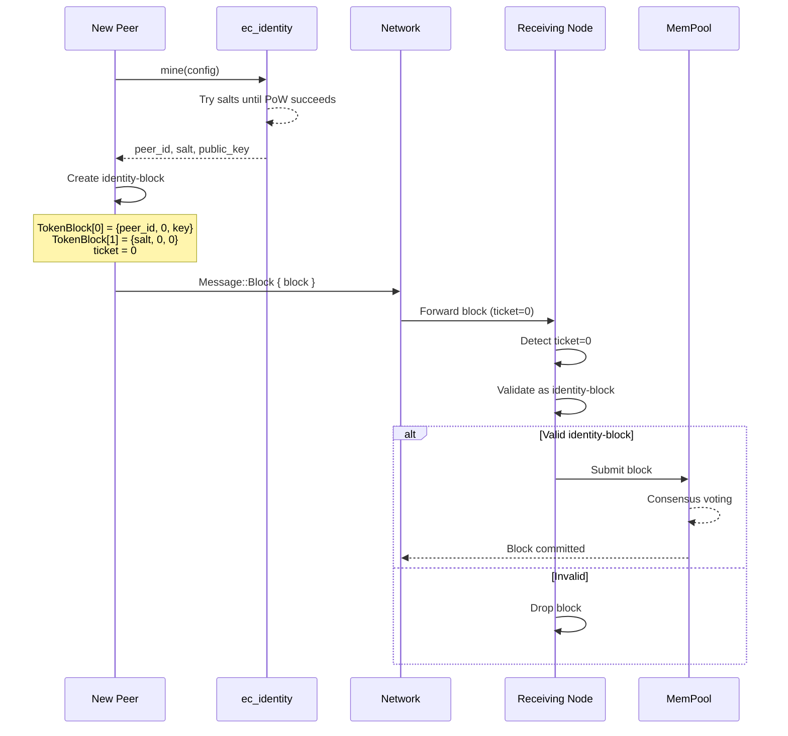

# Identity-Block Design

## Overview

The **identity-block** is a special block type that enables automated peer registration in the ecRust network. When a new peer completes identity mining (proof-of-work), it can broadcast its peer-id as a token without requiring pre-existing network participation or manual registration.

## Motivation

In the current system, tokens are created through normal block transactions that require valid tickets from subsystems (mempool or commit chain). However, new peers face a bootstrap problem:
- They need their peer-id registered as a token to participate
- But they can't create normal blocks without already being part of the network
- Manual registration breaks the automated, trustless design

The identity-block solves this by creating a special "zero-ticket" exception that allows self-registration after proof-of-work.

## Protocol Specification

### Message Flow



### Block Structure

An identity-block is a standard `Block` with special semantics:

```rust
Block {
    id: BlockId,              // Standard hash of block contents
    time: EcTime,             // Current time
    used: 2..=6,              // At least 2 tokens (peer-id + salt)
    parts: [
        // [0] Primary identity token
        TokenBlock {
            token: peer_id,   // The mined peer-id (Argon2 hash output)
            last: 0,          // Genesis (REQUIRED in production)
            key: public_key_hash,  // Blake3(Ed25519) public key (or 0 for non-updatable)
        },
        // [1] Proof-of-work salt
        TokenBlock {
            token: salt,      // 16-byte salt used in mining
            last: 0,          // Not a real token history
            key: public_key_hash,           // Blake3(Ed25519) public key (or 0 for non-updatable)
        },
        // [2..5] Optional future identity metadata
        TokenBlock { ... },   // Reserved for future use
    ],
    signatures: [None; 6],    // No signatures required
}
```

Sent via:
```rust
MessageEnvelope {
    sender: peer_id,
    receiver: network_peer,
    ticket: 0,                // Zero-ticket identifies identity-block
    time: current_time,
    message: Message::Block { block },
}
```

### Token Semantics

| Position | Token Field | Value | Meaning |
|----------|-------------|-------|---------|
| `parts[0].token` | peer-id | `[u8; 32]` | The mined address (Argon2 output) |
| `parts[0].last` | last | `0` | **Genesis requirement** - prevents updates without payment |
| `parts[0].key` | key | `PublicKey` or `0` | Blake3(Ed25519) public key for transfer (or 0 for non-updatable) |
| `parts[1].token` | salt | `[u8; 16]` (padded to token size) | Proof-of-work salt |
| `parts[1].last` | last | `0` | Metadata marker |
| `parts[1].key` | key | `PublicKey` or `0` | Blake3(Ed25519) public key for transfer (or 0 for non-updatable) |
| `parts[2..5]` | (any) | (any) | Reserved for future identity extensions |

## Validation Rules

### Test Mode Validation

Minimal validation for development:

```rust
fn validate_identity_block_test(block: &Block) -> bool {
    // 1. Must have at least 2 tokens
    if block.used < 2 {
        return false;
    }

    // 2. First token must equal sender's peer-id
    let claimed_peer_id = block.parts[0].token;
    // (sender peer-id would come from message envelope in future)

    // 3. That's it for testing!
    true
}
```

**Rationale**: Testing mode skips cryptographic validation to enable fast iteration without mining delays.

### Production Validation

Full cryptographic verification:

```rust
fn validate_identity_block_production(
    block: &Block,
    sender_public_key: &PublicKey,
    config: &AddressConfig
) -> bool {
    // 1. Must have at least 2 tokens (peer-id + salt)
    if block.used < 2 {
        log::warn("Identity-block rejected: insufficient tokens");
        return false;
    }

    // 2. Extract identity components
    let claimed_peer_id = block.parts[0].token;
    let salt = block.parts[1].token[..16];  // First 16 bytes

    // 3. GENESIS REQUIREMENT: Must be new peer-id
    if block.parts[0].last != 0 {
        log::warn("Identity-block rejected: not genesis (last != 0)");
        return false;
    }

    // 4. FAST-FAIL: Check trailing zeros BEFORE expensive Argon2
    // This prevents DoS via blocks with invalid difficulty
    if !check_difficulty(&claimed_peer_id, config.difficulty) {
        log::warn("Identity-block rejected: insufficient difficulty");
        return false;
    }

    // 5. PROOF-OF-WORK VALIDATION: Verify Argon2(public_key, salt) == peer_id
    // This is the expensive check (~5ms), only run after fast-fail above
    if !PeerIdentity::validate(
        sender_public_key,
        &salt,
        &claimed_peer_id,
        config
    ) {
        log::warn("Identity-block rejected: invalid PoW");
        return false;
    }

    // 6. Optional: Verify block hash matches contents
    // if block.id != calculate_block_hash(&block) { return false; }

    true
}
```

**Critical Security Properties**:
1. **Sybil Resistance**: Argon2 PoW (~24 hours mining per identity)
2. **Genesis Enforcement**: `last == 0` prevents identity updates without paying transaction fees
3. **Cryptographic Binding**: peer-id cryptographically derived from public key
4. **Non-Transferable**: Can't steal someone's identity token
5. **Fast-Fail DoS Protection**: Trailing-zero check before Argon2 prevents computational DoS

**Validation Performance**:
- **Step 4** (trailing zeros): ~0.1µs (bitwise operations)
- **Step 5** (Argon2): ~5ms (cryptographic hash)
- **Total**: ~5ms for valid blocks, <1µs for invalid difficulty (DoS protection)

## Mathematical Validation

The core validation formula:

**peer_id = Argon2(public_key, salt)** where **trailing_zeros(peer_id) ≥ difficulty**

Given:
- `pk` = X25519 public key (32 bytes)
- `s` = random salt (16 bytes)
- `d` = difficulty (trailing zero bits)
- `H(pk, s)` = Argon2id(pk, s, memory=4MiB, iterations=1)

Identity is valid iff:
```
∃s : H(pk, s) mod 2^d = 0
```

Mining expected attempts:
```
E[attempts] = 2^d
```

For production config (d=24):
```
E[attempts] = 2^24 ≈ 16.7M attempts
E[time] ≈ 24 hours on modern CPU
```

Validation cost is constant `O(1)` regardless of difficulty (single Argon2 hash ~5ms).

## Implementation Strategy

### Phase 1: ec_node.rs Handler Extension

Modify `Message::Block` handler in [ec_node.rs:474](src/ec_node.rs#L474):

```rust
Message::Block { block } => {
    // TODO basic common block-validation (like SHA of content match block.id)
    let mut block_was_useful = false;

    // NEW: Special case for identity-block (zero-ticket)
    if msg.ticket == 0 {
        if validate_identity_block_test(&block) {
            // Submit to mempool like normal blocks
            if self.mem_pool.block(block, self.time) {
                block_was_useful = true;
                self.event_sink.log(
                    self.time,
                    self.peer_id,
                    Event::IdentityBlockReceived {
                        peer_id: block.parts[0].token,
                        sender: msg.sender,
                    },
                );
            }
        } else {
            log::warn("Invalid identity-block received from {}", msg.sender);
        }
    }
    // Existing ticket validation logic...
    else if msg.ticket == self.block_req_ticket ^ block.id
        || msg.ticket == self.parent_block_req_ticket ^ block.id
    {
        // Block request from mempool
        if self.mem_pool.block(block, self.time) {
            block_was_useful = true;
            // ...
        }
    }
    // ...

    // IMPORTANT: After all ticket validation
    if block_was_useful {
        // For identity-blocks (ticket=0), do NOT mark sender as Identified
        // This prevents abuse where nodes spam identity-blocks to gain trust
        if msg.ticket != 0 {
            // Normal blocks can trigger Identified status
            // (existing logic here)
        }
    }
}
```

### Phase 2: ec_identity.rs Integration (Future)

Extend `PeerIdentity::mine()` to automatically broadcast identity-block:

```rust
impl PeerIdentity {
    pub fn mine_and_register<N: NetworkInterface>(
        &mut self,
        config: AddressConfig,
        network: &mut N
    ) -> Result<BlockId, String> {
        // 1. Mine identity (existing code)
        self.mine(config)?;

        // 2. Create identity-block
        let identity_block = Block {
            id: 0, // TODO: compute hash
            time: network.current_time(),
            used: 2,
            parts: [
                TokenBlock {
                    token: self.peer_id.unwrap(),
                    last: 0,  // Genesis
                    key: *self.public_key.as_bytes(),
                },
                TokenBlock {
                    token: pad_salt(self.salt.unwrap()),
                    last: 0,
                    key: 0,
                },
                Default::default(),
                Default::default(),
                Default::default(),
                Default::default(),
            ],
            signatures: [None; 6],
        };

        // 3. Broadcast to network with zero-ticket
        network.send(MessageEnvelope {
            sender: self.peer_id.unwrap(),
            receiver: network.bootstrap_peer(),
            ticket: 0,  // Identity-block marker
            time: network.current_time(),
            message: Message::Block { block: identity_block },
        })?;

        Ok(identity_block.id)
    }
}
```

## Security Analysis

### Attack Vectors and Mitigations

**1. Sybil Attack (Mass Identity Creation)**
- **Attack**: Adversary pre-mines thousands of identities
- **Mitigation**: 24-hour PoW per identity (production config)
- **Cost**: 24,000 CPU-hours for 1,000 identities
- **Note**: This is the fundamental tradeoff - validation must be fast (5ms) while mining is slow (24h)

**2. Identity Replay Attack**
- **Attack**: Reuse someone else's mined identity
- **Mitigation**: Cryptographic binding (peer-id derived from public key)
- **Proof**: Adversary cannot forge valid signature without private key

**3. Genesis Bypass (Free Identity Updates)**
- **Attack**: Update identity without paying transaction fees
- **Mitigation**: Enforce `last == 0` in validation
- **Result**: Updates require normal token transaction fees

**4. Resource Exhaustion (Spam Invalid Blocks)**
- **Attack**: Flood network with invalid identity-blocks
- **Mitigation**: Fast-fail validation (check `ticket == 0 && used >= 2`, then trailing zeros)
- **Cost**: Full validation with Argon2 is ~5ms, which is acceptable overhead
- **Note**: The trailing-zero check is an optimization, not strictly required - Argon2 is already cheap enough at ~5ms that direct validation is viable

**5. Peer Status Abuse (Spam for Trust)**
- **Attack**: Submit many identity-blocks to gain "Identified" peer status
- **Mitigation**: **Do not mark sender as Identified** when processing identity-blocks (ticket=0)
- **Result**: Identity-blocks only register the peer-id token, not grant special peer privileges
- **Rationale**: Prevents nodes from spamming identity-blocks to bypass normal trust-building mechanisms

**6. Network Partition (Isolated Identity Registration)**
- **Attack**: Register identity in isolated network partition
- **Mitigation**: Consensus voting (existing mempool mechanism)
- **Result**: Identity only commits if majority agrees

### Trust Model

| Property | Guarantee | Mechanism |
|----------|-----------|-----------|
| **Uniqueness** | One peer per identity | Cryptographic binding (private key) |
| **Sybil Resistance** | Expensive to create many identities | Argon2 PoW (~24h per identity) |
| **Non-Transferable** | Can't steal identities | Public key cryptography |
| **Genesis Enforcement** | No free updates | `last == 0` validation |
| **Consensus Agreement** | Network agrees on validity | Existing voting mechanism |
| **No Trust Bypass** | Identity-blocks don't grant peer privileges | Excluded from Identified status logic |

## Future Extensions

The identity-block reserves slots `parts[2..5]` for future identity-related metadata:

### Possible Future Uses

**Multi-Key Rotation Setup**
```rust
parts[2] = TokenBlock {
    token: backup_public_key,  // Recovery key
    last: 0,
    key: 0,
}
```

**Network Capability Advertisement**
```rust
parts[3] = TokenBlock {
    token: capability_flags,   // e.g., supports X protocol version
    last: 0,
    key: 0,
}
```

**Geographic Hint (Optional)**
```rust
parts[4] = TokenBlock {
    token: geo_hash,           // Coarse location for latency optimization
    last: 0,
    key: 0,
}
```

**Commitment to External Identity**
```rust
parts[5] = TokenBlock {
    token: hash(external_identity),  // e.g., link to web-of-trust
    last: 0,
    key: 0,
}
```

## Comparison to Alternative Designs

### Alternative 1: Pre-Registration via Bootstrap Node

**Design**: New peers contact bootstrap node to register peer-id

❌ **Rejected**: Centralization point, bootstrap node is bottleneck and trust anchor

### Alternative 2: Proof-of-Stake Registration Fee

**Design**: Require staking tokens to register identity

❌ **Rejected**: Chicken-and-egg problem (need tokens to get tokens)

### Alternative 3: Invitation System

**Design**: Existing peers issue invitation tokens

❌ **Rejected**: Permission-based, limits organic growth, social engineering risk

### Alternative 4: Identity-Block with Zero-Ticket ✅

**Design**: Special block type with PoW validation

✅ **Selected**:
- Trustless and permissionless
- Leverages existing block consensus
- Sybil-resistant via PoW
- Self-contained validation

## Design Considerations

### 1. Identity Expiration (Future Consideration)

**Problem**: Adversary could build up a large base of pre-mined identities over time.

**Current**: No expiration - genesis blocks remain valid indefinitely.

**Future Options**:
- Add timestamp validation in mempool (reject identities older than N months)
- Require periodic "heartbeat" transactions to maintain active status
- Implement reputation decay for inactive identities

**Tradeoff**: Expiration adds complexity but limits long-term sybil pre-mining attacks.

### 2. Multiple Peer-IDs Per Public Key (Naturally Protected)

**Question**: Can one public key be used to mine multiple peer-ids with different salts?

**Answer**: **Yes, but network will reject duplicate genesis blocks**, making this ineffective:

**Why It's Protected**:
- Mining different salts produces **different peer-id values** (hash output is unpredictable)
- To submit a second genesis block for the same key, you'd need the **same peer-id**
- But you can't predict which peer-id the hash will produce
- Even if you somehow got duplicate peer-ids, the network **rejects duplicate genesis blocks** for the same token

**Potential Attack Vector**:
- Attacker could mine multiple (public_key, salt) pairs → multiple peer-ids
- Each gets a separate identity token

**Mitigation**:
- PoW cost scales linearly (24h × N identities)
- Network can track public key reuse and apply reputation penalties
- Future: Could add global public-key registry to enforce one-to-one mapping

**Conclusion**: While technically possible, it's expensive and counter-productive (confuses the network, harms the user).

### 3. Identity Transfer (Supported as Feature)

**Status**: ✅ **Supported via normal transaction mechanism**

**How It Works**:
- Genesis creates non-transferable identity token (like any other token)
- **Updates/transfers require normal transaction path** through connected nodes
- This creates the **incentive model for running nodes**:
  - Node operators can charge fees for transaction relay
  - Or use nodes for apps/services they profit from
  - Or operate nodes for personal use

**Payment Model**:
- Either **operate your own connected node** (no fees)
- Or **pay a connected node** to relay your transaction

**Security**: Identity transfer uses standard token transaction security (signatures, consensus, etc.)

### 4. Network Partition Handling

**Scenario**: Identity commits in one partition but not another during network split.

**Current Approach**:
- Relies on eventual consensus convergence when partition heals
- Node can **re-send identity-block** if it detects low acceptance
- No special partition detection needed

**DoS Protection**:
- Handled by outer layers (not identity-block specific)
- Rate limiting and peer reputation apply to all messages

**Recovery**:
- When partition heals, standard consensus mechanism resolves conflicts
- Identity with more votes wins (just like any other block)

## Testing Strategy

### Unit Tests

```rust
#[test]
fn test_identity_block_validation_test_mode() {
    let block = create_identity_block(peer_id, salt);
    assert!(validate_identity_block_test(&block));
}

#[test]
fn test_identity_block_requires_genesis() {
    let mut block = create_identity_block(peer_id, salt);
    block.parts[0].last = 1;  // Non-genesis
    assert!(!validate_identity_block_production(&block, &pub_key, &config));
}

#[test]
fn test_identity_block_rejects_invalid_pow() {
    let block = create_identity_block(peer_id, wrong_salt);
    assert!(!validate_identity_block_production(&block, &pub_key, &config));
}
```

### Integration Tests

```rust
#[test]
fn test_identity_block_commits_to_network() {
    let mut network = create_test_network(100);
    let identity = PeerIdentity::new();
    identity.mine(AddressConfig::TEST);

    let block = create_identity_block_from_identity(&identity);
    network.broadcast_block(block, ticket=0);

    network.run_until_convergence();

    // Verify identity token is committed
    assert!(network.has_token(identity.peer_id.unwrap()));
}
```

## Summary

The identity-block design provides a **trustless, automated peer registration mechanism** that solves the bootstrap problem without requiring centralized coordination.

### Key Design Features

**✅ Core Mechanism**:
- **Zero-ticket exception**: `ticket=0` identifies identity-blocks in `Message::Block` handler
- **Genesis-only registration**: `last == 0` requirement prevents free updates
- **PoW validation**: Argon2 proof-of-work provides sybil resistance (~24h mining per identity)
- **Fast validation**: ~5ms per identity check, enabling high throughput

**✅ Security Properties**:
- **Cryptographic binding**: peer-id = Argon2(public_key, salt) prevents identity theft
- **Natural duplicate protection**: Network rejects duplicate genesis blocks for same token
- **No trust bypass**: Identity-blocks do NOT grant "Identified" peer status
- **Consensus-based**: Leverages existing mempool voting mechanism

**✅ Economic Model**:
- **Genesis registration**: Free (self-submission via identity-block)
- **Identity updates/transfers**: Paid (requires transaction through connected nodes)
- **Node incentives**: Operators can charge fees for transaction relay or use nodes for apps

**✅ Extensibility**:
- Reserved token slots `parts[2..5]` for future identity metadata
- Compatible with key rotation, capability flags, geographic hints, etc.

### Implementation Path

**Phase 1 (Test Mode)**:
- Add `ticket == 0` special case to `Message::Block` handler
- Simple validation: check `used >= 2` and `parts[0].token == sender_peer_id`
- Submit to mempool like normal blocks
- **Exclude from Identified status** (prevent trust bypass)

**Phase 2 (Production)**:
- Integrate full PoW validation via `PeerIdentity::validate()`
- Enforce `last == 0` genesis requirement
- Add public key to message envelope for cryptographic verification
- Extend `ec_identity::mine()` to auto-submit identity-blocks

### Design Rationale

The zero-ticket exception is a **minimal protocol extension** that:
- Leverages existing block consensus infrastructure
- Maintains trustless, permissionless operation
- Provides strong sybil resistance through PoW
- Creates proper economic incentives for node operators
- Enables fully automated peer onboarding

This approach avoids centralization (no bootstrap node registration), eliminates chicken-and-egg problems (no tokens needed to get tokens), and maintains the security properties of the broader ecRust consensus protocol.
