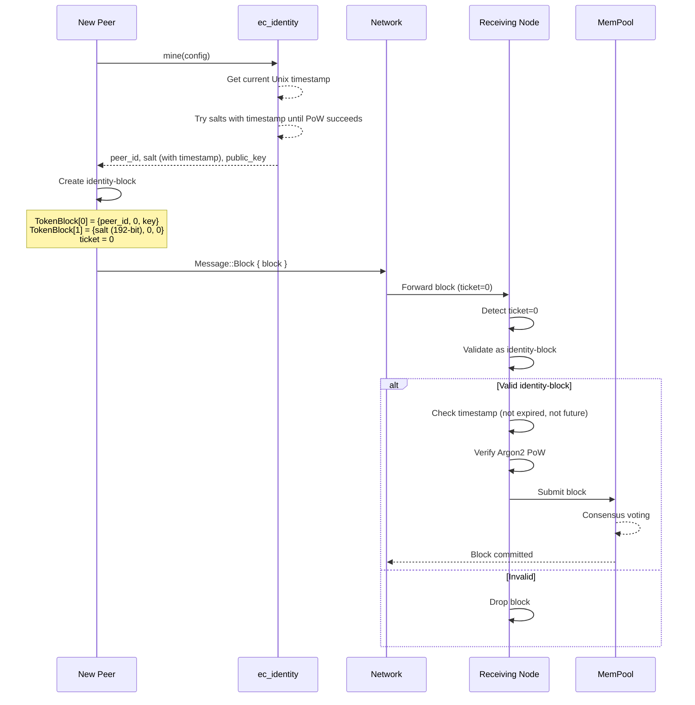

# Identity-Block Design

## Overview

The **identity-block** is a special block type that enables automated peer registration in the ecRust network. When a new peer completes identity mining (proof-of-work), it can broadcast its peer-id as a token without requiring pre-existing network participation or manual registration.

**Key Innovation: Timestamp-Based Identity Expiration**

To prevent long-term identity hoarding attacks, identities include a cryptographically-bound timestamp that enforces a maximum lifetime of 1 year. This prevents adversaries from accumulating unlimited identities over years of pre-mining.

## Motivation

In the current system, tokens are created through normal block transactions that require valid tickets from subsystems (mempool or commit chain). However, new peers face a bootstrap problem:
- They need their peer-id registered as a token to participate
- But they can't create normal blocks without already being part of the network
- Manual registration breaks the automated, trustless design

The identity-block solves this by creating a special "zero-ticket" exception that allows self-registration after proof-of-work.

## Protocol Specification

### Salt Structure with Timestamp

The salt used in identity mining is **192 bits (24 bytes)**:

```
Salt (192 bits):
┌──────────────────────┬──────────────────────┐
│  Random Entropy      │   Unix Timestamp     │
│  128 bits (16 bytes) │   64 bits (8 bytes)  │
└──────────────────────┴──────────────────────┘
```

**Layout**:
- `salt[0..16]`: 128-bit random entropy (mining nonce)
- `salt[16..24]`: 64-bit Unix timestamp (little-endian)

**Cryptographic Binding**: The timestamp is part of the Argon2 hash input, so it cannot be changed after mining without invalidating the proof-of-work.

### Timestamp Validation Rules

When validating an identity, nodes check:

1. **Not Expired**: `timestamp ≥ now - max_age_secs` (default: 1 year)
2. **Not Future-Dated**: `timestamp ≤ now + future_tolerance_secs` (default: 24 hours)

**Parameters**:
- `max_age_secs`: 365 × 24 × 3600 = 31,536,000 seconds (1 year)
- `future_tolerance_secs`: 24 × 3600 = 86,400 seconds (24 hours for clock skew)

**Rationale**:
- **1-year expiration**: Balances security (prevents hoarding) with usability (re-mining only once/year)
- **24-hour tolerance**: Generous allowance for clock drift, timezone confusion, leap seconds

### Message Flow



### Block Structure

An identity-block is a standard `Block` with special semantics:

```rust
Block {
    id: BlockId,              // Standard hash of block contents
    time: EcTime,             // Current time
    used: 2..=6,              // At least 2 tokens (peer-id + salt)
    parts: [
        // [0] Primary identity token
        TokenBlock {
            token: peer_id,   // The mined peer-id (Argon2 hash output)
            last: 0,          // Genesis (REQUIRED in production)
            key: public_key_hash,  // Blake3(Ed25519) public key (or 0 for non-updatable)
        },
        // [1] Proof-of-work salt with timestamp
        TokenBlock {
            token: salt,      // 24-byte salt (16 random + 8 timestamp)
            last: 0,          // Not a real token history
            key: public_key_hash,  // Blake3(Ed25519) public key (or 0 for non-updatable)
        },
        // [2..5] Optional future identity metadata
        TokenBlock { ... },   // Reserved for future use
    ],
    signatures: [None; 6],    // No signatures required
}
```

Sent via:
```rust
MessageEnvelope {
    sender: peer_id,
    receiver: network_peer,
    ticket: 0,                // Zero-ticket identifies identity-block
    time: current_time,
    message: Message::Block { block },
}
```

### Token Semantics

| Position | Token Field | Value | Meaning |
|----------|-------------|-------|---------|
| `parts[0].token` | peer-id | `[u8; 32]` | The mined address (Argon2 output) |
| `parts[0].last` | last | `0` | **Genesis requirement** - prevents updates without payment |
| `parts[0].key` | key | `PublicKey` or `0` | Blake3(Ed25519) public key for transfer (or 0 for non-updatable) |
| `parts[1].token` | salt | `[u8; 24]` (192-bit) | Proof-of-work salt with timestamp |
| `parts[1].last` | last | `0` | Metadata marker |
| `parts[1].key` | key | `PublicKey` or `0` | Blake3(Ed25519) public key for transfer (or 0 for non-updatable) |
| `parts[2..5]` | (any) | (any) | Reserved for future identity extensions |

## Validation Rules

### Test Mode Validation

Minimal validation for development:

```rust
fn validate_identity_block_test(block: &Block) -> bool {
    // 1. Must have at least 2 tokens
    if block.used < 2 {
        return false;
    }

    // 2. First token must equal sender's peer-id
    let claimed_peer_id = block.parts[0].token;
    // (sender peer-id would come from message envelope in future)

    // 3. That's it for testing!
    true
}
```

**Rationale**: Testing mode skips cryptographic validation to enable fast iteration without mining delays.

### Production Validation

Full cryptographic verification with timestamp checking:

```rust
fn validate_identity_block_production(
    block: &Block,
    sender_public_key: &PublicKey,
    config: &AddressConfig,
    now: u64  // Current Unix timestamp
) -> bool {
    // 1. Must have at least 2 tokens (peer-id + salt)
    if block.used < 2 {
        log::warn("Identity-block rejected: insufficient tokens");
        return false;
    }

    // 2. Extract identity components
    let claimed_peer_id = block.parts[0].token;
    let salt = block.parts[1].token[..24];  // Full 192-bit salt

    // 3. GENESIS REQUIREMENT: Must be new peer-id
    if block.parts[0].last != 0 {
        log::warn("Identity-block rejected: not genesis (last != 0)");
        return false;
    }

    // 4. TIMESTAMP VALIDATION (FAST CHECK)
    // Extract timestamp from salt[16..24]
    let timestamp = u64::from_le_bytes(salt[16..24]);

    // 4a. Check not expired (older than 1 year)
    if let Some(min_timestamp) = now.checked_sub(config.max_age_secs) {
        if timestamp < min_timestamp {
            log::warn("Identity-block rejected: expired (age: {} days)",
                (now - timestamp) / (24 * 3600));
            return false;
        }
    }

    // 4b. Check not too far in future (> 24 hours)
    if let Some(max_timestamp) = now.checked_add(config.future_tolerance_secs) {
        if timestamp > max_timestamp {
            log::warn("Identity-block rejected: too far in future (diff: {} hours)",
                (timestamp - now) / 3600);
            return false;
        }
    }

    // 5. FAST-FAIL: Check trailing zeros BEFORE expensive Argon2
    // This prevents DoS via blocks with invalid difficulty
    if !check_difficulty(&claimed_peer_id, config.difficulty) {
        log::warn("Identity-block rejected: insufficient difficulty");
        return false;
    }

    // 6. PROOF-OF-WORK VALIDATION: Verify Argon2(public_key, salt) == peer_id
    // This is the expensive check (~5ms), only run after fast-fail above
    if !PeerIdentity::validate(
        sender_public_key,
        &salt,
        &claimed_peer_id,
        config
    ) {
        log::warn("Identity-block rejected: invalid PoW");
        return false;
    }

    // 7. Optional: Verify block hash matches contents
    // if block.id != calculate_block_hash(&block) { return false; }

    true
}
```

**Critical Security Properties**:
1. **Sybil Resistance**: Argon2 PoW (~24 hours mining per identity)
2. **Genesis Enforcement**: `last == 0` prevents identity updates without paying transaction fees
3. **Cryptographic Binding**: peer-id cryptographically derived from public key
4. **Timestamp Binding**: Timestamp cryptographically bound into PoW hash
5. **Expiration Enforcement**: Identities expire after 1 year, preventing unlimited hoarding
6. **Non-Transferable**: Can't steal someone's identity token
7. **Fast-Fail DoS Protection**: Timestamp + trailing-zero checks before Argon2 prevent computational DoS

**Validation Performance**:
- **Step 4** (timestamp check): ~0.01µs (integer comparisons)
- **Step 5** (trailing zeros): ~0.1µs (bitwise operations)
- **Step 6** (Argon2): ~5ms (cryptographic hash)
- **Total**: ~5ms for valid blocks, <1µs for invalid difficulty/timestamp (DoS protection)

## Mathematical Analysis

### Core Validation Formula

The core validation formula with timestamp:

$$\text{peer\_id} = \text{Argon2}(\text{public\_key}, \text{salt})$$

where:
- $\text{salt} = \text{entropy}_{128} \| \text{timestamp}_{64}$ (192 bits total)
- $\text{trailing\_zeros}(\text{peer\_id}) \geq \text{difficulty}$

Given:
- $pk$ = X25519 public key (32 bytes)
- $e$ = random entropy (16 bytes)
- $t$ = Unix timestamp (8 bytes)
- $s = e \| t$ = combined salt (24 bytes)
- $d$ = difficulty (trailing zero bits)
- $H(pk, s)$ = Argon2id(pk, s, memory=4MiB, iterations=1)

Identity is valid iff:
$$\exists e : H(pk, e \| t) \bmod 2^d = 0 \land t_{\text{min}} \leq t \leq t_{\text{max}}$$

where:
- $t_{\text{min}} = \text{now} - 365 \times 24 \times 3600$ (1 year ago)
- $t_{\text{max}} = \text{now} + 24 \times 3600$ (24 hours ahead)

### Mining Complexity

Expected mining attempts (unchanged from non-timestamped version):
$$E[\text{attempts}] = 2^d$$

For production config ($d=24$):
$$E[\text{attempts}] = 2^{24} \approx 16.7\text{M attempts}$$
$$E[\text{time}] \approx 24 \text{ hours on modern CPU}$$

Validation cost is constant $O(1)$ regardless of difficulty (single Argon2 hash ~5ms).

### Identity Hoarding Analysis

**Threat Model**: Adversary with $C$ CPUs attempting to pre-mine identities for future attack.

**Hoarding capacity over $Y$ years**:

**Without expiration**:
$$I_{\text{unlimited}} = 365 \times C \times Y$$

**With 1-year expiration**:
$$I_{\text{max}} = 365 \times C$$

**Example**: $C = 1000$ CPUs over $Y = 10$ years:
- Without expiration: $3{,}650{,}000$ identities
- With expiration: $365{,}000$ identities (max)
- **Reduction factor**: $10\times$ fewer identities

**Effectiveness**: For arbitrary $Y$:
$$\text{Reduction} = \frac{I_{\text{unlimited}}}{I_{\text{max}}} = Y$$

**Conclusion**: Expiration provides linear scaling defense against long-term hoarding. For multi-year attack preparation, the reduction is proportional to the time horizon.

### Operational Cost Analysis

For **PRODUCTION config** (24-bit difficulty, ~24h mining per identity):

Annual re-mining burden:
$$\text{Annual CPU utilization} = \frac{24 \text{ hours}}{8760 \text{ hours/year}} = 0.27\%$$

**This is extremely reasonable**:
- ~24 hours of compute once per year
- ~\$1-5 in electricity for typical users
- Compare to: Ethereum validators (100% uptime), Bitcoin mining (continuous)

For **TEST config**: Seconds to re-mine, trivial burden.

### Attack Vector Analysis

| Attack | Description | Mitigation |
|--------|-------------|------------|
| **Future-dating** | Mine with $t = \text{now} + 1\text{ year}$ | Rejected by other nodes ($t > t_{\text{max}}$) |
| **Timestamp forgery** | Reuse old salt with new timestamp | Hash changes, won't meet difficulty |
| **Clock manipulation** | Set system clock forward during mining | Only gains ~24h (within tolerance), negligible |
| **Stockpiling within window** | Max out 1-year window | **Expected behavior** - still limited to $365 \times C$ identities |
| **Timestamp grinding** | Try different timestamps to find easier PoW | No advantage: difficulty is uniform across timestamps |

**Proof of timestamp binding**: Given valid $(e, t_1, \text{peer\_id}_1)$:
$$H(pk, e \| t_1) = \text{peer\_id}_1$$

For different $t_2 \neq t_1$:
$$H(pk, e \| t_2) = \text{peer\_id}_2 \neq \text{peer\_id}_1 \text{ (with overwhelming probability)}$$

Therefore, changing timestamp invalidates the proof-of-work, preventing timestamp forgery.

## Implementation Strategy

### Phase 1: ec_node.rs Handler Extension

Modify `Message::Block` handler in [ec_node.rs:474](src/ec_node.rs#L474):

```rust
Message::Block { block } => {
    // TODO basic common block-validation (like SHA of content match block.id)
    let mut block_was_useful = false;

    // NEW: Special case for identity-block (zero-ticket)
    if msg.ticket == 0 {
        if validate_identity_block_test(&block) {
            // Submit to mempool like normal blocks
            if self.mem_pool.block(block, self.time) {
                block_was_useful = true;
                self.event_sink.log(
                    self.time,
                    self.peer_id,
                    Event::IdentityBlockReceived {
                        peer_id: block.parts[0].token,
                        sender: msg.sender,
                    },
                );
            }
        } else {
            log::warn("Invalid identity-block received from {}", msg.sender);
        }
    }
    // Existing ticket validation logic...
    else if msg.ticket == self.block_req_ticket ^ block.id
        || msg.ticket == self.parent_block_req_ticket ^ block.id
    {
        // Block request from mempool
        if self.mem_pool.block(block, self.time) {
            block_was_useful = true;
            // ...
        }
    }
    // ...

    // IMPORTANT: After all ticket validation
    if block_was_useful {
        // For identity-blocks (ticket=0), do NOT mark sender as Identified
        // This prevents abuse where nodes spam identity-blocks to gain trust
        if msg.ticket != 0 {
            // Normal blocks can trigger Identified status
            // (existing logic here)
        }
    }
}
```

### Phase 2: ec_identity.rs Integration (Future)

Extend `PeerIdentity::mine()` to automatically broadcast identity-block:

```rust
impl PeerIdentity {
    pub fn mine_and_register<N: NetworkInterface>(
        &mut self,
        config: AddressConfig,
        network: &mut N
    ) -> Result<BlockId, String> {
        // 1. Mine identity (existing code with timestamp)
        self.mine(config)?;

        // 2. Create identity-block
        let identity_block = Block {
            id: 0, // TODO: compute hash
            time: network.current_time(),
            used: 2,
            parts: [
                TokenBlock {
                    token: self.peer_id.unwrap(),
                    last: 0,  // Genesis
                    key: *self.public_key.as_bytes(),
                },
                TokenBlock {
                    token: pad_salt_to_token_size(self.salt.unwrap()),  // 24-byte salt
                    last: 0,
                    key: 0,
                },
                Default::default(),
                Default::default(),
                Default::default(),
                Default::default(),
            ],
            signatures: [None; 6],
        };

        // 3. Broadcast to network with zero-ticket
        network.send(MessageEnvelope {
            sender: self.peer_id.unwrap(),
            receiver: network.bootstrap_peer(),
            ticket: 0,  // Identity-block marker
            time: network.current_time(),
            message: Message::Block { block: identity_block },
        })?;

        Ok(identity_block.id)
    }
}
```

## Security Analysis

### Attack Vectors and Mitigations

**1. Sybil Attack (Mass Identity Creation)**
- **Attack**: Adversary pre-mines thousands of identities
- **Mitigation**: 24-hour PoW per identity (production config)
- **Cost**: 24,000 CPU-hours for 1,000 identities
- **Note**: This is the fundamental tradeoff - validation must be fast (5ms) while mining is slow (24h)

**2. Long-Term Identity Hoarding**
- **Attack**: Adversary accumulates identities over years for burst attack
- **Mitigation**: 1-year expiration limits maximum stockpile to $365 \times C$ identities
- **Effectiveness**: 10× reduction over 10-year attack preparation
- **Cost**: Forces continuous mining (detectable, expensive infrastructure)

**3. Identity Replay Attack**
- **Attack**: Reuse someone else's mined identity
- **Mitigation**: Cryptographic binding (peer-id derived from public key)
- **Proof**: Adversary cannot forge valid signature without private key

**4. Genesis Bypass (Free Identity Updates)**
- **Attack**: Update identity without paying transaction fees
- **Mitigation**: Enforce `last == 0` in validation
- **Result**: Updates require normal token transaction fees

**5. Resource Exhaustion (Spam Invalid Blocks)**
- **Attack**: Flood network with invalid identity-blocks
- **Mitigation**: Fast-fail validation (check `ticket == 0 && used >= 2`, timestamp, then trailing zeros before Argon2)
- **Cost**: Full validation with Argon2 is ~5ms, which is acceptable overhead
- **Note**: Timestamp + trailing-zero checks are optimizations that reduce DoS surface

**6. Peer Status Abuse (Spam for Trust)**
- **Attack**: Submit many identity-blocks to gain "Identified" peer status
- **Mitigation**: **Do not mark sender as Identified** when processing identity-blocks (ticket=0)
- **Result**: Identity-blocks only register the peer-id token, not grant special peer privileges
- **Rationale**: Prevents nodes from spamming identity-blocks to bypass normal trust-building mechanisms

**7. Network Partition (Isolated Identity Registration)**
- **Attack**: Register identity in isolated network partition
- **Mitigation**: Consensus voting (existing mempool mechanism)
- **Result**: Identity only commits if majority agrees

**8. Timestamp Manipulation Attacks**
- **Attack 8a**: Future-date timestamp to extend lifetime
  - **Mitigation**: Rejected if $t > \text{now} + 24\text{h}$
  - **Max gain**: 24 hours (negligible)
- **Attack 8b**: Forge timestamp on old identity
  - **Mitigation**: Changing timestamp invalidates PoW hash (cryptographic binding)
  - **Result**: Must re-mine entirely (~24h)
- **Attack 8c**: Grind timestamps for easier PoW
  - **Mitigation**: Argon2 output is uniformly random regardless of timestamp
  - **Result**: No advantage over entropy grinding

### Trust Model

| Property | Guarantee | Mechanism |
|----------|-----------|-----------|
| **Uniqueness** | One peer per identity | Cryptographic binding (private key) |
| **Sybil Resistance** | Expensive to create many identities | Argon2 PoW (~24h per identity) |
| **Hoarding Resistance** | Limited long-term identity accumulation | 1-year expiration (max $365 \times C$ stockpile) |
| **Temporal Freshness** | Active identities are recent (<1 year old) | Timestamp validation + expiration |
| **Non-Transferable** | Can't steal identities | Public key cryptography |
| **Genesis Enforcement** | No free updates | `last == 0` validation |
| **Consensus Agreement** | Network agrees on validity | Existing voting mechanism |
| **No Trust Bypass** | Identity-blocks don't grant peer privileges | Excluded from Identified status logic |
| **Clock Drift Tolerance** | Handles reasonable clock skew | 24-hour future tolerance |

### Additional Security Benefits

Beyond anti-hoarding:

1. **Identity freshness**: Active addresses represent recent participants (< 1 year)
2. **Natural pruning**: Abandoned/compromised identities expire automatically
3. **Sybil detection signal**: Sudden influx of old-timestamped identities is suspicious
4. **Audit trail**: Network can analyze timestamp distribution to detect attacks
5. **Operational hygiene**: Forces periodic identity refresh, encouraging key rotation

## Future Extensions

The identity-block reserves slots `parts[2..5]` for future identity-related metadata:

### Possible Future Uses

**Multi-Key Rotation Setup**
```rust
parts[2] = TokenBlock {
    token: backup_public_key,  // Recovery key
    last: 0,
    key: 0,
}
```

**Network Capability Advertisement**
```rust
parts[3] = TokenBlock {
    token: capability_flags,   // e.g., supports X protocol version
    last: 0,
    key: 0,
}
```

**Geographic Hint (Optional)**
```rust
parts[4] = TokenBlock {
    token: geo_hash,           // Coarse location for latency optimization
    last: 0,
    key: 0,
}
```

**Commitment to External Identity**
```rust
parts[5] = TokenBlock {
    token: hash(external_identity),  // e.g., link to web-of-trust
    last: 0,
    key: 0,
}
```

**Identity Refresh Counter**
```rust
parts[2] = TokenBlock {
    token: refresh_count,      // How many times this identity has been refreshed
    last: 0,
    key: 0,
}
```

This could help detect suspicious behavior (identity refreshed 100 times in a year suggests automated hoarding).

## Comparison to Alternative Designs

### Alternative 1: Pre-Registration via Bootstrap Node

**Design**: New peers contact bootstrap node to register peer-id

❌ **Rejected**: Centralization point, bootstrap node is bottleneck and trust anchor

### Alternative 2: Proof-of-Stake Registration Fee

**Design**: Require staking tokens to register identity

❌ **Rejected**: Chicken-and-egg problem (need tokens to get tokens)

### Alternative 3: Invitation System

**Design**: Existing peers issue invitation tokens

❌ **Rejected**: Permission-based, limits organic growth, social engineering risk

### Alternative 4: Identity-Block with Zero-Ticket ✅

**Design**: Special block type with PoW validation

✅ **Selected**:
- Trustless and permissionless
- Leverages existing block consensus
- Sybil-resistant via PoW
- Self-contained validation

### Alternative 5: Periodic Heartbeat Transactions

**Design**: Require active transactions to maintain identity (instead of timestamp expiration)

❌ **Rejected for initial design**:
- Requires continuous network participation
- Creates ongoing transaction fees
- Penalizes offline/dormant but legitimate users
- Timestamp expiration is simpler and achieves similar goal

**Comparison**:
- **Timestamp expiration**: One-time re-mining per year, offline-friendly
- **Heartbeat transactions**: Continuous activity required, generates fee revenue for operators

*Could be considered as future enhancement alongside timestamp expiration*

### Alternative 6: No Expiration

**Design**: Identities valid forever (original design)

❌ **Rejected**:
- Allows unlimited long-term hoarding ($I_{\text{unlimited}} = 365 \times C \times Y$)
- Adversary can prepare 10-year attack with 10× more identities
- No natural pruning of abandoned/compromised identities
- Asymmetric threat: "mine for years, attack once"

## Design Considerations

### 1. Identity Expiration (Implemented)

**Solution**: Timestamp-based expiration with 1-year lifetime

**Benefits**:
- Limits long-term hoarding to $365 \times C$ identities (vs unlimited)
- Natural pruning of inactive identities
- Forces ongoing resource commitment (detectable)
- Aligns PoW cost with active participation

**Tradeoffs**:
- Honest users must re-mine once per year (~24h compute)
- Adds timestamp validation overhead (~0.01µs, negligible)
- Requires network-wide time synchronization (reasonable for NTP era)

**Verdict**: ✅ **Worth it** - 0.27% annual CPU utilization prevents 10× hoarding capacity growth

### 2. Multiple Peer-IDs Per Public Key (Naturally Protected)

**Question**: Can one public key be used to mine multiple peer-ids with different salts?

**Answer**: **Yes, but network will reject duplicate genesis blocks**, making this ineffective:

**Why It's Protected**:
- Mining different salts produces **different peer-id values** (hash output is unpredictable)
- To submit a second genesis block for the same key, you'd need the **same peer-id**
- But you can't predict which peer-id the hash will produce
- Even if you somehow got duplicate peer-ids, the network **rejects duplicate genesis blocks** for the same token

**Potential Attack Vector**:
- Attacker could mine multiple (public_key, salt) pairs → multiple peer-ids
- Each gets a separate identity token

**Mitigation**:
- PoW cost scales linearly (24h × N identities)
- Network can track public key reuse and apply reputation penalties
- Future: Could add global public-key registry to enforce one-to-one mapping

**Conclusion**: While technically possible, it's expensive and counter-productive (confuses the network, harms the user).

### 3. Identity Transfer (Supported as Feature)

**Status**: ✅ **Supported via normal transaction mechanism**

**How It Works**:
- Genesis creates non-transferable identity token (like any other token)
- **Updates/transfers require normal transaction path** through connected nodes
- This creates the **incentive model for running nodes**:
  - Node operators can charge fees for transaction relay
  - Or use nodes for apps/services they profit from
  - Or operate nodes for personal use

**Payment Model**:
- Either **operate your own connected node** (no fees)
- Or **pay a connected node** to relay your transaction

**Security**: Identity transfer uses standard token transaction security (signatures, consensus, etc.)

### 4. Network Partition Handling

**Scenario**: Identity commits in one partition but not another during network split.

**Current Approach**:
- Relies on eventual consensus convergence when partition heals
- Node can **re-send identity-block** if it detects low acceptance
- No special partition detection needed

**DoS Protection**:
- Handled by outer layers (not identity-block specific)
- Rate limiting and peer reputation apply to all messages

**Recovery**:
- When partition heals, standard consensus mechanism resolves conflicts
- Identity with more votes wins (just like any other block)

### 5. Clock Synchronization Requirements

**Question**: What happens if node clocks are badly out of sync?

**Scenarios**:

| Clock Drift | Identity Age | Validation Result | Notes |
|-------------|-------------|-------------------|-------|
| Node -25h | Fresh identity | ❌ Rejected | Mined timestamp appears "in future" |
| Node +25h | Fresh identity | ✅ Accepted | Still within 24h tolerance |
| Node +400d | 1-year-old identity | ❌ Rejected | Appears expired (> 1 year old) |
| Node uses NTP | Any valid identity | ✅ Accepted | Expected case |

**Mitigation**:
- **24-hour future tolerance** handles most clock drift
- Nodes should use NTP (standard practice for network services)
- Identities rejected due to clock issues can be re-submitted after clock correction

**Design choice**: Prioritize security (prevent hoarding) over accommodating badly misconfigured nodes

### 6. Identity Refresh Strategy

**When should honest users re-mine?**

**Options**:
1. **Reactive**: Wait until identity expires, then re-mine (~24h downtime)
2. **Proactive**: Re-mine before expiration, submit new identity-block early
3. **Dual-identity**: Maintain two identities with staggered expiration dates

**Recommended**: **Proactive refresh**
- Re-mine 1-2 months before expiration
- Minimizes service disruption
- Allows time for consensus on new identity
- Can maintain both identities during transition

**Future Enhancement**: Add "identity refresh" transaction type that links old → new identity with signature proof, preserving reputation.

## Testing Strategy

### Unit Tests

```rust
#[test]
fn test_identity_block_validation_test_mode() {
    let block = create_identity_block(peer_id, salt);
    assert!(validate_identity_block_test(&block));
}

#[test]
fn test_identity_block_requires_genesis() {
    let mut block = create_identity_block(peer_id, salt);
    block.parts[0].last = 1;  // Non-genesis
    assert!(!validate_identity_block_production(&block, &pub_key, &config, now));
}

#[test]
fn test_identity_block_rejects_invalid_pow() {
    let block = create_identity_block(peer_id, wrong_salt);
    assert!(!validate_identity_block_production(&block, &pub_key, &config, now));
}

#[test]
fn test_identity_block_rejects_expired() {
    let old_timestamp = now - (2 * 365 * 24 * 3600);  // 2 years old
    let salt = create_salt_with_timestamp(random_entropy, old_timestamp);
    let block = create_identity_block(peer_id, salt);
    assert!(!validate_identity_block_production(&block, &pub_key, &config, now));
}

#[test]
fn test_identity_block_rejects_future() {
    let future_timestamp = now + (48 * 3600);  // 2 days in future
    let salt = create_salt_with_timestamp(random_entropy, future_timestamp);
    let block = create_identity_block(peer_id, salt);
    assert!(!validate_identity_block_production(&block, &pub_key, &config, now));
}

#[test]
fn test_timestamp_cannot_be_forged() {
    // Mine identity with timestamp t1
    let (peer_id, salt1, _) = mine_identity(pub_key, timestamp1, config);

    // Try to change timestamp to t2 (keeping same entropy)
    let entropy = &salt1[0..16];
    let salt2 = create_salt(entropy, timestamp2);

    // PoW should fail (different hash output)
    assert!(!PeerIdentity::validate(&pub_key, &salt2, &peer_id, &config));
}
```

### Integration Tests

```rust
#[test]
fn test_identity_block_commits_to_network() {
    let mut network = create_test_network(100);
    let identity = PeerIdentity::new();
    identity.mine(AddressConfig::TEST);

    let block = create_identity_block_from_identity(&identity);
    network.broadcast_block(block, ticket=0);

    network.run_until_convergence();

    // Verify identity token is committed
    assert!(network.has_token(identity.peer_id.unwrap()));
}

#[test]
fn test_expired_identity_rejected_by_network() {
    let mut network = create_test_network(100);

    // Create identity with old timestamp
    let old_timestamp = network.time() - (400 * 24 * 3600);  // 400 days old
    let identity = mine_identity_at_timestamp(old_timestamp);

    let block = create_identity_block_from_identity(&identity);
    network.broadcast_block(block, ticket=0);

    network.run_until_convergence();

    // Verify identity was rejected (not committed)
    assert!(!network.has_token(identity.peer_id.unwrap()));
}
```

## Summary

The identity-block design provides a **trustless, automated peer registration mechanism** that solves the bootstrap problem without requiring centralized coordination.

### Key Design Features

**✅ Core Mechanism**:
- **Zero-ticket exception**: `ticket=0` identifies identity-blocks in `Message::Block` handler
- **Genesis-only registration**: `last == 0` requirement prevents free updates
- **PoW validation**: Argon2 proof-of-work provides sybil resistance (~24h mining per identity)
- **Fast validation**: ~5ms per identity check, enabling high throughput
- **Timestamp-based expiration**: 1-year identity lifetime prevents long-term hoarding

**✅ Security Properties**:
- **Cryptographic binding**: peer-id = Argon2(public_key, salt) prevents identity theft
- **Timestamp binding**: Timestamp cryptographically bound in PoW, prevents forgery
- **Anti-hoarding**: 1-year expiration limits stockpile to $365 \times C$ identities
- **Natural duplicate protection**: Network rejects duplicate genesis blocks for same token
- **No trust bypass**: Identity-blocks do NOT grant "Identified" peer status
- **Consensus-based**: Leverages existing mempool voting mechanism

**✅ Economic Model**:
- **Genesis registration**: Free (self-submission via identity-block)
- **Identity updates/transfers**: Paid (requires transaction through connected nodes)
- **Node incentives**: Operators can charge fees for transaction relay or use nodes for apps
- **Re-mining cost**: 0.27% annual CPU utilization (24h per year)

**✅ Extensibility**:
- Reserved token slots `parts[2..5]` for future identity metadata
- Compatible with key rotation, capability flags, geographic hints, refresh counters, etc.

### Implementation Path

**Phase 1 (Test Mode)**:
- Add `ticket == 0` special case to `Message::Block` handler
- Simple validation: check `used >= 2` and `parts[0].token == sender_peer_id`
- Submit to mempool like normal blocks
- **Exclude from Identified status** (prevent trust bypass)

**Phase 2 (Production)**:
- Integrate full PoW validation via `PeerIdentity::validate()`
- Enforce `last == 0` genesis requirement
- Add timestamp validation (not expired, not too far in future)
- Add public key to message envelope for cryptographic verification
- Extend `ec_identity::mine()` to auto-submit identity-blocks

**Phase 3 (Expiration Management)**:
- Add identity expiration tracking to `ec_peers`
- Implement periodic cleanup of expired identities
- Add metrics for identity age distribution
- Optional: Add "identity refresh" transaction type for seamless transitions

### Design Rationale

The zero-ticket exception with timestamp-based expiration is a **minimal protocol extension** that:
- Leverages existing block consensus infrastructure
- Maintains trustless, permissionless operation
- Provides strong sybil resistance through PoW
- Prevents long-term identity hoarding attacks (10× reduction over 10-year horizon)
- Creates proper economic incentives for node operators
- Enables fully automated peer onboarding
- Enforces periodic identity refresh with minimal operational burden (0.27% annual CPU)

This approach avoids centralization (no bootstrap node registration), eliminates chicken-and-egg problems (no tokens needed to get tokens), and maintains the security properties of the broader ecRust consensus protocol while adding robust anti-hoarding defenses.
