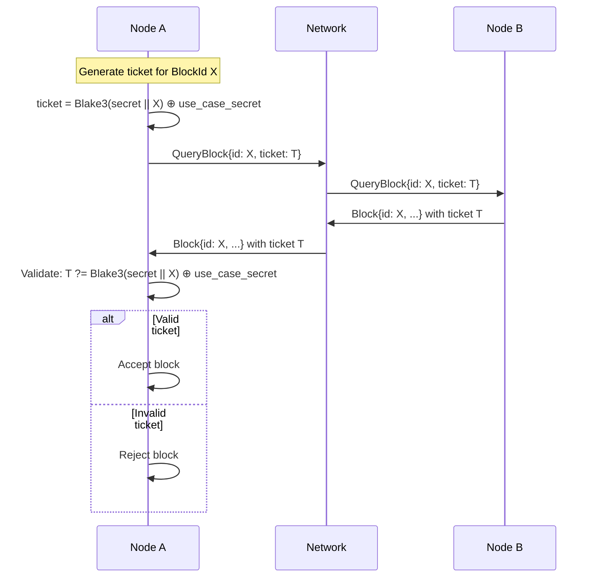
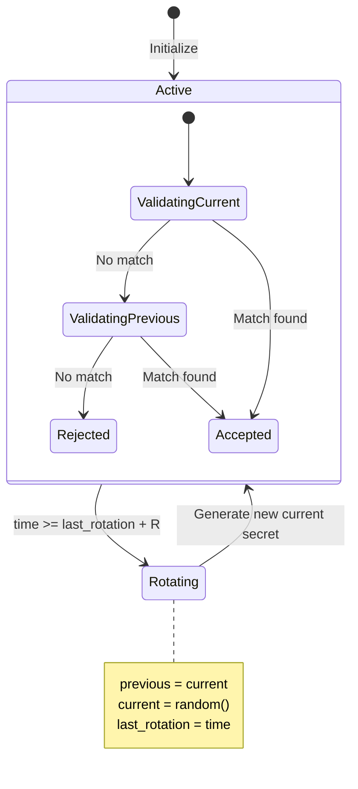
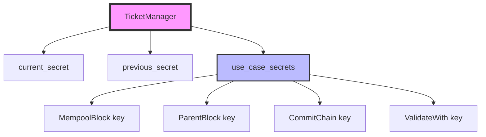
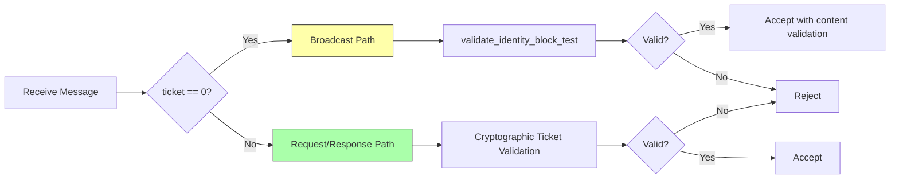

# Cryptographic Ticket System for Block Routing

## Overview

The ticket system provides cryptographically secure routing and anti-injection protection for block messages in the ecRust consensus protocol. Using rotating secrets and Blake3 hashing, the system prevents malicious peers from injecting unsolicited blocks while allowing legitimate request/response flows.

## Core Concept

### Request/Response Binding

When a node requests a block, it generates a unique ticket that cryptographically binds the request to the expected response. Only blocks matching a previously requested BlockId with a valid ticket are accepted.

### Threat Model

**Primary threat:** Unsolicited block injection
- Malicious peer sends blocks that were never requested
- Could cause state corruption if accepted
- **Mitigation:** Cryptographic ticket validation

**Non-threats (due to idempotent operations):**
- Replay of legitimately requested blocks
- Multiple responses to same request
- Late messages arriving after processing

## Cryptographic Construction

### Ticket Generation

For a block request with BlockId $b$ and use case $u$:

$$\text{ticket} = \text{Blake3}(s_{\text{current}} \parallel b) \oplus k_u$$

Where:
- $s_{\text{current}}$ = 256-bit current secret (random)
- $b$ = BlockId (in production: Blake3 hash of block content)
- $k_u$ = 256-bit use-case secret for use case $u$
- $\parallel$ = concatenation
- $\oplus$ = XOR operation

### Ticket Validation

Upon receiving a block with BlockId $b'$ and ticket $t$:

$$\text{valid} = \exists u \in U : t = \text{Blake3}(s_{\text{current}} \parallel b') \oplus k_u$$

If validation fails with current secret, retry with previous secret:

$$\text{valid} = \exists u \in U : t = \text{Blake3}(s_{\text{previous}} \parallel b') \oplus k_u$$

Where $U$ is the set of all use cases.

### Secret Rotation

Secrets rotate every $R$ ticks (rotation period):

## Security Analysis

### Property 1: Unsolicited Injection Prevention

**Claim:** An attacker cannot inject an arbitrary block without knowing the secrets.

**Proof:**

Given:
- Attacker wants to inject block with BlockId $b_{\text{evil}}$
- Attacker observes ticket $t$ on the network
- Attacker does not know $s_{\text{current}}$ or any $k_u$

For the attack to succeed, attacker must compute:
$$t_{\text{evil}} = \text{Blake3}(s_{\text{current}} \parallel b_{\text{evil}}) \oplus k_u$$

Without knowing $s_{\text{current}}$ or $k_u$:
- Cannot compute $\text{Blake3}(s_{\text{current}} \parallel b_{\text{evil}})$ (requires $s_{\text{current}}$)
- Cannot compute $t_{\text{evil}}$ (requires both hash output and $k_u$)
- Probability of guessing correct ticket: $P(\text{success}) = 2^{-256}$

Therefore, unsolicited injection is computationally infeasible. ∎

### Property 2: Response Substitution Prevention

**Claim:** An attacker cannot substitute a different block for a requested one.

**Proof:**

Given:
- Node A requests BlockId $b_{\text{requested}}$ with ticket $t$
- Attacker intercepts and attempts to send $b_{\text{fake}}$ where $b_{\text{fake}} \neq b_{\text{requested}}$

In production, BlockId is the Blake3 hash of content:
$$b = \text{Blake3}(\text{block\_content})$$

For validation to pass:
$$t = \text{Blake3}(s \parallel b_{\text{fake}}) \oplus k_u$$

But ticket was generated as:
$$t = \text{Blake3}(s \parallel b_{\text{requested}}) \oplus k_u$$

For these to be equal:
$$\text{Blake3}(s \parallel b_{\text{requested}}) = \text{Blake3}(s \parallel b_{\text{fake}})$$

Since $b_{\text{requested}} \neq b_{\text{fake}}$, this requires a Blake3 collision.

Probability of finding collision: $P(\text{collision}) \approx 2^{-128}$ (birthday bound)

Therefore, response substitution is computationally infeasible. ∎

### Property 3: Secret Extraction Resistance

**Claim:** Observing tickets does not leak information about secrets.

**Proof:**

Attacker observes multiple tickets for different blocks:
$$t_1 = \text{Blake3}(s \parallel b_1) \oplus k_{u_1}$$
$$t_2 = \text{Blake3}(s \parallel b_2) \oplus k_{u_2}$$
$$\vdots$$

**Case 1: Single observation**

From $t = h \oplus k$ where $h = \text{Blake3}(s \parallel b)$:
- XOR provides information-theoretic security (one-time pad)
- Knowing $t$ gives no information about $h$ or $k$ without the other
- Cannot extract $s$ from $h$ (Blake3 preimage resistance)

**Case 2: Multiple observations (same use case)**

$$t_1 \oplus t_2 = \text{Blake3}(s \parallel b_1) \oplus \text{Blake3}(s \parallel b_2)$$

- Eliminates $k_u$ but still doesn't reveal $s$
- No algebraic relationship exploitable due to Blake3 properties
- Requires preimage attack on Blake3

**Case 3: Multiple observations (different use cases)**

- Each $k_u$ is independent
- No algebraic relationship between different use case tickets
- Each ticket provides one-time pad security for its hash

Therefore, passive observation of tickets does not compromise secrets. ∎

### Property 4: Forward Secrecy

**Claim:** Compromise of current secrets does not compromise past communications.

**Proof:**

After rotation at time $T$:
- $s_{\text{old}}$ is discarded
- Only $s_{\text{current}}$ and $s_{\text{previous}}$ retained

For tickets generated before $T - 2R$ (two rotations ago):
$$t_{\text{old}} = \text{Blake3}(s_{\text{discarded}} \parallel b) \oplus k_u$$

Even if attacker learns $s_{\text{current}}$ and all $k_u$ at time $T + \epsilon$:
- Cannot compute $s_{\text{discarded}}$ (no relationship between secrets)
- Cannot validate or forge tickets from more than $2R$ ticks ago

Therefore, the system provides forward secrecy with granularity $2R$ ticks. ∎

## Use Case Isolation

Different block request types use separate use-case secrets:

**Property:** Cross-talk prevention

A ticket generated for use case $u_1$ cannot validate for use case $u_2$ where $u_1 \neq u_2$:

$$t = \text{Blake3}(s \parallel b) \oplus k_{u_1}$$

For this to validate as $u_2$:
$$\text{Blake3}(s \parallel b) \oplus k_{u_1} = \text{Blake3}(s \parallel b) \oplus k_{u_2}$$
$$k_{u_1} = k_{u_2}$$

Since use-case secrets are independently random, $P(k_{u_1} = k_{u_2}) = 2^{-256}$.

## Special Case: Broadcast Messages (ticket=0)

Identity blocks and Answer messages use `ticket=0` to indicate unsolicited broadcasts:

Broadcast messages bypass cryptographic ticket validation but use separate content-based validation logic.

## Performance Characteristics

### Validation Cost

Per block message validation:
- Compute: $h = \text{Blake3}(s_{\text{current}} \parallel b)$ — 1 hash operation
- Check: $\forall u \in U : t \stackrel{?}{=} h \oplus k_u$ — $|U|$ XOR + compare operations
- Repeat with $s_{\text{previous}}$ if no match — 1 additional hash operation

**Worst case (invalid ticket):**
$$C_{\text{validation}} = 2 \times (C_{\text{Blake3}} + |U| \times C_{\text{XOR}})$$

With Blake3 throughput ~3 GB/s and 32-byte input:
- $C_{\text{Blake3}} \approx 10$ ns
- $C_{\text{XOR}} \approx 1$ ns
- For $|U| = 4$: $C_{\text{validation}} \approx 2 \times (10 + 4) = 28$ ns

**Conclusion:** Negligible overhead even for high message rates.

### Memory Cost

Per node:
$$M = |s_{\text{current}}| + |s_{\text{previous}}| + \sum_{u \in U} |k_u|$$
$$M = 32 + 32 + (32 \times |U|) \text{ bytes}$$

For $|U| = 4$: $M = 192$ bytes (negligible).

## Parameter Selection

### Rotation Period ($R$)

**Constraint:** Must exceed maximum legitimate message delay.

For simulation with network delay:
$$R \geq 3 \times \text{max\_delay}$$

Acceptance window spans $2R$ ticks (current + previous), providing:
$$\text{grace\_period} = 2R - \text{max\_delay}$$

**Recommendation:**
- Simulation: $R = 100$ ticks
- Production: $R = 3 \times \text{RTT}$ (e.g., 1 second for 300ms RTT)

### Secret Size

Production systems use full Blake3 output:
- $|s| = 256$ bits
- $|k_u| = 256$ bits
- $|\text{ticket}| = 256$ bits

Provides $2^{256}$ security against brute force attacks.

## Mathematical Summary

| Property | Security Bound |
|----------|----------------|
| Unsolicited injection | $2^{-256}$ |
| Response substitution | $2^{-128}$ (collision bound) |
| Secret extraction | Computationally infeasible (preimage resistance) |
| Ticket brute force | $2^{-256}$ per attempt |
| Forward secrecy window | $2R$ ticks |
| Cross-talk between use cases | $2^{-256}$ |

All security properties rely on:
1. Blake3 collision resistance
2. Blake3 preimage resistance
3. Cryptographic randomness of secrets
4. XOR one-time pad properties
