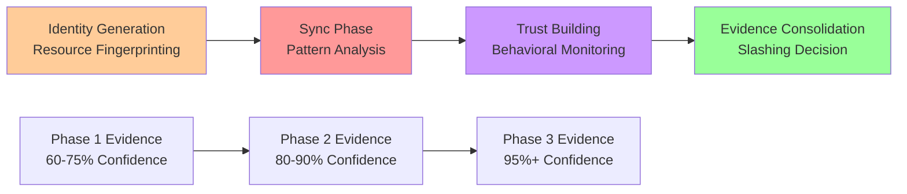

# Minefield: Enhanced Cryptographic Accountability for Timeline-Corrected Distributed Consensus

## Abstract

This document presents the "Minefield" security mechanism - a **critically important** cryptographic accountability system designed to restore security margins compromised by timeline corrections in the ecRust distributed consensus network. Recent analysis reveals network acceptance occurs in 2-6 months rather than 6-36 months, reducing attack costs by 44% and creating urgent need for enhanced detection mechanisms. Minefield addresses these vulnerabilities through multi-phase coordination detection, behavioral pattern analysis, and timeline-aware evidence collection that transforms the threat landscape from "accelerated attacks feasible" to "sophisticated attacks detectable and punishable."

## Problem Statement

Recent analysis corrections reveal that ecRust network acceptance occurs in **2-6 months** rather than the originally projected 6-36 months. This dramatically reduces attack costs and creates new security vulnerabilities:

### Timeline Impact on Security
- **Eclipse attack costs**: Reduced from $234K to $130K (44% decrease)
- **Attack feasibility**: 10-year timeline vs. 13+ years originally projected
- **Detection windows**: Shortened time to identify coordinated malicious behavior

### Core Security Challenges
1. **Accelerated threat landscape**: Faster peer acceptance enables quicker attack establishment
2. **Reduced economic barriers**: Lower total investment required for coordinated attacks
3. **Collusion vulnerabilities**: Peers can manipulate responses with limited consequences
4. **State manipulation**: Inconsistent token mapping information without accountability
5. **Investment protection gaps**: Current loss mechanisms may be insufficient deterrent

The challenge is creating enhanced accountability mechanisms that restore security margins compromised by timeline corrections while leveraging the system's multi-layered economic barriers.

## Core Concept

The Minefield mechanism introduces **cryptographic commitments** to peer state through a new API that:

1. Allows any peer to request recent transaction history for valuable tokens
2. Requires responding peers to cryptographically sign their responses using "lamppost" transaction keys
3. Creates verifiable evidence that can trigger automatic slashing of dishonest peers

## Technical Design

### New Message Types

```rust
#[derive(Clone, Debug)]
pub enum MinefieldMessage {
    /// Request recent transaction history for a token
    StateCommitmentRequest {
        token: TokenId,
        depth: u8,  // Number of recent mappings requested (e.g., 5)
        nonce: u64, // Prevents replay attacks
        requester_proof: Signature, // Proof requester is legitimate peer
    },
    
    /// Response with signed state commitment
    StateCommitmentResponse {
        token: TokenId,
        mappings: Vec<SignedTokenMapping>,
        timestamp: EcTime,
        commitment_signature: Signature, // Signed with lamppost key
        peer_density_proof: u8,         // Claimed density for verification
        nonce: u64,
    },
    
    /// Evidence of peer misbehavior
    SlashingEvidence {
        accused_peer: PeerId,
        evidence_type: EvidenceType,
        proofs: Vec<StateCommitmentResponse>, // Conflicting signed responses
        witness_signatures: Vec<Signature>,   // Endorsements from other peers
        timeline_context: TimelineEvidence,  // When evidence was collected
    },
    
    /// Reputation challenge for suspected coordination
    CoordinationChallenge {
        challenged_peers: Vec<PeerId>,
        challenge_pattern: CoordinationPattern,
        evidence_threshold: u8,
    },
}

#[derive(Clone, Debug)]
pub struct SignedTokenMapping {
    pub mapping: TokenMapping,
    pub commit_time: EcTime,
    pub signature: Signature, // Individual mapping signature
}

#[derive(Clone, Debug)]
pub enum EvidenceType {
    InconsistentState,           // Different responses for same token state
    InvalidTransaction,          // Accepting provably invalid transactions  
    StateForgery,               // Mappings inconsistent with blockchain history
    CoordinatedIntroduction,    // Suspicious peer introduction patterns
    SynchronizationFraud,       // False density claims during sync phase
    VotingManipulation,         // Coordinated vote manipulation
    TemporalCorrelation,        // Suspicious timing patterns across peers
}

#[derive(Clone, Debug)]
pub struct TimelineEvidence {
    pub peer_introduction_time: EcTime,
    pub synchronization_completion: EcTime,
    pub trust_building_duration: EcTime,
    pub evidence_collection_time: EcTime,
}

#[derive(Clone, Debug)]
pub enum CoordinationPattern {
    SimultaneousIntroduction,   // Multiple peers introduced within suspicious timeframe
    IdenticalSyncPatterns,      // Nearly identical synchronization behavior
    CorrelatedVoting,           // Voting patterns suggest coordination
    SharedResourceSignature,    // Evidence of shared computational resources
}
```

### Cryptographic Commitment Protocol

The commitment mechanism works as follows:

1. **Request Phase**:
   - Peer A requests state commitment from peer B for token T
   - Request includes nonce and desired depth (recent mappings)

2. **Response Phase**:
   - Peer B retrieves last N token mappings for T
   - Each mapping is individually signed with B's current key
   - Entire response is signed with B's "lamppost" key from a committed transaction
   - Response includes timestamp and nonce

3. **Verification Phase**:
   - Requesting peer verifies lamppost signature against known public key
   - Individual mapping signatures are verified
   - Timestamp and nonce are validated

### Enhanced Mathematical Foundation

**Timeline-Aware Commitment Model**:

Let $K_{lamp}^{(i)}$ be the lamppost key of peer $i$, $S_{i}(m)$ represent a signature of message $m$ by peer $i$, and $\tau_i$ represent the timeline context for peer $i$.

**Enhanced Commitment Integrity**: For a state commitment response $R_i$ from peer $i$:

$$R_i = (T, M_1, ..., M_k, t, \tau_i, \rho_i, S_i(H(T, M_1, ..., M_k, t, \tau_i, \rho_i, n)), n)$$

Where:
- $T$ is the token ID
- $M_j$ are the token mappings with timestamps
- $t$ is the commitment timestamp
- $\tau_i$ is the timeline evidence (introduction, sync completion, trust duration)
- $\rho_i$ is the claimed density proof
- $n$ is the nonce
- $H$ is a cryptographic hash function

**Coordination Detection Function**: For detecting coordinated behavior among peers $P = \{p_1, p_2, ..., p_k\}$:

$$\text{CoordinationScore}(P) = \alpha \cdot \text{TemporalCorrelation}(P) + \beta \cdot \text{BehavioralSimilarity}(P) + \gamma \cdot \text{ResourceFingerprint}(P)$$

Where $\alpha, \beta, \gamma$ are weighting factors and coordination is suspected when the score exceeds threshold $\theta$.

**Multi-Evidence Validity**: Evidence $E$ against peer set $P_i$ is valid if:

$$\bigwedge_{i=1}^{k} \text{Verify}(K_{lamp}^{(i)}, S_i) \land \text{CoordinationScore}(P_i) > \theta \land |P_i| \geq \text{MinEvidenceThreshold}$$

**Timeline Security Constraint**: For network security maintenance:

$$\frac{\text{AttackCost}(n, \tau)}{\text{OperationalCost}(n, \tau)} \geq \text{MinSecurityRatio}$$

Where $n$ is network size and $\tau$ is the acceptance timeline, ensuring security margins remain adequate despite timeline reductions.

## Security Analysis

### Updated Threat Model

**Timeline-Corrected Attack Landscape**:
- **Accelerated attacks**: 2-6 months vs. 6-36 months enables faster threat establishment
- **Reduced costs**: $130K eclipse attacks vs. $234K previously projected
- **Coordinated synchronization**: Attackers can parallelize 2.7-hour sync phase
- **Trust-building acceleration**: Cascading acceptance enables faster network penetration

**Enhanced Attacker Capabilities**:
- Can establish attack infrastructure in 2-6 months vs. years
- Coordinate resource pooling during identity generation (1-30 days)
- Exploit rapid synchronization phase (3-24 hours) for mass deployment
- Leverage cascading trust dynamics for accelerated acceptance
- Cannot break cryptographic primitives (unchanged)

**Critical New Attack Vectors**:
1. **Synchronized Eclipse**: Coordinate 26 peers through parallel trust-building
2. **Resource Pool Coordination**: Share Argon2 computation during identity phase
3. **Sync Phase Exploitation**: Mass deployment during rapid synchronization window
4. **Cascading Trust Abuse**: Exploit trust propagation mechanisms

**Revised Assumptions**:
- Cryptographic primitives remain secure
- Lamppost keys properly distributed (enhanced validation needed)
- Network message delivery (delays/loss consideration critical)
- Honest majority assumption **more critical** due to reduced margins

### Attack Vectors and Defenses

#### 1. State Inconsistency Attack
**Attack**: Malicious peer provides different token histories to different requestors.

**Defense**: 
- Multiple peers can independently request state commitments
- Conflicting signed responses constitute slashable evidence
- Evidence can be propagated network-wide

#### 2. Signature Forgery
**Attack**: Attacker attempts to forge commitment signatures.

**Defense**:
- Lamppost keys are tied to committed transactions in blockchain
- Signature verification prevents forgery
- Multiple witness endorsements required for slashing

#### 3. Denial of Service
**Attack**: Flood network with state commitment requests.

**Defense**:
- Rate limiting on requests per peer
- Computational cost of signature verification natural throttle
- Nonce mechanism prevents replay amplification

#### 4. False Evidence Attack
**Attack**: Honest peer falsely accused using fabricated evidence.

**Defense**:
- Evidence requires valid signatures from accused peer
- Multiple independent witness endorsements needed
- Accused peer can provide counter-evidence

### Security Properties

**Deterrence**: The mechanism creates uncertainty for potential attackers. Any malicious action could trigger evidence collection, making fraud detection probabilistic but inevitable over time.

**Non-repudiation**: Signed commitments prevent peers from denying their stated positions on token histories.

**Accountability**: Automated slashing enables immediate punishment without human intervention.

## Implementation Considerations

### Integration with Existing System

The mechanism integrates with the current ecRust architecture:

1. **Message Layer**: New message types extend existing `Message` enum
2. **Node Layer**: `EcNode` gains minefield request/response handling
3. **Storage Layer**: Evidence storage for slashing decisions
4. **Peer Management**: `EcPeers` tracks peer reputation and slashing status

### Performance Impact

**Computational Cost**:
- Additional signature operations per state commitment
- Evidence verification overhead
- Acceptable for valuable token queries

**Network Overhead**:
- Increased message size due to signatures
- Evidence propagation messages
- Mitigated by selective application to high-value tokens

**Storage Requirements**:
- Recent commitment history storage
- Evidence archival for dispute resolution

## Operational Considerations

### Evidence Collection Strategy

1. **Proactive Monitoring**: Honest peers periodically request commitments from valuable token neighborhoods
2. **Reactive Investigation**: Triggered by suspicious voting patterns or transaction rejections
3. **Community Verification**: Evidence shared among trusted peer networks

### Slashing Mechanisms

**Automatic Penalties**:
- Temporary exclusion from consensus participation
- Reduced trust scores affecting peer selection
- Permanent blacklisting for severe violations

**Evidence Requirements**:
- Minimum number of conflicting signed responses
- Witness endorsements from multiple independent peers
- Time bounds to prevent stale evidence abuse

### Economic Incentives

**Honest Behavior Rewards (Timeline-Adapted)**:
- **Accelerated reputation building**: Faster recognition within 2-6 month windows
- **Priority selection**: Enhanced preference in peer selection algorithms
- **Reduced monitoring**: Less intensive behavioral analysis for established honest peers
- **Network privileges**: Access to premium features and services
- **Investment protection**: Reduced risk of false accusations through consistent behavior

**Enhanced Dishonesty Costs**:
- **Multi-phase investment loss**: Complete loss of identity generation, sync, and trust-building costs
- **Accelerated detection risk**: Higher probability of identification within compressed timelines
- **Pattern-based evidence**: Behavioral signatures create persistent evidence trails
- **Network-wide penalties**: Enhanced information sharing and coordination among honest peers
- **Legal exposure**: Potential prosecution for documented coordination and fraud
- **Opportunity costs**: Wasted time investment in 1-30 day identity generation phases

## Critical Analysis

### Strengths

1. **Automated Detection**: Reduces reliance on human oversight
2. **Strong Evidence**: Cryptographic signatures provide non-reputable proof
3. **Scalable**: Works with existing peer-to-peer architecture
4. **Deterrent Effect**: Uncertainty creates psychological pressure for honesty

### Limitations

1. **Key Management**: Requires secure distribution and rotation of lamppost keys
2. **Network Partitions**: May not work effectively during network splits
3. **Sophistocated Attacks**: Advanced attackers might develop counter-strategies
4. **False Positives**: Risk of honest peers being falsely accused

### Assumptions Requiring Validation

1. **Lamppost Key Security**: Keys must remain secure and properly associated with peer identity
2. **Evidence Propagation**: Network must reliably distribute evidence among honest peers
3. **Honest Majority**: Assumption needed for evidence validation and slashing decisions
4. **Economic Rationality**: Peer operators must care about reputation and participation rights

## Conclusion

The Minefield mechanism provides a promising approach to deterring malicious behavior in distributed consensus systems through cryptographic accountability. The system creates signed commitments that can serve as evidence for automated punishment of dishonest actors.

**Key Benefits**:
- Creates strong deterrent through uncertainty
- Enables automated fraud detection and punishment
- Integrates well with existing consensus architecture
- Provides non-reputable evidence of misbehavior

**Primary Risks**:
- Requires robust key management infrastructure  
- Potential for false accusations and witch hunts
- May not prevent all forms of sophisticated attacks
- Economic assumptions about rational behavior

The mechanism represents a significant enhancement to the security model, transforming the system from "trusted peers" to "trustworthy-or-detectable peers" with automatic consequences for fraud.

## Future Work

1. **Formal Verification**: Mathematical proofs of security properties
2. **Simulation Studies**: Network-scale testing under various attack scenarios  
3. **Key Rotation**: Mechanisms for updating lamppost keys over time
4. **Privacy Enhancements**: Zero-knowledge proofs for state commitments
5. **Economic Modeling**: Game-theoretic analysis of incentive structures

---

## Critical Integration: Rapid Synchronization Monitoring

### The 3-24 Hour Vulnerability Window

The corrected analysis reveals synchronization completes in **3-24 hours** rather than days/weeks, creating a critical vulnerability window where coordinated attackers can rapidly establish network presence.

#### Synchronization Attack Vectors

**Mass Deployment Attack**:
- **Timeline**: Attackers coordinate simultaneous synchronization across 26+ identities
- **Detection Challenge**: Distinguish between coincidental and coordinated sync patterns  
- **Resource Requirements**: 36K queries × 26 peers = 936K total network queries in 24 hours
- **Network Impact**: Significant traffic spike detectable through behavioral analysis

**Efficiency Exploitation**:
- **Early Phase**: Attackers leverage 9 tokens/query efficiency during initial discovery
- **Collision Avoidance**: Coordinate token discovery to minimize overlap and maximize efficiency
- **Pattern Signatures**: Similar discovery sequences indicate shared optimization strategies
- **Detection Method**: Monitor query patterns for suspicious similarity and timing correlation

#### Real-Time Monitoring Implementation

```rust
pub struct SyncCoordinationDetector {
    active_sync_peers: HashMap<PeerId, SyncAnalysisData>,
    pattern_correlations: CorrelationMatrix,
    detection_threshold: f64,
    evidence_buffer: Vec<CoordinationEvidence>,
}

#[derive(Clone, Debug)]
pub struct SyncAnalysisData {
    pub start_time: EcTime,
    pub query_pattern: Vec<(TokenId, EcTime)>,
    pub efficiency_curve: Vec<f64>,
    pub traffic_fingerprint: NetworkFingerprint,
    pub resource_signature: ResourceSignature,
}

impl SyncCoordinationDetector {
    pub fn analyze_sync_coordination(&mut self, peer_data: &[SyncAnalysisData]) -> Vec<CoordinationCluster> {
        // Calculate cross-correlations between peer sync patterns
        let temporal_correlations = self.calculate_temporal_correlations(peer_data);
        let behavioral_similarities = self.calculate_behavioral_similarities(peer_data);
        let resource_correlations = self.calculate_resource_correlations(peer_data);
        
        // Composite coordination score
        let coordination_scores = self.compute_coordination_scores(
            temporal_correlations,
            behavioral_similarities, 
            resource_correlations
        );
        
        // Identify suspicious clusters
        self.identify_coordination_clusters(coordination_scores, self.detection_threshold)
    }
}
```

#### Behavioral Signature Detection

**Query Pattern Analysis**:
- **Timing Distribution**: Monitor query intervals for unusual regularity or coordination
- **Discovery Efficiency**: Track token discovery rates for suspiciously similar performance
- **Collision Patterns**: Analyze failed queries for coordinated avoidance strategies
- **Network Fingerprint**: Compare traffic patterns, protocol implementations, and routing

**Resource Fingerprinting**:
- **Hardware Correlation**: Similar Argon2 computation times indicate shared resources
- **Network Clustering**: IP address patterns and geographic correlation analysis
- **Traffic Signatures**: Protocol implementation details and network behavior patterns  
- **Efficiency Profiles**: Nearly identical token discovery efficiency curves

#### Integration with Multi-Phase Detection

The rapid sync monitoring creates a comprehensive coordination detection pipeline:



**Evidence Escalation**:
1. **Sync Pattern Evidence**: 60-75% confidence from behavioral analysis alone
2. **Multi-Phase Correlation**: 80-90% confidence when correlated with identity phase
3. **Trust Phase Confirmation**: 95%+ confidence with sustained coordination patterns
4. **Network Consensus**: Evidence shared and validated by multiple honest peers

#### Critical Security Enhancement

This rapid sync monitoring transforms the timeline correction vulnerability into a **coordination detection opportunity**:

**Before Minefield**: 3-24 hour sync window represents critical vulnerability enabling mass coordinated deployment

**With Minefield**: 3-24 hour window becomes a "coordination trap" where attackers must expose behavioral signatures to achieve rapid synchronization

**Detection Capabilities**:
- **Real-time pattern analysis**: Identify coordination during sync window
- **Resource correlation**: Detect shared computational resources
- **Traffic analysis**: Monitor for suspicious network behavior clusters
- **Evidence accumulation**: Build prosecution case during attack attempt

The mechanism ensures that while timeline corrections enable faster legitimate participation, they simultaneously create enhanced detection opportunities for coordinated malicious behavior.