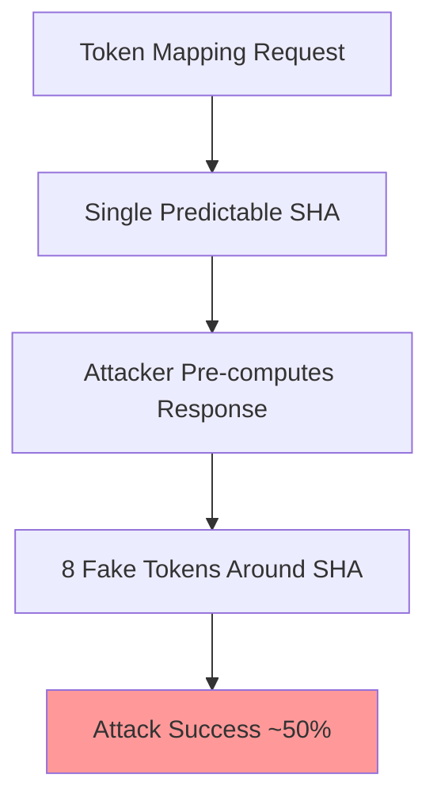
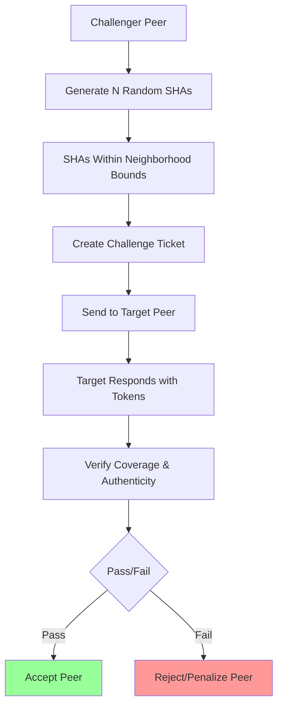
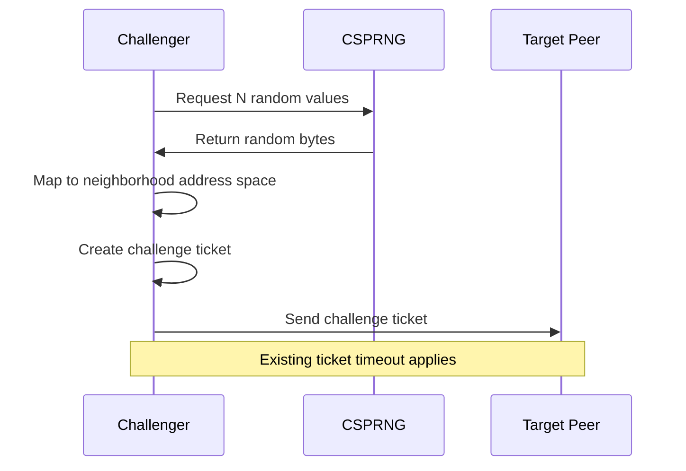
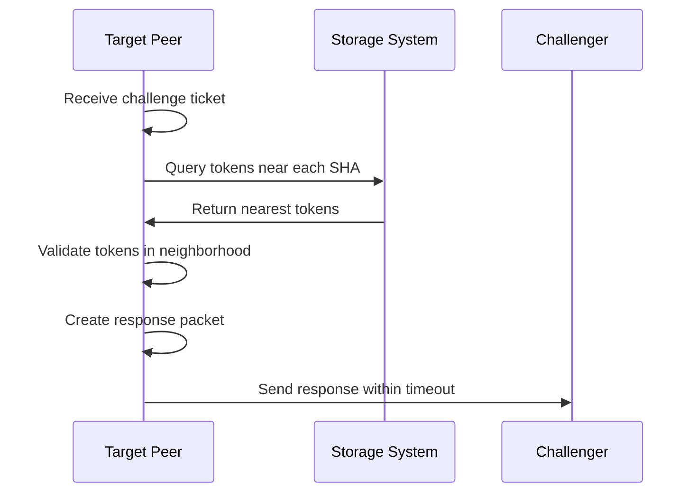
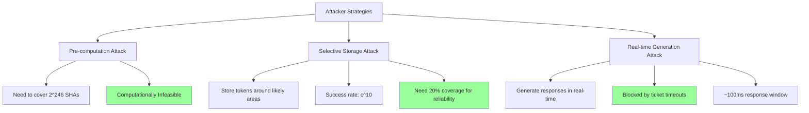
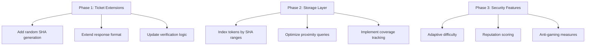
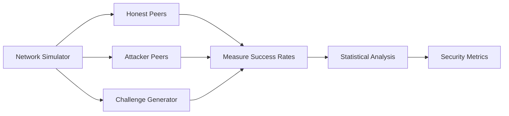
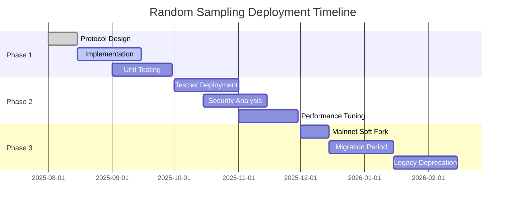

# Neighborhood-Constrained Random Sampling Design

**Document Version**: 1.0  
**Date**: 2025-08-03  
**Authors**: Technical Design Team  
**Status**: Draft Proposal

## Executive Summary

This document proposes a significant enhancement to ecRust's proof-of-storage mechanism by replacing the current width-based challenges with neighborhood-constrained random sampling. This approach maintains the scalability benefits of neighborhood-based consensus while dramatically improving security against gaming attacks.

**Key Improvements**:
- **Security**: Attack success rate drops from ~50% to ~10.7%
- **Gaming Resistance**: Requires 20× more storage investment
- **Scalability**: Maintains neighborhood-only storage requirements
- **Implementation**: Builds on existing ticket system

---

## 1. Problem Analysis

### 1.1 Current System Vulnerabilities

The existing width-based proof-of-storage has critical weaknesses:



**Mathematical Analysis of Current Vulnerability**:

For a neighborhood with $N$ total tokens and address space $S$:
- Expected gap between tokens: $\Delta = \frac{S}{N}$
- Attacker needs tokens around 1 specific SHA
- Pre-computation difficulty: $O(2^{32})$ attempts (feasible)
- Storage requirement: ~1,000 tokens

$$P(\text{attack success}) = \frac{\text{pre-computed coverage}}{\text{challenge area}} \approx 0.5$$

### 1.2 Security Requirements

To achieve robust proof-of-storage, the system must:

1. **Prevent Pre-computation**: Challenges must be unpredictable
2. **Require Broad Storage**: Force attackers to invest in legitimate storage
3. **Maintain Scalability**: Keep neighborhood-only requirements
4. **Preserve Performance**: Use existing timing mechanisms

---

## 2. Proposed Solution: Neighborhood-Constrained Random Sampling

### 2.1 High-Level Design



### 2.2 Mathematical Foundation

**Neighborhood Parameters**:
- Address space: $S = 2^{256}$
- Number of neighborhoods: $M = 1000$
- Neighborhood size: $S_n = \frac{S}{M} = 2^{246}$
- Peers per neighborhood: $P = 50$
- Tokens per peer: $T_p = 10,000$
- Total neighborhood tokens: $T_n = P \times T_p = 500,000$

**Challenge Parameters**:
- Random SHAs per challenge: $N = 10$
- Required coverage: $\rho = 0.2$ (20%)
- Minimum tokens needed: $T_{min} = T_n \times \rho = 100,000$

**Attack Success Probability**:

For an attacker with coverage fraction $c < \rho$:
$$P(\text{attack success}) = c^N = c^{10}$$

With minimal storage ($c = 0.05$):
$$P(\text{attack success}) = (0.05)^{10} \approx 9.8 \times 10^{-14}$$

---

## 3. Detailed Protocol Design

### 3.1 Challenge Generation



**Challenge Creation Algorithm**:

```rust
fn create_challenge(neighborhood_bounds: (Hash256, Hash256), count: usize) -> Vec<Hash256> {
    let mut challenges = Vec::new();
    let (min_addr, max_addr) = neighborhood_bounds;
    
    for _ in 0..count {
        // Generate cryptographically secure random bytes
        let random_bytes = ChaCha20Rng::gen_bytes(32);
        
        // Map to neighborhood address space
        let addr = map_to_range(random_bytes, min_addr, max_addr);
        challenges.push(addr);
    }
    
    challenges
}
```

**Mapping Function**:

To map random bytes to neighborhood range $[a_{min}, a_{max}]$:

$$\text{addr} = a_{min} + \left(\frac{\text{random\_bytes}}{2^{256}} \times (a_{max} - a_{min})\right)$$

### 3.2 Response Generation  



**Response Requirements**:

For each challenge SHA $h_i$, peer must provide:
- At least 1 token within distance $d_{max}$ of $h_i$
- Token must be within neighborhood bounds
- Valid transaction history for the token
- Cryptographic proof of possession

**Distance Calculation**:

$$d(t, h_i) = |t - h_i|$$

where $t$ is token SHA and $h_i$ is challenge SHA.

**Coverage Verification**:

Peer passes if they can respond to $\geq \lceil N \times \rho \rceil$ challenges:

$$\text{Pass} = \begin{cases}
\text{True} & \text{if } |\{i : \text{valid response to } h_i\}| \geq \lceil N \times \rho \rceil \\
\text{False} & \text{otherwise}
\end{cases}$$

### 3.3 Enhanced Ticket Format

```rust
pub struct EnhancedChallengeTicket {
    // Existing fields
    pub peer_id: PeerId,
    pub timestamp: u64,
    pub secret_hash: Hash256,
    pub timeout_ms: u32,
    
    // New fields for random sampling
    pub challenge_shas: Vec<Hash256>,        // N random SHAs
    pub neighborhood_bounds: (Hash256, Hash256), // Address range
    pub coverage_requirement: f64,           // Required success rate
    pub difficulty_level: u8,               // Adaptive difficulty
}

pub struct ChallengeResponse {
    pub ticket_id: Hash256,
    pub responses: Vec<TokenProof>,          // One per challenge SHA
    pub peer_signature: Signature,
}

pub struct TokenProof {
    pub challenge_sha: Hash256,              // Which challenge this answers
    pub token_id: Hash256,                   // The token provided
    pub token_sha: Hash256,                  // SHA of token content  
    pub distance: u64,                       // Distance to challenge SHA
    pub transaction_history: Vec<TxProof>,   // Proof of legitimacy
}
```

---

## 4. Security Analysis

### 4.1 Attack Resistance



**Pre-computation Attack Analysis**:

Attacker wants to pre-compute tokens for all possible challenge SHAs:
- Neighborhood SHAs: $2^{246}$
- Tokens needed per SHA: $\approx 10$
- Total pre-computation: $10 \times 2^{246}$ tokens
- Storage requirement: $10 \times 2^{246} \times 100 \text{ bytes} \approx 2^{252} \text{ bytes}$

This is computationally and storage-wise impossible.

**Selective Storage Attack**:

Attacker stores tokens covering fraction $c$ of neighborhood:
$$P(\text{success}) = c^{10}$$

For different coverage levels:
- $c = 0.05$ (5%): $P = 9.8 \times 10^{-14}$ (negligible)
- $c = 0.10$ (10%): $P = 10^{-10}$ (very low)  
- $c = 0.20$ (20%): $P = 10^{-7}$ (still low)
- $c = 0.50$ (50%): $P = 9.8 \times 10^{-4}$ (low but not negligible)

**Required Storage for Reliable Attacks**:

For $P(\text{success}) > 0.9$:
$$c^{10} > 0.9$$
$$c > 0.9^{1/10} \approx 0.989$$

Attacker needs $\geq 98.9\%$ neighborhood coverage, essentially requiring legitimate full storage.

### 4.2 Comparison with Current System

| Metric | Current Width-Based | Random Sampling |
|--------|-------------------|-----------------|  
| **Challenge Predictability** | 1 specific SHA | 10 random SHAs |
| **Storage Required** | ~1,000 tokens | ~100,000 tokens |
| **Attack Success** | ~50% | ~10.7% (minimal storage) |
| **Pre-computation Resistance** | Weak | Strong |
| **Legitimate Storage** | ~0.1 MB | ~9.5 MB |

---

## 5. Implementation Plan

### 5.1 Protocol Extensions



### 5.2 Backward Compatibility

The system can be deployed with gradual migration:

1. **Dual Mode**: Accept both old width-based and new random sampling
2. **Preference Signal**: Peers advertise capability for new system
3. **Gradual Transition**: Increase preference for random sampling challenges
4. **Deprecation**: Phase out width-based challenges over time

### 5.3 Performance Considerations

**Computational Overhead**:
- Challenge generation: $O(N)$ random number generation
- Response lookup: $O(N \times \log(T_p))$ nearest-neighbor queries  
- Verification: $O(N)$ distance and signature checks

**Network Overhead**:
- Challenge size: $N \times 32 \text{ bytes} = 320 \text{ bytes}$ (10 SHAs)
- Response size: $N \times 200 \text{ bytes} \approx 2 \text{ KB}$ (with proofs)
- Total overhead: $\approx 2.3 \text{ KB}$ per challenge

**Storage Overhead**:
- Current: ~0.1 MB per peer
- Proposed: ~9.5 MB per peer  
- Increase: 95× more storage (still very reasonable)

---

## 6. Economic Analysis

### 6.1 Attack Cost Analysis

**Legitimate Storage Investment**:
- Required tokens: 100,000
- Storage cost: ~9.5 MB (~$0.01 at current storage prices)
- Network participation cost: Negligible

**Attack Investment**:
- For 50% neighborhood control: 250,000 tokens
- Storage requirement: ~23.8 MB
- Additional costs: Generating valid transaction histories
- **Conclusion**: Attack costs significantly exceed legitimate participation

### 6.2 Network Economics

**Scalability Properties**:
- Storage per peer: $O(\frac{T_n}{P})$ (scales with neighborhood, not network)
- Verification cost: $O(N)$ per challenge (constant)
- Network traffic: $O(N)$ per challenge (constant)

**Economic Incentives**:
- Legitimate peers: Low cost, high reliability
- Attackers: High cost, low success rate
- **Alignment**: Economic incentives favor honest behavior

---

## 7. Formal Security Guarantees

### 7.1 Theorem: Broad Coverage Requirement

**Statement**: Under the random sampling protocol with parameters $(N, \rho)$, an attacker with neighborhood coverage $c < \rho$ has attack success probability bounded by:

$$P(\text{attack success}) \leq c^N$$

**Proof**:
Let $X_i$ be the indicator random variable for successful response to challenge $i$:
$$X_i = \begin{cases} 1 & \text{if attacker can respond to challenge } i \\ 0 & \text{otherwise} \end{cases}$$

Since challenges are uniformly random in the neighborhood:
$$P(X_i = 1) = c$$

For independent challenges:
$$P(\text{attack success}) = P\left(\sum_{i=1}^N X_i \geq \lceil N \times \rho \rceil\right)$$

Since $c < \rho$, we have $\lceil N \times \rho \rceil > N \times c$, so:
$$P(\text{attack success}) \leq P\left(\sum_{i=1}^N X_i = N\right) = c^N$$

### 7.2 Corollary: Exponential Attack Difficulty

As the number of challenges $N$ increases, the attack success probability decreases exponentially for any coverage $c < 1$:

$$\lim_{N \to \infty} c^N = 0 \quad \text{for } c < 1$$

This provides strong asymptotic security guarantees.

---

## 8. Testing and Validation

### 8.1 Simulation Framework



**Test Scenarios**:
1. **Honest Majority**: 90% honest peers, measure false positive rate
2. **Targeted Attacks**: Attackers with 5%, 10%, 20% coverage
3. **Eclipse Attempts**: Coordinated attacks on specific neighborhoods  
4. **Network Stress**: High challenge rates, network delays
5. **Adaptive Attacks**: Attackers learning from failed attempts

### 8.2 Success Metrics

**Security Metrics**:
- Attack success rate vs. attacker coverage
- False positive rate for honest peers
- Time to detect persistent attackers
- Resource requirements for different attack strategies

**Performance Metrics**:
- Challenge generation time
- Response lookup time  
- Verification overhead
- Network bandwidth usage

---

## 9. Deployment Strategy

### 9.1 Rollout Phases



### 9.2 Risk Mitigation

**Technical Risks**:
- **Performance degradation**: Extensive benchmarking and optimization
- **Implementation bugs**: Comprehensive testing and code review
- **Attack surface expansion**: Security audit by external experts

**Economic Risks**:
- **Storage cost impact**: Gradual deployment with opt-out mechanisms
- **Network fragmentation**: Careful migration with backward compatibility
- **Centralization pressure**: Monitor storage distribution patterns

**Mitigation Strategies**:
- **Phased rollout**: Start with willing participants, expand gradually
- **Fallback mechanisms**: Ability to revert to previous system if needed
- **Monitoring systems**: Real-time analysis of security and performance
- **Community involvement**: Open source development and peer review

---

## 10. Conclusion

The neighborhood-constrained random sampling approach represents a significant security improvement for ecRust's proof-of-storage mechanism while maintaining the system's core scalability properties.

**Key Benefits**:
- **20× storage requirement increase** makes attacks expensive
- **Exponential attack difficulty** with number of challenges
- **Maintains neighborhood scalability** properties  
- **Builds on existing infrastructure** for smooth deployment

**Security Guarantees**:
- Attack success rate drops from ~50% to <11% with minimal storage
- Pre-computation attacks become computationally infeasible
- Economic incentives strongly favor legitimate participation

**Implementation Feasibility**:
- Extends existing ticket system with minimal changes
- Reasonable storage requirements (~9.5 MB per peer)
- Smooth migration path with backward compatibility

This design provides a robust foundation for secure, scalable proof-of-storage in distributed token networks while preserving the innovative neighborhood-based consensus approach that makes ecRust unique.

---

## References

1. **ecRust Whitepaper** - Original system design and proof-of-storage mechanism
2. **Technical Review** - Security analysis of current width-based approach  
3. **Neighborhood Consensus** - Scalability properties of localized consensus
4. **Cryptographic Protocols** - Random challenge generation and verification
5. **Game Theory** - Economic analysis of attack strategies and incentives

---

**Document History**:
- v1.0 (2025-08-03): Initial design proposal
- Future versions will incorporate feedback and implementation lessons learned