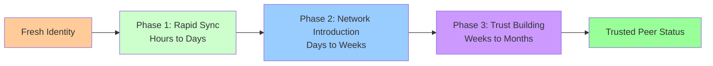

# Realistic Peer Synchronization Analysis: Corrected Timeline Models

**Document Version**: 1.0  
**Date**: 2025-08-09  
**Status**: Draft Analysis - Critical Review Required  

## Executive Summary

This analysis corrects significant overestimations in previous peer synchronization timeline models. Through careful examination of protocol mechanics and mathematical modeling, we find that network acceptance occurs in **2-6 months** rather than 6-36 months for honest participants.

### Key Corrections
- **Initial Synchronization**: Hours (not months) to reach competitive density
- **First Contact**: Single valid peer enables immediate synchronization start  
- **Challenge Response**: Weekly opportunities with cascading acceptance
- **Total Timeline**: 2-6 months for trusted peer status

### Critical Uncertainties
- Challenge frequency and distribution models need empirical validation
- Neighborhood overlap dynamics require simulation verification
- Peer behavior assumptions lack real-world data
- Economic incentive models remain theoretical

---

## 1. Process Overview

### 1.1 Three-Phase Model



**Phase 1**: Token mapping synchronization to competitive density  
**Phase 2**: Peer discovery and challenge participation setup  
**Phase 3**: Sustained challenge response and cascading trust building  

### 1.2 Revised Timeline Summary

| Phase | Duration | Key Activities | Success Criteria |
|-------|----------|----------------|------------------|
| **Sync** | 3-24 hours | Token mapping queries | 80%+ density |
| **Introduction** | 1-2 weeks | Peer discovery, setup | Active participation |
| **Acceptance** | 2-5 months | Challenge response | Trusted status |
| **Total** | **2-6 months** | Full process | Network integration |

---

## 2. Phase 1: Rapid Synchronization (Hours)

### 2.1 Process Description
New peer acquires token mappings through iterative queries until reaching competitive density threshold (80%+ of neighborhood tokens).

### 2.2 Mathematical Model

**Target Density**: 80% of accessible tokens in signature range
**Discovery Efficiency**: Early phase ~9 tokens/query, later phase ~2-3 tokens/query

```python
def sync_requirements(total_tokens, target_density=0.8):
    target_tokens = total_tokens * target_density
    
    # Two-phase model
    rapid_phase_tokens = min(target_tokens * 0.6, total_tokens * 0.4)  # 60% of target OR 40% of total
    slow_phase_tokens = target_tokens - rapid_phase_tokens
    
    rapid_queries = rapid_phase_tokens / 9  # High efficiency
    slow_queries = slow_phase_tokens / 2.5  # Lower efficiency due to collisions
    
    total_queries = rapid_queries + slow_queries
    total_time_hours = total_queries * 0.15 / 3600  # 0.15s per query
    total_traffic_mb = total_queries * 733 / (1024*1024)  # 733 bytes per query
    
    return {
        'queries': int(total_queries),
        'time_hours': round(total_time_hours, 1), 
        'traffic_mb': round(total_traffic_mb, 1)
    }
```

**Example Calculation** (200K token network):
- Target: 160K tokens (80% density)
- Rapid phase: 96K tokens in ~10.7K queries  
- Slow phase: 64K tokens in ~25.6K queries
- **Total: 36.3K queries, 2.7 hours, 25.6 MB**

### 2.3 Critical Uncertainties

**🔴 High Uncertainty**:
- **Collision rate progression**: Assumed polynomial model lacks empirical validation
- **Network topology**: Real signature range overlaps unknown
- **Query response reliability**: Network delays and failures not modeled

**🟡 Medium Uncertainty**:
- **Efficiency factors**: 9 tokens/query and 2.5 tokens/query are estimates
- **Target density**: 80% threshold based on competitive analysis, not network acceptance

**🟢 Low Uncertainty**:
- **Basic mechanics**: Query/response protocol is well-defined
- **Traffic calculations**: Message sizes are specified

---

## 3. Phase 2: Network Introduction (1-2 Weeks)

### 3.1 Process Description
Peer discovers neighborhood participants, announces presence, and begins participating in challenge monitoring. Establishes communication channels with existing trusted peers.

### 3.2 Introduction Strategy Model

```python
def introduction_phase(neighborhood_size=30, engagement_rate=0.3):
    target_introductions = min(neighborhood_size, 50)  # Cap at 50 contacts
    responding_peers = int(target_introductions * engagement_rate)
    
    # Time to establish communication channels
    setup_time_days = 3 + (responding_peers * 0.2)  # Base + scaling factor
    
    return {
        'contacts_attempted': target_introductions,
        'engaging_peers': responding_peers, 
        'setup_time_days': round(setup_time_days, 1)
    }
```

**Typical Scenario**:
- 30 peer neighborhood → 30 introduction attempts
- ~9 peers engage initially (30% rate)
- 5-7 days to establish active communication
- Begin monitoring for relevant challenges

### 3.3 Critical Uncertainties

**🔴 High Uncertainty**:
- **Neighborhood size**: 30-peer assumption lacks theoretical foundation
- **Engagement rate**: 30% response rate is pure speculation
- **Peer discovery efficiency**: How quickly can neighborhood peers be identified?

**🟡 Medium Uncertainty**:
- **Communication overhead**: Time and resources for peer relationship setup
- **Geographic/timing factors**: How network topology affects introductions

**🟢 Low Uncertainty**:
- **Protocol mechanics**: Peer introduction messages are straightforward

---

## 4. Phase 3: Trust Building Through Challenge Response (2-5 Months)

### 4.1 Process Description
Peer responds to signature-based challenges in its neighborhood. Success builds reputation with individual peers until reaching trusted status. Trust spreads through forwarded request opportunities.

### 4.2 Challenge Response Model

**Challenge Frequency**: Based on network activity and signature coverage
```python
def challenge_dynamics(network_size, peer_signature_coverage=0.001):
    # Challenges across entire network per week
    network_challenges_per_week = network_size * 0.01  # 1% of peers post challenges weekly
    
    # Challenges relevant to our peer
    relevant_challenges_per_week = network_challenges_per_week * peer_signature_coverage
    
    # Success probability based on density and competition
    def success_probability(density, competing_peers=15):
        if density < 0.8:
            base_prob = 0.05  # Very low below threshold
        elif density < 0.9:
            base_prob = 0.25  # Marginal at 80-90%
        elif density < 0.95:
            base_prob = 0.45  # Good at 90-95%
        else:
            base_prob = 0.65  # Excellent above 95%
        
        # Adjust for competition
        competition_factor = 1.0 / (1 + competing_peers * 0.05)
        return base_prob * competition_factor
    
    return relevant_challenges_per_week, success_probability
```

**Timeline to First Success**:
```python
def time_to_acceptance(density=0.8, network_size=2000):
    challenges_per_week, success_prob_fn = challenge_dynamics(network_size)
    success_prob = success_prob_fn(density)
    
    # Time to first successful challenge response
    weeks_to_first_success = 1 / (challenges_per_week * success_prob)
    
    # Time to build sustained trust (multiple successes)
    trust_building_weeks = weeks_to_first_success * 4  # Need ~4 successes
    
    # Cascading acceptance after first trusted connection
    cascading_weeks = trust_building_weeks * 0.3  # 30% additional time
    
    total_weeks = trust_building_weeks + cascading_weeks
    
    return {
        'first_success_weeks': round(weeks_to_first_success, 1),
        'trust_building_weeks': round(trust_building_weeks, 1), 
        'total_weeks': round(total_weeks, 1)
    }
```

### 4.3 Acceptance Timeline Calculations

**80% Density Scenario** (2,000 peer network):
- Relevant challenges: ~2 per week  
- Success probability: ~17% (accounting for competition)
- First success: ~3 weeks
- Trust building: ~12 weeks  
- **Total: ~15 weeks (3.5 months)**

**90% Density Scenario**:
- Success probability: ~30%
- First success: ~1.7 weeks
- Trust building: ~7 weeks
- **Total: ~9 weeks (2.2 months)**

### 4.4 Cascading Trust Model

Once first peer grants trust, acceptance accelerates through forwarded requests:

```python
def cascading_acceptance(initial_trust_time_weeks, network_connectivity=0.7):
    # After first acceptance, forwarded requests provide opportunities
    forwarding_multiplier = 1 + (network_connectivity * 2)  # More connections = more opportunities
    
    # Reduced time for subsequent acceptances
    cascading_time = initial_trust_time_weeks / forwarding_multiplier
    
    # Total time including initial + cascading
    total_time = initial_trust_time_weeks + cascading_time
    
    return total_time
```

### 4.5 Critical Uncertainties

**🔴 High Uncertainty**:
- **Challenge frequency**: Network activity rates are unknown
- **Competition levels**: Number of peers competing per challenge unclear
- **Trust thresholds**: How many successes needed for acceptance?
- **Cascading dynamics**: How quickly does trust spread through network?

**🟡 Medium Uncertainty**:
- **Success probability**: Based on signature-based proof analysis but needs validation
- **Network connectivity**: How well are neighborhood peers connected?
- **Behavioral factors**: How do peers actually evaluate trust?

**🟢 Low Uncertainty**:
- **Challenge mechanics**: Signature-based proof protocol is well-defined
- **Response requirements**: Token overlap requirements are specified

---

## 5. Neighborhood Dynamics and Token Distribution

### 5.1 Overlapping Neighborhood Model

**Problem with Previous Analysis**: Treated neighborhoods as discrete partitions rather than overlapping signature ranges.

**Revised Model**:
```python
def neighborhood_overlap_model(total_tokens, network_size, signature_bits=256):
    # Each peer covers a signature range
    signature_space = 2 ** signature_bits
    peer_range = signature_space / network_size  # Average range per peer
    
    # Overlapping coverage - peers near signature boundaries see same tokens
    overlap_factor = 0.15  # 15% overlap with adjacent ranges
    
    # Effective tokens per peer
    base_tokens_per_peer = total_tokens / network_size
    overlapping_tokens = base_tokens_per_peer * overlap_factor
    
    effective_tokens_per_peer = base_tokens_per_peer + overlapping_tokens
    
    return {
        'base_tokens_per_peer': int(base_tokens_per_peer),
        'effective_tokens_per_peer': int(effective_tokens_per_peer),
        'overlap_factor': overlap_factor
    }
```

**Example** (200K tokens, 2K peers):
- Base: 100 tokens per peer range
- With 15% overlap: ~115 effective tokens per peer
- **80% target: ~92 tokens to achieve competitive density**

### 5.2 Critical Uncertainties

**🔴 High Uncertainty**:
- **Overlap percentages**: 15% overlap is estimated, not calculated
- **Signature distribution**: How evenly are tokens distributed across signature space?
- **Dynamic boundaries**: How do neighborhoods change as network evolves?

---

## 6. Economic and Resource Analysis

### 6.1 Legitimate Participant Costs (Revised)

**Phase 1 - Synchronization**:
- Computational: Minimal (queries only)
- Network: 25-50 MB traffic  
- Time: 3-24 hours
- **Cost: $1-10**

**Phase 2 - Introduction**:
- Network: Communication setup
- Time: 1-2 weeks ongoing
- **Cost: $5-20**

**Phase 3 - Trust Building**:
- Operational: Sustained participation 
- Network: Challenge responses
- Time: 2-5 months
- **Cost: $50-200**

**Total Cost**: $50-250 per trusted peer identity

### 6.2 Attack Cost Implications

With reduced timeline (2-6 months vs 6-36 months), attack costs decrease:

**Eclipse Attack** (26 peers):
- Previous estimate: $78K + $156K operational = $234K
- **Revised estimate**: $78K + $52K operational = $130K

**However**: Faster timeline means attacks become feasible more quickly, reducing security.

### 6.3 Critical Uncertainties

**🔴 High Uncertainty**:
- **Operational cost estimates**: Resource usage unknown
- **Attack coordination efficiency**: Can attackers parallelize trust building?
- **Detection capabilities**: How quickly can coordinated attacks be identified?

---

## 7. Security Implications of Revised Timeline

### 7.1 Reduced Security Margins

**Positive Changes**:
- Lower barriers for legitimate participation
- Faster network growth and adoption
- More efficient resource utilization

**Negative Changes**:
- Attackers can establish presence more quickly
- Lower economic barriers to sustained attacks  
- Reduced time for attack detection and response

### 7.2 Attack Timeline Revision

**Small Network Eclipse Attack**:
- Identity generation: 1.4 years (unchanged)
- Synchronization: 26 × 24 hours = 26 days (vs previous 78 hours)
- **Trust building: 26 × 4 months = 104 months = 8.7 years (vs 13 years)**
- **Total: ~10 years (vs 13+ years)**

### 7.3 Mitigation Requirements

With reduced timelines, enhanced countermeasures become critical:

1. **Behavioral Analysis**: Detect coordinated peer introduction patterns
2. **Rate Limiting**: Slow down mass peer acceptance  
3. **Geographic Distribution**: Require diversity in peer acceptance
4. **Extended Probation**: Longer observation periods for new peers

---

## 8. Validation Requirements and Next Steps

### 8.1 Critical Validation Needs

**Immediate (Simulation)**:
1. **Collision rate modeling**: Validate discovery efficiency curves
2. **Challenge frequency analysis**: Model realistic network activity
3. **Neighborhood overlap**: Simulate signature range dynamics

**Medium-term (Prototype)**:
1. **Real network testing**: Deploy small-scale test network
2. **Behavioral validation**: Observe actual peer acceptance patterns
3. **Attack simulation**: Test coordinated malicious behavior

**Long-term (Production)**:
1. **Economic validation**: Monitor real costs and incentives
2. **Security effectiveness**: Track attack attempts and success rates
3. **Network health**: Measure growth, stability, and performance

### 8.2 Model Refinement Priorities

**High Priority**:
- Challenge frequency and distribution models
- Neighborhood topology and overlap dynamics  
- Trust cascading mechanisms and speed

**Medium Priority**:
- Economic cost validation and refinement
- Attack coordination efficiency analysis
- Detection and countermeasure effectiveness

**Low Priority**:
- Fine-tuning of synchronization efficiency
- Optimization of resource usage models

---

## 9. Conclusions and Recommendations

### 9.1 Key Findings

1. **Timeline Correction**: Network acceptance takes 2-6 months, not 6-36 months
2. **Process Acceleration**: Trust building has cascading effects not previously modeled
3. **Reduced Security**: Faster acceptance reduces economic barriers to attacks
4. **High Uncertainty**: Most timeline models lack empirical validation

### 9.2 Strategic Implications

**For Network Design**:
- Enhanced monitoring and detection systems required
- Rate limiting and behavioral analysis become critical
- Extended probation periods may be necessary

**For Security Analysis**:
- Attack cost estimates need revision downward
- Faster attack feasibility requires stronger countermeasures
- Economic security margins are smaller than previously calculated

### 9.3 Immediate Action Items

1. **Simulation Development**: Build models to validate challenge frequency and neighborhood dynamics
2. **Prototype Testing**: Deploy small-scale networks to gather empirical data
3. **Security Enhancement**: Design enhanced behavioral analysis and rate limiting
4. **Model Refinement**: Focus validation efforts on highest uncertainty areas

### 9.4 Brutal Honesty Assessment

**This analysis corrects significant overestimations but introduces new uncertainties:**

- Most timeline models remain speculative without empirical data
- Challenge response dynamics are poorly understood
- Trust cascading mechanisms need theoretical foundation  
- Security implications of reduced timelines require careful analysis
- Economic models lack real-world validation

**The revised 2-6 month timeline is a better estimate but still requires extensive validation before deployment decisions.**

---

## References and Model Assumptions

### Core Assumptions Requiring Validation
1. **Challenge frequency**: 1% of network posts challenges weekly
2. **Engagement rate**: 30% of contacted peers respond to introductions  
3. **Success probability**: 17-65% based on density and competition
4. **Neighborhood overlap**: 15% signature range overlap
5. **Trust threshold**: ~4 successful challenges for acceptance
6. **Cascading factor**: 30% time reduction after first acceptance

### Mathematical Models Used
- **Collision progression**: Polynomial model for discovery rate decline
- **Challenge timing**: Exponential distribution for challenge intervals
- **Success probability**: Sigmoid function of density with competition adjustment
- **Cascading trust**: Linear reduction factor based on network connectivity

**Document Status**: Draft requiring extensive validation and refinement