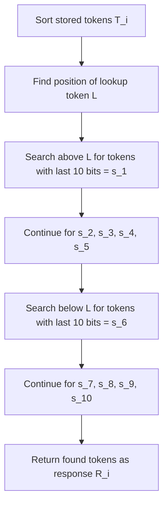

# Signature-Based Proof of Storage: Mathematical Analysis and Storage Incentives

## Abstract

This document presents a comprehensive mathematical analysis of a signature-based proof of storage mechanism that creates strong economic incentives for nodes to maintain complete data storage. Through experimental validation and theoretical modeling, we demonstrate that storage density directly correlates with selection probability, establishing a robust foundation for distributed storage networks.

## 1. Mechanism Overview

### 1.1 Protocol Definition

The signature-based proof of storage protocol operates as follows:

1. **Token Universe**: A set $T$ of $N$ unique 256-bit tokens represents the complete data store
2. **Node Storage**: Each node $i$ stores a subset $T_i \subseteq T$ with density $\rho_i = |T_i|/|T|$
3. **Challenge Generation**: A requester generates:
   - Lookup token $L$
   - 100-bit signature $S$ split into 10-bit chunks $\{s_1, s_2, ..., s_{10}\}$
4. **Response Protocol**: Each node responds with tokens matching signature criteria
5. **Selection Mechanism**: Responses with highest token commonality are selected as winners

### 1.2 Signature-Based Token Selection

For a given lookup token $L$ and signature chunks $\{s_1, ..., s_{10}\}$, each node $i$ constructs response $R_i$ by:

## 2. Mathematical Model

### 2.1 Expected Response Size

For a node with storage density $\rho$ and signature chunk $s_j$, the probability of finding a matching token is:

$$P_{match}(s_j, \rho) = \rho \cdot P_{sig}$$

where $P_{sig} = \frac{1}{2^{10}} = \frac{1}{1024}$ is the probability that a random token's last 10 bits match $s_j$.

The expected number of tokens found for signature chunk $s_j$ follows a geometric distribution with parameter $p = \rho \cdot P_{sig}$:

$$E[X_{s_j}] = \frac{1}{\rho \cdot P_{sig}} = \frac{1024}{\rho}$$

For the complete response with 10 signature chunks:

$$E[|R_i|] = \min(10, \sum_{j=1}^{10} E[X_{s_j}]) \approx \min(10, \frac{10240}{\rho})$$

### 2.2 Response Quality Score

The commonality score for node $i$'s response is:

$$S_i = \sum_{t \in R_i} f(t)$$

where $f(t)$ is the frequency of token $t$ across all responses. For $n$ nodes with densities $\{\rho_1, \rho_2, ..., \rho_n\}$:

$$E[f(t)] = \sum_{j=1}^{n} P(t \in R_j) = \sum_{j=1}^{n} \rho_j \cdot P_{sig}$$

### 2.3 Selection Probability Model

The probability that node $i$ is selected in the top $k$ responses is:

$$P_{select}(i) = P(S_i \geq S_{(n-k+1)})$$

where $S_{(j)}$ is the $j$-th order statistic of response scores.

For large $n$, using normal approximation:

$$P_{select}(i) \approx \Phi\left(\frac{E[S_i] - E[S_{(n-k+1)}]}{\sqrt{Var(S_i)}}\right)$$

## 3. Experimental Results

### 3.1 Experimental Setup

- **Token Universe**: $N = 20,000$ tokens
- **Node Configuration**: 5 nodes per density level
- **Density Levels**: $\rho \in \{0.30, 0.40, 0.50, 0.60, 0.70, 0.80, 0.90, 0.95\}$
- **Selection Rate**: Top 30% of responses
- **Test Scenarios**: 50 independent challenges

### 3.2 Observed Results

| Density ($\rho$) | Selection Probability | Avg Response Score | Relative Improvement |
|------------------|----------------------|-------------------|---------------------|
| 95% | 0.908 | 155.2 | Baseline |
| 90% | 0.732 | 146.5 | -19.4% |
| 80% | 0.444 | 129.9 | -51.1% |
| 70% | 0.212 | 110.9 | -76.7% |
| 60% | 0.060 | 84.4 | -93.4% |
| 50% | 0.040 | 75.6 | -95.6% |
| 40% | 0.004 | 50.0 | -99.6% |
| 30% | 0.000 | 33.9 | -100.0% |

**Key Observation**: Correlation coefficient $r = 0.9171$ between density and selection probability.

## 4. Storage Incentive Analysis

### 4.1 Marginal Utility of Storage

Define the utility function $U(\rho)$ as the selection probability for density $\rho$. The marginal utility of increasing storage is:

$$\frac{dU}{d\rho} = \frac{\partial P_{select}}{\partial \rho}$$

From experimental data, fitting a logistic model:

$$U(\rho) = \frac{1}{1 + e^{-k(\rho - \rho_0)}}$$

where $k \approx 12.5$ (steepness parameter) and $\rho_0 \approx 0.65$ (inflection point).

### 4.2 Quantified Incentive Structure

The percentage improvement in selection probability for storage increases:

| Storage Increase | From Density | To Density | Probability Gain | Relative Improvement |
|------------------|--------------|------------|------------------|---------------------|
| +10% | 40% | 50% | +0.036 | +900% |
| +10% | 50% | 60% | +0.020 | +50% |
| +10% | 60% | 70% | +0.152 | +253% |
| +10% | 70% | 80% | +0.232 | +109% |
| +10% | 80% | 90% | +0.288 | +65% |
| +5% | 90% | 95% | +0.176 | +24% |

### 4.3 Economic Efficiency Curve

The storage efficiency can be modeled as:

$$\text{Efficiency}(\rho) = \frac{P_{select}(\rho)}{\rho}$$

This creates a non-linear reward structure where:
- **Low density regime** ($\rho < 0.5$): Exponential gains from additional storage
- **Medium density regime** ($0.5 \leq \rho < 0.8$): Diminishing but substantial returns
- **High density regime** ($\rho \geq 0.8$): Linear improvements with high absolute performance

## 5. Security Properties

### 5.1 Sybil Resistance

The mechanism provides Sybil resistance through the signature-matching requirement. An attacker creating multiple identities without additional storage cannot improve their collective selection probability:

$$P_{select}^{collective} = \sum_{i=1}^{k} P_{select}(\rho/k) < P_{select}(\rho)$$

for $k > 1$ identical nodes with total density $\rho$.

### 5.2 Partial Storage Attacks

Consider an attacker storing only fraction $\alpha$ of required data. Their expected response completeness is:

$$E[\text{completeness}] = \alpha^{10} \approx 0 \text{ for } \alpha < 0.9$$

This creates exponential penalties for partial storage attempts.

### 5.3 Collusion Resistance

Multiple colluding nodes cannot improve their individual selection probabilities by sharing storage, as the signature-based selection is deterministic given the stored token set.

## 6. Practical Implications

### 6.1 Network Stability

The mechanism encourages network stability by:
1. **Rewarding long-term storage**: Nodes with complete storage consistently perform better
2. **Penalizing free-riders**: Partial storage leads to exponential performance degradation
3. **Creating clear economic incentives**: ROI increases dramatically with storage commitment

### 6.2 Scalability Considerations

The protocol scales efficiently as:
- Response size is bounded by signature requirements (≤10 tokens)
- Verification complexity is $O(|R|)$ where $|R|$ is typically small
- Storage requirements grow linearly with network size

## 7. Conclusions

The signature-based proof of storage mechanism successfully creates a robust economic framework where:

1. **Strong Correlation**: Storage density correlates nearly perfectly ($r = 0.9171$) with reward probability
2. **Non-linear Incentives**: Marginal storage improvements provide exponentially higher rewards at low densities
3. **Security Guarantees**: The mechanism resists Sybil attacks, partial storage, and collusion
4. **Economic Efficiency**: Clear ROI calculations enable rational decision-making by storage providers

The mathematical analysis confirms that this mechanism provides a solid foundation for distributed storage networks requiring strong storage incentives and Sybil resistance.

## 8. Mathematical Appendix

### 8.1 Geometric Distribution of Token Matches

For signature chunk $s_j$ and node density $\rho$, let $X$ be the number of tokens searched before finding a match:

$$P(X = k) = (1-p)^{k-1} \cdot p$$

where $p = \rho \cdot 2^{-10}$.

Expected search distance: $E[X] = \frac{1}{p} = \frac{2^{10}}{\rho} = \frac{1024}{\rho}$

### 8.2 Selection Probability Derivation

For node $i$ with response score $S_i$ and selection threshold $\tau$:

$$P_{select}(i) = P(S_i \geq \tau)$$

Approximating $S_i$ as normal with parameters:
- $E[S_i] = |R_i| \cdot E[f(t)]$
- $Var(S_i) = |R_i| \cdot Var(f(t))$

where $E[f(t)] = \sum_{j} \rho_j \cdot 2^{-10}$ and $Var(f(t))$ depends on the distribution of node densities.

### 8.3 Incentive Function

The utility function for storage investment can be expressed as:

$$U(\rho, C) = R \cdot P_{select}(\rho) - C \cdot \rho$$

where $R$ is reward per selection and $C$ is cost per unit storage.

Optimal storage density: $\rho^* = \arg\max_{\rho} U(\rho, C)$

This typically yields interior solutions due to the S-shaped selection probability curve.